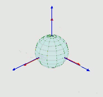
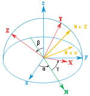
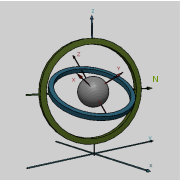
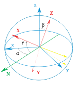

# **Euler angles**欧拉角

**欧拉角**是Leonhard Euler引入的三个角，用于描述刚体相对于固定坐标系的方向。[1]

They can also represent the orientation of a mobile frame of reference in physics or the orientation of a general basis in 3-dimensional linear algebra. Alternative forms were later introduced by Peter Guthrie Tait and George H. Bryan intended for use in aeronautics and engineering.

它们还可以表示物理学中移动参考系的方向，或三维线性代数中一般基的方向。后来，彼得·古思里·泰特（Peter Guthrie Tait）和乔治·H·布莱恩（George H.Bryan）引入了另一种形式，用于航空和工程领域。

> **[info]**   
frame of reference：参考坐标系
basis：基  

# Chained rotations equivalence 链式旋转等效

> 从已知参考方向开始，使用特定的内旋序列，可以达到任何目标方向，其大小为目标方向的欧拉角。本例使用z-x′-z〃序列。

Euler angles can be defined by elemental geometry or by composition of rotations. The geometrical definition demonstrates that three composed elemental rotations (rotations about the axes of a coordinate system) are always sufficient to reach any target frame.

欧拉角可以通过基本几何或旋转组合来定义。几何定义表明，三个组合元素旋转（围绕坐标系的轴旋转）足以到达任何目标帧。

> **[warning]**基本几何定义和组合旋转定义有什么区别？  

三个元素旋转可以是外旋（围绕原始坐标系的轴xyz旋转，假设其保持不变），也可以是内旋（围绕旋转坐标系的轴XYZ旋转，与运动物体保持一致，在每次元素旋转后改变其方向）。

> **[info]**  
extrinsic rotations：外旋  
intrinsic rotations：内旋  

欧拉角通常表示为α、β、γ或ψ、θ、φ。不同的作者可以使用不同的旋转轴集来定义Euler角度，或者为相同的角度使用不同的名称。因此，任何使用欧拉角的讨论都应在其定义之后进行。

Without considering the possibility of using two different conventions for the definition of the rotation axes (intrinsic or extrinsic), there exist twelve possible sequences of rotation axes, divided in two groups:

假设不会同时用两种不同约定来定义旋转轴（内旋或外旋），存在十二种可能的旋转轴序列，分为两组：

- **Proper欧拉角**（z-x-z，x-y-x，y-z-y，z-y-z，x-z-x，y-x-y）
- **Tait–Bryan角**（x-y-z，y-z-x，z-x-y，x-z-y，z-y-x，y-x-z）。

Tait–Bryan角也称为**卡丹角**、**航海角**、**行进方向，高度，边坡**、或**偏航，俯仰，和横滚**。有时，这两种序列都被称为“欧拉角”。在这种情况下，第一组的序列称为proper欧拉角或经典欧拉角。

# Proper Euler angles[edit]正确的欧拉角[编辑]

> Proper欧拉角几何定义  
  固定坐标系（x、y、z）  
  旋转坐标系（X、Y、Z）  
  交点线（N）

> **左**：万向节组，显示z-x-z旋转序列。底座为外部坐标第。内部轴为红色。**右图**：一个简单的图，在图显示相似的欧拉角。

> **[success]** 以下内容全部假设旋转顺序为z-x-z

## 几何定义

The axes of the original frame are denoted as x, y, z and the axes of the rotated frame as X, Y, Z. The **geometrical** **definition** (sometimes referred to as static) begins by defining the line of nodes (N) as the intersection of the planes xy and XY (it can also be defined as the common perpendicular to the axes z and Z and then written as the vector product N = z \times  Z). Using it, the three **Euler angles** can be defined as follows:

原始坐标系的轴表示为x，y，z，旋转框架的轴表示为X，Y，Z.**几何定义**（有时称为静态）首先将交点线（N）定义为平面xy和xy的相交的线（也可以定义为同时与轴z轴和Z轴垂直的线，因此写为向量积 $N=z \times Z$）。使用它，三个**欧拉角**可以定义如下：

> **[info]** line of nodes：交点线

- $\alpha$（或$\varphi$）是x轴和N轴之间的有符号角度（x约定–也可以在y和N之间定义，称为y约定）。  

> **[success]**  
A轴与B轴之间的平角，另一种表达方式是，以$A\times B$为轴，从A到B的旋转角度  
N在xy平面上，因此x与N的夹角可以看作是以z为轴在xy平面上的转动  

- $\beta$（或$\theta$）是z轴和Z轴之间的角度。  

> **[success]**  
只有第二次旋转会导致z->Z  

- $\gamma$（或$\psi$）是N轴和X轴之间的有符号角度（X约定）。  

> **[success]**  
N在XY平面上，因此N与X的夹角可以看作是以Z为轴在XY平面上的转动  

仅当两个参照系具有相同的惯用手时，才定义两个参照系之间的欧拉角。

## 内旋

Euler angles between two reference frames are defined only if both frames have the same handedness.

Intrinsic rotations are elemental rotations that occur about the axes of a coordinate system XYZ attached to a moving body. Therefore, they change their orientation after each elemental rotation. The XYZ system rotates, while xyz is fixed. Starting with XYZ overlapping xyz, a composition of three intrinsic rotations can be used to reach any target orientation for XYZ.

固有旋转是围绕附着到移动物体的坐标系XYZ的轴发生的基本旋转。因此，它们在每次元素旋转后都会改变方向。XYZ系统旋转，而XYZ是固定的。从XYZ重叠XYZ开始，三个固有旋转的组合可用于达到XYZ的任何目标方向。

Euler angles can be defined by intrinsic rotations. The rotated frame XYZ may be imagined to be initially aligned with xyz, before undergoing the three elemental rotations represented by Euler angles. Its successive orientations may be denoted as follows:

欧拉角可以通过固有旋转来定义。旋转的帧XYZ可以想象为在经历由欧拉角表示的三个元素旋转之前，最初与XYZ对齐。其连续方向可表示如下：

- x-y-z, or x0-y0-z0 (initial) （初始值）
- x′-y′-z′, or x1-y1-z1 (after first rotation) （第一次旋转后）
- x″-y″-z″, or x2-y2-z2 (after second rotation)（第二轮后）
- X-Y-Z, or x3-y3-z3 (final)（最终版）

For the above-listed sequence of rotations, the line of nodes N can be simply defined as the orientation of X after the first elemental rotation. Hence, N can be simply denoted x′. Moreover, since the third elemental rotation occurs about Z, it does not change the orientation of Z. Hence Z coincides with z″. This allows us to simplify the definition of the Euler angles as follows:

对于上面列出的旋转序列，节点N的线可以简单地定义为第一个元素旋转后X的方向。因此，N可以简单地表示为x′。此外，由于第三元素旋转发生在Z附近，因此不会改变Z的方向。因此，Z与Z〃重合。这使我们可以简化欧拉角的定义，如下所示：

- α (or $\varphi$ ) represents a rotation around the z axis, 

α（或$\varphi$）表示绕z轴旋转，
- β (or $\theta$ ) represents a rotation around the x′ axis,

β（或$\theta$）表示绕x′轴旋转，
- γ (or $\psi$ ) represents a rotation around the z″ axis.

γ（或$\psi$）表示绕z〃轴旋转。
