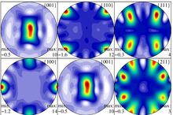

# **Euler angles**欧拉角

**欧拉角**是Leonhard Euler引入的三个角，用于描述刚体相对于固定坐标系的方向。[1]

它们还可以表示物理学中移动参考系的方向，或三维线性代数中一般基的方向。后来，彼得·古思里·泰特（Peter Guthrie Tait）和乔治·H·布莱恩（George H.Bryan）引入了另一种形式，用于航空和工程领域。

> &#x2705   
frame of reference：参考坐标系  
basis：基  

# Chained rotations equivalence 链式旋转等效

> &#x1F4CC 从已知参考方向开始，使用特定的内旋序列，可以达到任何目标方向，其大小为目标方向的欧拉角。本例使用z-x′-z〃序列。

欧拉角可以通过基本几何或旋转组合来定义。几何定义表明，三个组合元素旋转（围绕坐标系的轴旋转）足以到达任何目标坐标系。

> &#x2753 基本几何定义和组合旋转定义有什么区别？  

三个元素旋转可以是外旋（围绕原始坐标系的轴xyz旋转，假设其保持不变），也可以是内旋（围绕旋转坐标系的轴XYZ旋转，与运动物体保持一致，在每次元素旋转后改变其方向）。

> &#x2705  
extrinsic rotations：外旋  
intrinsic rotations：内旋  

欧拉角通常表示为α、β、γ或ψ、θ、φ。不同的作者可以使用不同的旋转轴集来定义Euler角度，或者为相同的角度使用不同的名称。因此，任何使用欧拉角的讨论都应在其定义之后进行。

假设不会同时用两种不同约定来定义旋转轴（内旋或外旋），存在十二种可能的旋转轴序列，分为两组：

- **Proper欧拉角**（z-x-z，x-y-x，y-z-y，z-y-z，x-z-x，y-x-y）
- **Tait–Bryan角**（x-y-z，y-z-x，z-x-y，x-z-y，z-y-x，y-x-z）。

Tait–Bryan角也称为**卡丹角**、**航海角**、**行进方向，高度，边坡**、或**偏航，俯仰，和横滚**。有时，这两种序列都被称为“欧拉角”。在这种情况下，第一组的序列称为proper欧拉角或经典欧拉角。

# Proper Euler angles  Proper欧拉角

> Proper欧拉角几何定义  
  固定坐标系（x、y、z）  
  旋转坐标系（X、Y、Z）  
  交点线（N）

> **左**：万向节组，显示z-x-z旋转序列。底座为外部坐标第。内部轴为红色。**右图**：一个简单的图，在图显示相似的欧拉角。

>  &#x1F4CC 以下内容全部假设旋转顺序为z-x-z

## 几何定义

The axes of the original frame are denoted as x, y, z and the axes of the rotated frame as X, Y, Z. The **geometrical** **definition** (sometimes referred to as static) begins by defining the line of nodes (N) as the intersection of the planes xy and XY (it can also be defined as the common perpendicular to the axes z and Z and then written as the vector product N = z \times  Z). Using it, the three **Euler angles** can be defined as follows:

原始坐标系的轴表示为x，y，z，旋转框架的轴表示为X，Y，Z.**几何定义**（有时称为静态）首先将交点线（N）定义为平面xy和XY的相交的线（也可以定义为同时与轴z轴和Z轴垂直的线，因此写为向量积 \\(N=z \times Z\\)）。使用它，三个**欧拉角**可以定义如下：

> &#x2705 line of nodes：交点线

-  \\(\alpha\\)（或\\(\varphi\\)）是x轴和N轴之间的有符号角度（x约定–也可以在y和N之间定义，称为y约定）。  

>  &#x1F4CC  
A轴与B轴之间的夹角，另一种表达方式是，以\\(A\times B\\)为轴，从A到B的旋转角度  
N在xy平面上，因此x与N的夹角可以看作是以z为轴在xy平面上的转动  

- \\(\beta\\)（或\\(\theta\\)）是z轴和Z轴之间的角度。  

> &#x1F4CC  
只有第二次旋转会导致z->Z  

- \\(\gamma\\)（或\\(\psi\\)）是N轴和X轴之间的有符号角度（X约定）。  

> &#x1F4CC  
N在XY平面上，因此N与X的夹角可以看作是以Z为轴在XY平面上的转动  

仅当两个参照系具有相同的惯用手时，才定义两个参照系之间的欧拉角。

## 内旋

内旋是围绕附着到移动物体的坐标系XYZ的轴发生的基本旋转。因此，它们在每次元素旋转后都会改变方向。XYZ系统会旋转，而xyz是固定的。三个内旋组合可使XYZ达到任何目标方向。

> &#x1F4CC  
初始时，XYZ和xyz重叠

Euler angles can be defined by intrinsic rotations. The rotated frame XYZ may be imagined to be initially aligned with xyz, before undergoing the three elemental rotations represented by Euler angles. Its successive orientations may be denoted as follows:

欧拉角可以通过内旋序列来定义。旋转的后的XYZ坐标系可以想象为先让XYZ与xyz对齐，然后经历由欧拉角表示的三个元素旋转。其连续方向可表示如下：

- x-y-z, or x0-y0-z0 （初始值）
- x′-y′-z′, or x1-y1-z1 （第一次旋转后）
- x″-y″-z″, or x2-y2-z2 （第二轮后）
- X-Y-Z, or x3-y3-z3 （最终）

> &#x1F4CC  
以哪个为轴旋转，那个轴旋转前后不变，因此，z=z',z''=Z,x'=x''

For the above-listed sequence of rotations, the line of nodes N can be simply defined as the orientation of X after the first elemental rotation. Hence, N can be simply denoted x′. Moreover, since the third elemental rotation occurs about Z, it does not change the orientation of Z. Hence Z coincides with z″. This allows us to simplify the definition of the Euler angles as follows:

对于上面列出的旋转序列，交点线N可以简单地定义为第一个元素旋转后X的方向。因此，N可以简单地表示为x′。此外，由于第三次元素旋转发生在Z附近，因此不会改变Z的方向。因此，Z与z〃重合。这使我们可以简化欧拉角的定义，如下所示：

> &#x1F4CC  
**N可以简单地表示为x′**:

- α（或\\(\varphi\\)）表示绕z轴旋转，

> &#x1F4CC  

- β（或\\(\theta\\)）表示绕x′轴旋转，

- γ（或\\(\psi\\)）表示绕z〃轴旋转。

> &#x1F4CC  
同理，z是γ的旋转轴，Z=z''

## 外旋
Extrinsic rotations are elemental rotations that occur about the axes of the fixed coordinate system xyz. The XYZ system rotates, while xyz is fixed. Starting with XYZ overlapping xyz, a composition of three extrinsic rotations can be used to reach any target orientation for XYZ. The Euler or Tait–Bryan angles (α, β, γ) are the amplitudes of these elemental rotations. For instance, the target orientation can be reached as follows (note the reversed order of Euler angle application):

外旋是围绕固定坐标系xyz的轴发生的基本旋转。XYZ系统会旋转，而xyz是固定的。从XYZ重叠xyz开始，三个外旋的组合可使XYZ达到任何目标方向。Euler角或Tait–Bryan角（α、β、γ）是这些元素旋转的幅度。例如，目标方向可按如下方式实现（注意应用Euler角的相反顺序）：

> &#x1F4CC  
**注意应用Euler角的相反顺序**：  
内旋和外旋的顺序不一样  
内旋：α->β->γ  
外旋：γ->β->α

- XYZ系统绕z轴旋转γ。X轴现在与x轴成角度γ。

- XYZ系统再次旋转，但这次绕x轴旋转β。Z轴现在与z轴成角度β。

- XYZ系统第三次绕z轴旋转角度α。

总之，三个元素的旋转发生在z、x和z附近。事实上，这个序列通常表示为z-x-z（或3-1-3）。与Proper Euler角和Tait–Bryan角关联的旋转轴集通常使用此符号命名（有关详细信息，请参见上文）。

## 符号、范围和约定

通常根据右手法则定义角度。也就是说，当它们从轴的正方向上看显示顺时针时，它们具有正值；当旋转显示为逆时针时，它们具有负值。相反的惯例（左手法则）很少被采用。

关于范围（使用区间表示法）：

- 对于α和γ，范围定义为模2π弧度。例如，有效范围可以是[−π, π].

- 对于β，范围包括π弧度（但不能说是模π）。例如，它可以是[0， π] 或[−π/2, π/2].

> &#x2753    
**但不能说是模π**:?

The angles α, β and γ are uniquely determined except for the singular case that the xy and the XY planes are identical, i.e. when the z axis and the Z axis have the same or opposite directions. Indeed, if the z axis and the Z axis are the same, β = 0 and only (α + γ) is uniquely defined (not the individual values), and, similarly, if the z axis and the Z axis are opposite, β = π and only (α − γ) is uniquely defined (not the individual values). These ambiguities are known as gimbal lock in applications.

角度α、β和γ是唯一确定的，但xy和XY平面相同的奇异情况除外，即z轴和Z轴方向相同或相反。事实上，如果z轴和Z轴相同，则β=0且只有（α+γ）是唯一定义的（不是单个值），并且，类似地，如果z轴和Z轴相反，则β=π且只有（α）− γ） 是唯一定义的（不是单个值）。这些歧义在应用程序中称为万向节锁。

> &#x1F4CC  
**角度α、β和γ是唯一确定的**：α、β、γ是独立的  
**（α）− γ） 是唯一定义的**：β为定值，α和γ不独立，这种情况称为万向节死锁

Proper欧拉角的旋转轴有六种可能的序列。在所有这些轴中，第一和第三旋转轴相同。六种可能的顺序是：

1. z1-x′-z2″ (内旋) or z2-x-z1 (外旋)

2. x1-y′-x2″ (内旋) or x2-y-x1 (外旋)

3. y1-z′-y2″ (内旋) or y2-z-y1 (外旋)

4. z1-y′-z2″ (内旋) or z2-y-z1 (外旋)

5. x1-z′-x2″ (内旋) or x2-z-x1 (外旋)

6. y1-x′-y2″ (内旋) or y2-x-y1 (外旋)

## 进动、章动和内旋

>- Euler basic motions of the Earth. Intrinsic (green), Precession (blue) and Nutation (red)
地球的基本运动。内旋（绿色）、进动（蓝色）和章动（红色）

Precession, nutation, and intrinsic rotation (spin) are defined as the movements obtained by changing one of the Euler angles while leaving the other two constant. These motions are not expressed in terms of the external frame, or in terms of the co-moving rotated body frame, but in a mixture. They constitute a **mixed axes of rotation** system, where the first angle moves the line of nodes around the external axis z, the second rotates around the line of nodes N and the third one is an intrinsic rotation around Z, an axis fixed in the body that moves.

进动、章动和内旋（自旋）被定义为改变其中一个欧拉角而保持另两个不变的运动。这些运动不是用外部框架表示的，也不是用共同运动的旋转体框架表示的，而是用一种混合物表示的。它们构成**混合旋转轴**系统，其中第一个角度围绕外部轴z移动交点线，第二个角度围绕交点线N旋转，第三个角度围绕Z旋转，Z轴固定在移动的主体中。

静态定义意味着：

- α（进动）表示绕z轴旋转，

- β（章动）表示绕N或x′轴旋转，

- γ（内旋）表示绕Z轴或z〃轴的旋转。

如果β为零，则不存在关于N的旋转。因此，Z与z重合，α和γ表示围绕同一轴（z）的旋转，且最终方向可通过围绕z的单个旋转获得，旋转角度等于α+γ。

作为一个例子，考虑顶部。顶部围绕其自身的对称轴旋转；这与它的内旋相对应。它也围绕其枢轴旋转，其质心围绕枢轴旋转；这种旋转是进动。最后，顶部可以上下摆动；倾角就是章动角。地球的运动也可以看到同样的例子。

虽然这三种运动都可以在某一坐标系中用系数恒定的旋转算子来表示，但它们不能同时用这些算子来表示。给定一个参考系，其中最多有一个是无系数的。一般来说，只有进动可以表示为空间基上的矩阵，而不依赖于其他角度。

These movements also behave as a gimbal set. If we suppose a set of frames, able to move each with respect to the former according to just one angle, like a gimbal, there will exist an external fixed frame, one final frame and two frames in the middle, which are called "intermediate frames". The two in the middle work as two gimbal rings that allow the last frame to reach any orientation in space.

这些运动还表现为万向节装置。如果我们假设一组框架能够像一个万向节一样根据一个角度来移动前者，则将存在一个外部固定框架、一个最终框架和中间两个框架，这被称为“中间框架”。中间的两个工作为两个万向环，允许最后一个框架在空间中到达任何方位。

# 泰特-布赖恩角

另见：飞机主轴

>- 泰特-布莱恩角。z-y′-x〃序列（内旋；N与y′重合）。角度旋转序列为ψ，θ，φ。注意，在这种情况下，ψ>90°，θ为负角度。

第二种形式被称为**泰特-布莱恩角**，以Peter Guthrie Tait 和George H. Bryan命名。这是通常用于航空航天应用的惯例，因此零度仰角表示水平姿态。Tait–Bryan角表示飞机相对于世界坐标系的方向。在处理其他车辆时，可以使用不同的轴约定。

## 定义

>- 泰特-布莱恩角。z-x′-y〃序列（内旋；N与x′重合）

Tait–Bryan角使用的定义和符号与上述适用于Euler角的定义和符号类似（几何定义、内旋定义、外旋定义）。唯一的区别是，Tait–Bryan角表示围绕三个不同轴（例如x-y-z或x-y′-z〃）的旋转，而Proper Euler角对第一个和第三个元素旋转（例如z-x-z或z-x′-z〃）使用相同的轴。

这意味着几何构造中交点线的定义不同。在Proper欧拉角情况下，它被定义为两个同源笛卡尔平面之间的交线（当欧拉角为零时平行；例如xy和XY）。在Tait–Bryan角的情况下，它被定义为两个非同源平面的交点（当Euler角为零时垂直；例如xy和YZ）。

> &#x2753    
笛卡尔平面？  
为什么旋转轴不同会导致line of nodes的定义不同？  
为什么要定义line of nodes?

##  约定

>- 飞机的机载和地面跟踪站的机载ENS轴的Heading, elevation and bank（Z-Y′-X〃）。固定参考坐标系x-y-z表示跟踪站。机载轴Y和Z未显示。X以绿色显示。此图不符合RHS规则：y轴必须反转为正角度符合RHS。

> &#x1F4CC  
RHS:右手坐标系法则

三个元素旋转可以围绕原始坐标系的轴发生，该坐标系保持不变（外旋），或者围绕旋转坐标系的轴发生，旋转坐标系的轴在每个元素旋转后改变其方向（内旋）。

Tait–Bryan角度的旋转轴序列有六种选择。六种可能的顺序是：

- x-y′-z″ (内旋) or z-y-x (外旋)

- y-z′-x″ (内旋) or x-z-y (外旋)

- z-x′-y″ (内旋) or y-x-z (外旋)

- x-z′-y″ (内旋) or y-z-x (外旋)

- z-y′-x″ (内旋) or x-y-z (外旋): the intrinsic rotations are known as: yaw, pitch and roll 内在旋转被称为：yaw, pitch 和 roll

- y-x′-z″ (内旋) or z-x-y (外旋)

> &#x1F4CC  
内旋和外旋的顺序是反的

##  符号和范围

>- 根据航空标准DIN 9300定义的飞机主轴。请注意，零度角时，固定坐标系和移动坐标系必须重合。因此，该规范还将强制定义了参考系统中的兼容轴约定

泰特-布莱恩公约广泛应用于工程中，有着不同的目的。在选择移动轴和固定轴的应用中，有几种轴约定，这些约定决定了角度的符号。因此，必须仔细研究每种情况下的角度符号。

> &#x1F4CC  
轴约定：特定的旋转轴顺序

角度ψ和φ的范围是2π弧度。对于θ，范围是π弧度。

## 备选名称

These angles are normally taken as one in the external reference frame (heading, bearing), one in the intrinsic moving frame (bank) and one in a middle frame, representing an elevation or inclination with respect to the horizontal plane, which is equivalent to the line of nodes for this purpose.

这些角度通常在外部参考坐标系（航向、方位）中取一个，在内部移动坐标系（bank）中取一个，在中间框架中取一个，表示相对于水平面的高程或倾角，相当于用于此目的的交点线。

> &#x2753    
这一段没看懂

>- 记住角度名称的助记符

对于飞机来说，如果按照正确的顺序绕其主轴旋转三次就可以得到特定角度的坐标系。偏航将获得轴承，俯仰将产生仰角，滚转将产生倾斜角度。因此，在航空航天中，它们有时被称为**偏航、俯仰和滚转**。请注意，如果以任何其他顺序旋转，或者旋转前飞机轴处于不与参考坐标系相等的其它任何位置，则这套名称不适用。

Tait–Bryan angles, following z-y′-x″ (intrinsic rotations) convention, are also known as **nautical angles**, because they can be used to describe the orientation of a ship or aircraft, or **Cardan angles**, after the Italian mathematician and physicist Gerolamo Cardano, who first described in detail the Cardan suspension and the Cardan joint.

Tait–Bryan角，遵循z-y′-x〃（内旋）惯例，也被称为**海角**，因为它们可以用来描述船只或飞机的方向，或者**卡丹角**，以意大利数学家和物理学家Gerolamo Cardano的名字命名，他首先详细描述了Cardan suspension和Cardan joint。

# 给定坐标系的角度

A common problem is to find the Euler angles of a given frame. The fastest way to get them is to write the three given vectors as columns of a matrix and compare it with the expression of the theoretical matrix (see later table of matrices). Hence the three Euler Angles can be calculated. Nevertheless, the same result can be reached avoiding matrix algebra and using only elemental geometry. Here we present the results for the two most commonly used conventions: ZXZ for proper Euler angles and ZYX for Tait–Bryan. Notice that any other convention can be obtained just changing the name of the axes.

一个常见的问题是求给定坐标系的欧拉角。获取它们的最快方法是将三个给定向量写成矩阵的列，并将其与理论矩阵的表达式进行比较（见后面的矩阵表）。因此，可以计算三个欧拉角。然而，避免使用矩阵代数和仅使用元素几何也可以得到相同的结果。这里我们给出了两种最常用的约定的结果：ZXZ表示适当的欧拉角，ZYX表示Tait–Bryan。请注意，只要更改轴的名称，就可以获得任何其他约定。

> &#x1F4CC  
**三个给定向量**：XYZ在xyz坐标系中的坐标向量  
  
**理论矩阵**：见6.1节

## Proper欧拉角

>- Z向量的投影

>- Y向量的投影

假设一个坐标系的单位向量（X，Y，Z）由其坐标给出，如主图所示，可以看出：

$$
\cos(\beta )=Z_{3}.
$$

又由于

$$
\sin ^{2}x=1-\cos ^{2}x,
$$

定义\\(\displaystyle 0<x<\pi \\)  我们得出

$$
\sin(\beta )={\sqrt {1-Z_{3}^{2}}}.
$$

As \\(Z_{2}\\) is the double projection of a unitary vector,

因为\\(Z_{2}\\)是酉向量的双重投影，

> &#x2753    
酉向量？

$$
\cos(\alpha) \cdot \sin(\beta) = -Z_2,
\cos(\alpha) = -Z_2 / \sqrt{1 - Z_3^2}.
$$

There is a similar construction for \\(Y_{3}\\), projecting it first over the plane defined by the axis z and the line of nodes. As the angle between the planes is \\(\pi /2-\beta\\)  and \\(\cos(\pi /2-\beta )=\sin(\beta )\\), this leads to:

\\(Y_{3}\\)也有类似的构造，首先将其投影到由z轴和交点线定义的平面上。由于平面之间的角度为\\(\pi/2-\beta\\)，又\\(\cos（\pi/2-\beta）=\sin（\beta）\\)，得出：

$$
\sin(\beta )\cdot \cos(\gamma )=Y_{3},
\cos(\gamma )=Y_{3}/{\sqrt {1-Z_{3}^{2}}}
$$

最后，使用反余弦函数，

$$
{\displaystyle \alpha =\arccos \left(-Z_{2}/{\sqrt {1-Z_{3}^{2}}}\right),}
{\displaystyle \beta =\arccos \left(Z_{3}\right),}
{\displaystyle \gamma =\arccos \left(Y_{3}/{\sqrt {1-Z_{3}^{2}}}\right).}
$$

##  泰特-布赖恩角

>- 三次泰特-布莱恩旋转后的x轴投影。请注意，θ是绕y′轴的负旋转。

假设一个坐标系的单位向量（X，Y，Z）由其坐标给出，如下图所示（注意角度θ为负），可以看出：

$$
{\displaystyle \sin(\theta )=-X_{3}}
$$

和前面一样

$$
{\displaystyle \cos ^{2}x=1-\sin ^{2}x,}
$$

定义

$$
{\displaystyle -\pi /2<x<\pi /2}
$$

我们得出

$$
{\displaystyle \cos(\theta )={\sqrt {1-X_{3}^{2}}}.}
$$

以与前一种类似的方式表达：

$$
{\displaystyle \sin(\psi )=X_{2}/{\sqrt {1-X_{3}^{2}}}.}
{\displaystyle \sin(\phi )=Y_{3}/{\sqrt {1-X_{3}^{2}}}.}
$$

另一种与前一个类似的表达式：

$$
{\displaystyle \psi =\arcsin \left(X_{2}/{\sqrt {1-X_{3}^{2}}}\right),}
{\displaystyle \theta =\arcsin(-X_{3}),}
{\displaystyle \phi =\arcsin \left(Y_{3}/{\sqrt {1-X_{3}^{2}}}\right).}
$$

## 结语

请注意，反正弦和余弦函数对同一参数会生成两个可能的值。在当前几何描述中，只有一个解是有效的。当欧拉角定义为一系列旋转时，所有解都有效，但在角度范围内只有一个解。这是因为如果之前未定义范围，则到达目标坐标系的旋转序列不是唯一的。[2]

出于计算目的，使用atan2（y，x）表示角度可能很有用。例如，在Proper欧拉角情况下：

$$
\alpha = \operatorname{atan2}(Z_1 , -Z_2),

\gamma =\operatorname {atan2} (X_{3},Y_{3}).
$$

> &#x2753    
使用atan2表达角度能简化哪方面计算？  
什么是atan2？

# 转换为其他方向表示法

  *主要文章：三维旋转形式§形式之间的转换公式*

欧拉角是表示方向的一种方式。还有其他方式，可以在不同方式之间进行转换。在三维欧氏空间中，通常需要三个参数来描述方向。它们可以用几种方式给出，欧拉角就是其中之一；其他信息请参见SO（3）中的图表。

最常用的方向表示是旋转矩阵、轴角度和四元数，也称为Euler–Rodrigues参数，它们提供了表示三维旋转的另一种机制。这相当于特殊的酉群描述。

将三维旋转表示为单位四元数而不是矩阵有一些优点：

- 把旋转串联起来在计算上更快，在数值上更稳定。

> &#x2753    
**在数值上更稳定**：为什么四元比旋转矩阵更稳定？

- 提取角度和旋转轴更简单。

- 插值更直接。参见示例slerp。

> &#x1F4CC  
**插值更直接**：四元数可以直接插值，旋转矩阵直接插值得到的不一定是旋转矩阵

- 四元数不像欧拉角那样受到万向节锁的影响。

无论如何，旋转矩阵计算是获得其他两种表示的第一步。

## Rotation matrix 旋转矩阵

从一个已知的标准方向开始，通过三个元素旋转组合可以达到任何一个方向。等价地，任何旋转矩阵R都可以分解为三个元素旋转矩阵的乘积。例如：

$$
R=X(\alpha )Y(\beta )Z(\gamma )
$$

是一个旋转矩阵，可用于表示绕z、y、x轴（按该顺序）的外旋组合，或绕x-y′-z〃轴（按该顺序）的内部旋转组合。然而，元素旋转矩阵X、Y、Z的定义及其乘法顺序取决于用户对旋转矩阵和欧拉角的定义所做的选择（例如，请参见旋转矩阵定义中的歧义）。不幸的是，用户在不同的上下文中采用了不同的约定集。下表是根据这组约定建立的：

> &#x1F4CC  
**绕z、y、x轴（按该顺序）**：每一次外旋用矩阵左乘表示，所以看上去顺序是反的  
**绕x-y′-z〃轴（按该顺序）**：内旋用矩阵右乘表示

1. 每个矩阵都要通过左乘列向量\\(\textstyle{\begin{bmatrix}x\\y\\z\end{bmatrix}}}\\)进行操作（请参见旋转矩阵定义中的歧义）

> &#x1F4CC  

2. Each matrix is meant to represent an active rotation (the composing and composed matrices are supposed to act on the coordinates of vectors defined in the initial fixed reference frame and give as a result the coordinates of a rotated vector defined in the same reference frame).

每个矩阵表示一次旋转（等式左边的矩阵和右边的矩阵都可以应用于初始固定参考坐标系中定义的向量坐标，并给出相同参考坐标系中定义的旋转后的向量坐标）。

3. Each matrix is meant to represent, primarily, a composition of intrinsic rotations (around the axes of the rotating reference frame) and, secondarily, the composition of three extrinsic rotations (which corresponds to the constructive evaluation of the R matrix by the multiplication of three truly elemental matrices, in reverse order).

每个矩阵可以表示内在旋转的组合（围绕旋转参考坐标系的轴），也可以表示三个外在旋转的组合（对应地通过将三个元素矩阵以相反顺序相乘构造出R矩阵的值）。

4. Right handed reference frames are adopted, and the right hand rule is used to determine the sign of the angles α, β, γ.

采用右手坐标系，用右手法则确定角度α、β、γ的符号。

For the sake of simplicity, the following table of matrix products uses the following nomenclature:

为了简单起见，下表中的矩阵乘积使用了以下术语：

1. 1, 2, 3 represent the angles α, β and γ, i.e. the angles corresponding to the first, second and third elemental rotations respectively.

1、2、3表示角度α、β和γ，即分别对应于第一、第二和第三元素旋转的角度。

2. X, Y, Z are the matrices representing the elemental rotations about the axes x, y, z of the fixed frame (e.g., X1 represents a rotation about x by an angle α).

X、 Y，Z是表示关于固定坐标系的轴x，y，z的基本旋转的矩阵（例如，X1表示关于x的角度α的旋转）。

3. s and c represent sine and cosine (e.g., s1 represents the sine of α).

s和c表示正弦和余弦（例如，s1表示α的正弦）。

These tabular results are available in numerous textbooks.[3] For each column the last row constitutes the most commonly used convention.

这些表格结果在许多教科书中都有。[3] 对于每一列，最后一行构成最常用的约定。

要更改被动旋转的公式（或查找反向主动旋转），对矩阵做转置（这样每个矩阵将向量的初始坐标变换为基在旋转参考系中的表达；相同的旋转轴，相同的角度，但现在坐标系旋转，而不是向量）。

> &#x1F4CC  
**被动旋转**：坐标系发生旋转，向量不变，则它在坐标系中的方向发生了改变  
**主动旋转**：在一个固定坐标系中，方向发生旋转。

> &#x2753    
passive rotations?  
reverse active rotation?

> &#x1F4CC  
**现在坐标系旋转，而不是向量**：前者是xyz在XYZ中的表达，后者是XYZ在xyz中的表达

The following table contains formulas for angles α, β and γ from elements of a rotation matrix R.[4]

下表包含旋转矩阵R关于角度α、β和γ的元素的公式[4]

# 属性
> &#x2753    
看不懂

  *另请参见：关于SO（3）和四元数以及空间旋转的图表*

The Euler angles form a chart on all of SO(3), the special orthogonal group of rotations in 3D space. The chart is smooth except for a polar coordinate style singularity along β = 0. See charts on SO(3) for a more complete treatment.

欧拉角在所有SO（3）上形成图表，SO（3）是三维空间中旋转的特殊正交组。除了沿β=0的极坐标式奇异点外，该图表是平滑的。有关更完整的处理方法，请参见SO（3）上的图表。

The space of rotations is called in general "The Hypersphere of rotations", though this is a misnomer: the group Spin(3) is isometric to the hypersphere S3, but the rotation space SO(3) is instead isometric to the real projective space ****RP**3** which is a 2-fold quotient space of the hypersphere. This 2-to-1 ambiguity is the mathematical origin of spin in physics.

旋转空间通常被称为“旋转超球”，尽管这是一个误称：群自旋（3）与超球S3等距，但旋转空间SO（3）与真实射影空间**RP3**等距，后者是超球的2倍商空间。这种2:1的模糊性是物理学中自旋的数学起源。

A similar three angle decomposition applies to SU(2), the special unitary group of rotations in complex 2D space, with the difference that β ranges from 0 to 2π. These are also called Euler angles.

类似的三角分解适用于SU（2），复杂二维空间中特殊的酉旋转群，不同之处在于β的范围为0到2π。这些也被称为欧拉角。

The Haar measure for SO(3) in Euler angles is given by the Hopf angle parametrisation of SO(3), \\(\displaystyle {\textrm {d}}V\propto \sin \beta .{\textrm {d}}\alpha .{\textrm {d}}\beta .{\textrm {d}}\gamma }\\),[5] where \\({\displaystyle (\beta ,\alpha )}\\) parametrise \\(S^{{2}}\\), the space of rotation axes.

欧拉角中SO（3）的Haar度量由SO（3）的Hopf角参数化给出，\\(\displaystyle {\textrm {d}}V\propto \sin \beta .{\textrm {d}}\alpha .{\textrm {d}}\beta .{\textrm {d}}\gamma }\\),[5] where \\({\displaystyle (\beta ,\alpha )\\) parametrise \\(S^{{2}}\\), 旋转轴的空间。

For example, to generate uniformly randomized orientations, let α and γ be uniform from 0 to 2π, let z be uniform from −1 to 1, and let β = arccos(z).

例如，为了生成均匀随机化的方向，假设α和γ在0到2π之间是均匀的，假设z在0到2π之间是均匀的−1到1，设β=arccos（z）。

## Geometric algebra 几何代数

Other properties of Euler angles and rotations in general can be found from the geometric algebra, a higher level abstraction, in which the quaternions are an even subalgebra. The principal tool in geometric algebra is the rotor \\(\displaystyle \mathbf {\mathbb {R} } =[\cos(\theta /2)-Iu\sin(\theta /2)]\\) where \\(\displaystyle \mathbf {\theta } =}angle of rotation, {\displaystyle \mathbf {(} u)=}rotation axis (unitary vector) and {\displaystyle \mathbf {(} I)=}pseudoscalar (trivector in \mathbb {R} ^{3})\\)

一般来说，欧拉角和旋转的其他性质可以从几何代数中找到，这是一种更高层次的抽象，其中四元数是偶数子代数。几何代数中的主要工具是转子\\(\displaystyle \mathbf {\mathbb {R} } =[\cos(\theta /2)-Iu\sin(\theta /2)]\\) where \\(\displaystyle \mathbf {\theta } =}angle of rotation, {\displaystyle \mathbf {(} u)=}rotation axis (unitary vector) and {\displaystyle \mathbf {(} I)=}pseudoscalar (trivector in \mathbb {R} ^{3})\\)

## Higher dimensions 更高维度

It is possible to define parameters analogous to the Euler angles in dimensions higher than three.[6]

可以定义尺寸大于三的类似于欧拉角的参数。[6]

The number of degrees of freedom of a rotation matrix is always less than the dimension of the matrix squared. That is, the elements of a rotation matrix are not all completely independent. For example, the rotation matrix in dimension 2 has only one degree of freedom, since all four of its elements depend on a single angle of rotation. A rotation matrix in dimension 3 (which has nine elements) has three degrees of freedom, corresponding to each independent rotation, for example by its three Euler angles or a magnitude one (unit) quaternion.

旋转矩阵的自由度总是小于矩阵平方的维数。也就是说，旋转矩阵的元素并非都是完全独立的。例如，维度2中的旋转矩阵只有一个自由度，因为其所有四个元素都依赖于单个旋转角度。维度3中的旋转矩阵（包含九个元素）具有三个自由度，对应于每个独立旋转，例如通过其三个Euler角或一个一级（单位）四元数。

In SO(4) the rotation matrix is defined by two quaternions, and is therefore 6-parametric (three degrees of freedom for every quaternion). The 4×4 rotation matrices have therefore 6 independent components out of 16.

在SO（4）中，旋转矩阵由两个四元数定义，因此是6参数的（每个四元数有三个自由度）。因此，4×4旋转矩阵在16个分量中有6个独立分量。

Any set of 6 parameters that define the rotation matrix could be considered an extension of Euler angles to dimension 4.

定义旋转矩阵的任何一组6个参数可被视为Euler角到尺寸4的延伸。

In general, the number of Euler angles in dimension D is quadratic in D; since any one rotation consists of choosing two dimensions to rotate between, the total number of rotations available in dimension D is \\(\displaystyle N_{\text{rot}}={\binom {D}{2}}=D(D-1)/2}, which for D=2,3,4 yields {\displaystyle N_{\text{rot}}=1,3,6\\).

一般来说，D维的欧拉角的个数是D的二次方； 因为任何一次旋转都包括选择两个维度进行旋转，所以维度 D 中可用的总旋转次数为 \\(\displaystyle N_{\text{rot}}={\binom {D}{2}}=D( D-1)/2}，对于 D=2,3,4 产生 {\displaystyle N_{\text{rot}}=1,3,6\\)。

# Applications 应用程序

> &#x2753    
没看懂

## Vehicles and moving frames 车辆和移动框架

*Main article: rigid body* *主要文章：刚体*

*See also: axes conventions* *另请参见：轴约定*

Their main advantage over other orientation descriptions is that they are directly measurable from a gimbal mounted in a vehicle. As gyroscopes keep their rotation axis constant, angles measured in a gyro frame are equivalent to angles measured in the lab frame. Therefore, gyros are used to know the actual orientation of moving spacecraft, and Euler angles are directly measurable. Intrinsic rotation angle cannot be read from a single gimbal, so there has to be more than one gimbal in a spacecraft. Normally there are at least three for redundancy. There is also a relation to the well-known gimbal lock problem of mechanical engineering[7] .

与其他方向描述相比，它们的主要优点是可以直接从安装在车辆上的万向节进行测量。由于陀螺仪保持其旋转轴恒定，在陀螺仪坐标系中测量的角度与在实验室坐标系中测量的角度相等。因此，陀螺仪被用来知道移动航天器的实际方位，而欧拉角是可以直接测量的。一个航天器的内旋角度不可能超过一个框架。通常至少有三个冗余。这也与机械工程中众所周知的万向节锁问题有关[7]。

When studying rigid bodies in general, one calls the xyz system space coordinates, and the XYZ system body coordinates. The space coordinates are treated as unmoving, while the body coordinates are considered embedded in the moving body. Calculations involving acceleration, angular acceleration, angular velocity, angular momentum, and kinetic energy are often easiest in body coordinates, because then the moment of inertia tensor does not change in time. If one also diagonalizes the rigid body's moment of inertia tensor (with nine components, six of which are independent), then one has a set of coordinates (called the principal axes) in which the moment of inertia tensor has only three components.

在一般情况下研究刚体时，可以调用xyz系统空间坐标和XYZ系统体坐标。空间坐标被视为未移动，而身体坐标被视为嵌入在移动的身体中。在物体坐标系中，涉及加速度、角加速度、角速度、角动量和动能的计算通常是最简单的，因为惯性矩张量不会随时间变化。如果还将刚体的惯性矩张量对角化（有九个分量，其中六个分量是独立的），则有一组坐标（称为主轴），其中惯性矩张量只有三个分量。

The angular velocity of a rigid body takes a simple form using Euler angles in the moving frame. Also the Euler's rigid body equations are simpler because the inertia tensor is constant in that frame.

刚体的角速度采用运动框架中欧拉角的简单形式。此外，欧拉刚体方程更简单，因为惯性张量在该框架中是常数。

## Crystallographic texture 晶体结构

>- Pole figures displaying crystallographic texture of gamma-TiAl in an alpha2-gamma alloy, as measured by high energy X-rays.[8]
极图显示了通过高能X射线测量的alpha2γ合金中γTiAl的晶体结构。[8]

In materials science, crystallographic texture (or preferred orientation) can be described using Euler angles. In texture analysis, the Euler angles provide a mathematical depiction of the orientation of individual crystallites within a polycrystalline material, allowing for the quantitative description of the macroscopic material.[9] The most common definition of the angles is due to Bunge and corresponds to the ZXZ convention. It is important to note, however, that the application generally involves axis transformations of tensor quantities, i.e. passive rotations. Thus the matrix that corresponds to the Bunge Euler angles is the transpose of that shown in the table above.[10]

在材料科学中，晶体织构（或优选取向）可以用欧拉角来描述。在织构分析中，欧拉角提供了多晶材料中单个微晶方向的数学描述，允许对宏观材料进行定量描述。[9] 最常见的角度定义是Bunge，与ZXZ约定相对应。然而，需要注意的是，该应用通常涉及张量的轴变换，即被动旋转。因此，对应于Bunge-Euler角的矩阵是上表所示矩阵的转置。[10]

## Others 其他

>- Industrial robot operating in a foundry
在铸造厂工作的工业机器人

Euler angles, normally in the Tait–Bryan convention, are also used in robotics for speaking about the degrees of freedom of a wrist. They are also used in electronic stability control in a similar way.

欧拉角，通常在泰特-布莱恩公约中，也用于机器人学中，用于谈论手腕的自由度。它们也以类似的方式用于电子稳定控制。

Gun fire control systems require corrections to gun-order angles (bearing and elevation) to compensate for deck tilt (pitch and roll). In traditional systems, a stabilizing gyroscope with a vertical spin axis corrects for deck tilt, and stabilizes the optical sights and radar antenna. However, gun barrels point in a direction different from the line of sight to the target, to anticipate target movement and fall of the projectile due to gravity, among other factors. Gun mounts roll and pitch with the deck plane, but also require stabilization. Gun orders include angles computed from the vertical gyro data, and those computations involve Euler angles.

火炮火控系统需要修正火炮顺序角（方位角和仰角），以补偿甲板倾斜（俯仰和横滚）。在传统系统中，带有垂直旋转轴的稳定陀螺仪用于校正甲板倾斜，并稳定光学瞄准具和雷达天线。然而，枪管指向与目标视线不同的方向，以预测目标移动和由于重力等因素导致的弹丸坠落。炮座随甲板平面滚动和俯仰，但也需要稳定。炮阶包括根据垂直陀螺仪数据计算的角度，这些计算涉及欧拉角。

Euler angles are also used extensively in the quantum mechanics of angular momentum. In quantum mechanics, explicit descriptions of the representations of SO(3) are very important for calculations, and almost all the work has been done using Euler angles. In the early history of quantum mechanics, when physicists and chemists had a sharply negative reaction towards abstract group theoretic methods (called the Gruppenpest), reliance on Euler angles was also essential for basic theoretical work.

欧拉角在角动量的量子力学中也有广泛的应用。在量子力学中，SO（3）表示的显式描述对于计算非常重要，几乎所有的工作都是用欧拉角完成的。在量子力学的早期历史上，当物理学家和化学家对抽象群论方法（称为Gruppenpest）产生强烈的负面反应时，对欧拉角的依赖也是基础理论工作的关键。

Many mobile computing devices contain accelerometers which can determine these devices' Euler angles with respect to the earth's gravitational attraction. These are used in applications such as games, bubble level simulations, and kaleidoscopes.[citation needed]

许多移动计算设备都包含加速计，可以确定这些设备相对于地球引力的欧拉角。这些用于游戏、气泡级模拟和万花筒等应用。[需要引用]

# See also 另见
- 3D projection 三维投影
- Axis-angle representation 轴角表示法
- Conversion between quaternions and Euler angles 四元数和欧拉角之间的转换
- Davenport chained rotations 达文波特链式旋转
- Euler's rotation theorem 欧拉旋转定理
- Gimbal lock 万向节锁
- Quaternion 四元数
- Quaternions and spatial rotation 四元数与空间旋转
- Rotation formalisms in three dimensions 三维旋转形式
- Spherical coordinate system 球面坐标系