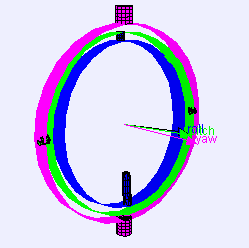

# Gimbal lock 万向节死锁

万向节死锁是三维、三个万向节机构中**一个自由度的损失**，当三个万向节中的两个的轴被驱动成平行配置时，就会发生这种情况，将系统“死锁”成退化的两轴旋转维空间。

## Gimbals 万向节

万向节是一个悬挂的环，因此它可以绕轴旋转。 万向节通常嵌套在另一个中，以适应围绕多个轴的旋转。

数学中的一些坐标系表现得好像有用于测量角度的真实万向节，特别是欧拉角。

对于三个或更少的嵌套万向节的情况，由于覆盖空间的特性（如下所述），在系统中的某些点不可避免地会发生万向节死锁。

具有 3 个旋转轴的万向节。 一组三个安装在一起的万向节允许三个自由度：滚动、俯仰和偏航。 当两个万向节绕同一轴旋转时，系统失去一个自由度。

>- Normal situation: the three gimbals are independent  
正常情况：三个万向节独立

>- Gimbal lock: two out of the three gimbals are in the same plane, one degree of freedom is lost  
万向节死锁：三个万向节中有两个在同一平面，失去一个自由度

## Solutions 解决方案

这个问题可以通过使用第四个万向节来克服，或者完全避免使用万向节，使用四元数方法代替。

>- Industrial robot operating in a foundry.  
在铸造厂工作的工业机器人。

In robotics, gimbal lock is commonly referred to as "wrist flip", due to the use of a "triple-roll wrist" in robotic arms, where three axes of the wrist, controlling yaw, pitch, and roll, all pass through a common point.

在机器人技术中，万向节死锁通常被称为“手腕翻转”，因为在机械臂中使用了“三滚腕”，其中手腕的三个轴，控制偏航，俯仰和滚动，都通过一个共同点。

An example of a wrist flip, also called a wrist singularity, is when the path through which the robot is traveling causes the first and third axes of the robot's wrist to line up. The second wrist axis then attempts to spin 180° in zero time to maintain the orientation of the end effector. The result of a singularity can be quite dramatic and can have adverse effects on the robot arm, the end effector, and the process.

手腕翻转的一个例子，也称为手腕奇点，是当机器人行进的路径导致机器人手腕的第一轴和第三轴对齐时。 然后，第二腕轴尝试在零时间内旋转 180°，以保持末端执行器的方向。 奇点的结果可能非常显着，并且可能对机器人手臂、末端执行器和过程产生不利影响。

The importance of avoiding singularities in robotics has led the American National Standard for Industrial Robots and Robot Systems – Safety Requirements to define it as "a condition caused by the collinear alignment of two or more robot axes resulting in unpredictable robot motion and velocities".[7]

避免机器人技术中的奇异性的重要性导致美国工业机器人和机器人系统国家标准 - 安全要求将其定义为“由两个或多个机器人轴共线对齐导致的机器人运动和速度不可预测的情况”。 7]

A rotation in 3D space can be represented numerically with matrices in several ways. One of these representations is:

3D 空间中的旋转可以通过多种方式用矩阵数字表示。 这些表示之一是：

$$
{\displaystyle {\begin{aligned}R&={\begin{bmatrix}1&0&0\\0&\cos \alpha &-\sin \alpha \\0&\sin \alpha &\cos \alpha \end{bmatrix}}{\begin{bmatrix}\cos \beta &0&\sin \beta \\0&1&0\\-\sin \beta &0&\cos \beta \end{bmatrix}}{\begin{bmatrix}\cos \gamma &-\sin \gamma &0\\\sin \gamma &\cos \gamma &0\\0&0&1\end{bmatrix}}\end{aligned}}}
$$

An example worth examining happens when ${\displaystyle \beta ={\tfrac {\pi }{2}}}$. Knowing that ${\displaystyle \cos {\tfrac {\pi }{2}}=0}$and ${\displaystyle \sin {\tfrac {\pi }{2}}=1}$, the above expression becomes equal to:

一个值得研究的例子发生在 ${\displaystyle \beta ={\tfrac {\pi }{2}}}$。 知道${\displaystyle \cos {\tfrac {\pi }{2}}=0}$和${\displaystyle \sin {\tfrac {\pi }{2}}=1}$，上述表达式变为 等于：

$$
{\displaystyle {\begin{aligned}R&={\begin{bmatrix}1&0&0\\0&\cos \alpha &-\sin \alpha \\0&\sin \alpha &\cos \alpha \end{bmatrix}}{\begin{bmatrix}0&0&1\\0&1&0\\-1&0&0\end{bmatrix}}{\begin{bmatrix}\cos \gamma &-\sin \gamma &0\\\sin \gamma &\cos \gamma &0\\0&0&1\end{bmatrix}}\end{aligned}}}
$$

Carrying out matrix multiplication:

执行矩阵乘法：

$$
{\displaystyle {\begin{aligned}R&={\begin{bmatrix}0&0&1\\\sin \alpha &\cos \alpha &0\\-\cos \alpha &\sin \alpha &0\end{bmatrix}}{\begin{bmatrix}\cos \gamma &-\sin \gamma &0\\\sin \gamma &\cos \gamma &0\\0&0&1\end{bmatrix}}&={\begin{bmatrix}0&0&1\\\sin \alpha \cos \gamma +\cos \alpha \sin \gamma &-\sin \alpha \sin \gamma +\cos \alpha \cos \gamma &0\\-\cos \alpha \cos \gamma +\sin \alpha \sin \gamma &\cos \alpha \sin \gamma +\sin \alpha \cos \gamma &0\end{bmatrix}}\end{aligned}}}
$$

And finally using the trigonometry formulas:

最后使用三角公式：

$$
{\displaystyle {\begin{aligned}R&={\begin{bmatrix}0&0&1\\\sin(\alpha +\gamma )&\cos(\alpha +\gamma )&0\\-\cos(\alpha +\gamma )&\sin(\alpha +\gamma )&0\end{bmatrix}}\end{aligned}}}
$$

Changing the values of ${\displaystyle \alpha }$ and ${\displaystyle \gamma }$  in the above matrix has the same effects: the rotation angle ${\displaystyle \alpha +\gamma }$  changes, but the rotation axis remains in the ${\displaystyle Z}$ direction: the last column and the first row in the matrix won't change. The only solution for ${\displaystyle \alpha }$  and ${\displaystyle \gamma }$ to recover different roles is to change ${\displaystyle \beta }$ .

改变上述矩阵中${\displaystyle \alpha }$和${\displaystyle \gamma }$的值具有相同的效果：旋转角度${\displaystyle \alpha +\gamma }$改变了，但是旋转轴 保持在 ${\displaystyle Z}$ 方向：矩阵中的最后一列和第一行不会改变。 ${\displaystyle \alpha }$ 和 ${\displaystyle \gamma }$ 恢复不同角色的唯一解决方案是更改 ${\displaystyle \beta }$ 。

It is possible to imagine an airplane rotated by the above-mentioned Euler angles using the X-Y-Z convention. In this case, the first angle - ${\displaystyle \alpha }$  is the pitch. Yaw is then set to ${\displaystyle {\tfrac {\pi }{2}}}$ and the final rotation - by ${\displaystyle \gamma }$  - is again the airplane's pitch. Because of gimbal lock, it has lost one of the degrees of freedom - in this case the ability to roll.

可以想象一架飞机使用 X-Y-Z 约定以上述欧拉角旋转。 在这种情况下，第一个角度 - ${\displaystyle \alpha }$ 是音高。 然后将偏航设置为 ${\displaystyle {\tfrac {\pi }{2}}}$，最后的旋转 - 通过 ${\displaystyle \gamma }$ - 再次是飞机的俯仰角。 由于万向节死锁，它失去了一个自由度——在这种情况下，它失去了滚动的能力。

It is also possible to choose another convention for representing a rotation with a matrix using Euler angles than the X-Y-Z convention above, and also choose other variation intervals for the angles, but in the end there is always at least one value for which a degree of freedom is lost.

除了上面的 X-Y-Z 约定，还可以选择使用欧拉角的矩阵表示旋转的另一种约定，也可以为角度选择其他变化区间，但最终总是至少有一个值的度数失去了自由。

The gimbal lock problem does not make Euler angles "invalid" (they always serve as a well-defined coordinate system), but it makes them unsuited for some practical applications.

万向节死锁问题不会使欧拉角“无效”（它们始终用作定义明确的坐标系），但它使它们不适合某些实际应用。

The cause of gimbal lock is the representation of orientation in calculations as three axial rotations based on Euler angles. A potential solution therefore is to represent the orientation in some other way. This could be as a rotation matrix, a quaternion (see quaternions and spatial rotation), or a similar orientation representation that treats the orientation as a value rather than three separate and related values. Given such a representation, the user stores the orientation as a value. To quantify angular changes produced by a transformation, the orientation change is expressed as a delta angle/axis rotation. The resulting orientation must be re-normalized to prevent the accumulation of floating-point error in successive transformations. For matrices, re-normalizing the result requires converting the matrix into its nearest orthonormal representation. For quaternions, re-normalization requires performing quaternion normalization.

万向节死锁的原因是计算中的方向表示为基于欧拉角的三个轴向旋转。 因此，一个潜在的解决方案是以其他方式表示方向。 这可以是旋转矩阵、四元数（参见四元数和空间旋转）或类似的方向表示，将方向视为一个值，而不是三个单独的相关值。 给定这样的表示，用户将方向存储为一个值。 为了量化变换产生的角度变化，方向变化表示为增量角度/轴旋转。 生成的方向必须重新归一化，以防止在连续转换中累积浮点误差。 对于矩阵，重新归一化结果需要将矩阵转换为其最接近的正交表示。 对于四元数，重新归一化需要执行四元数归一化。

Charts on SO(3)

Flight dynamics

Grid north (equivalent navigational problem on polar expeditions)

Inertial navigation system

Motion planning

Quaternions and spatial rotation