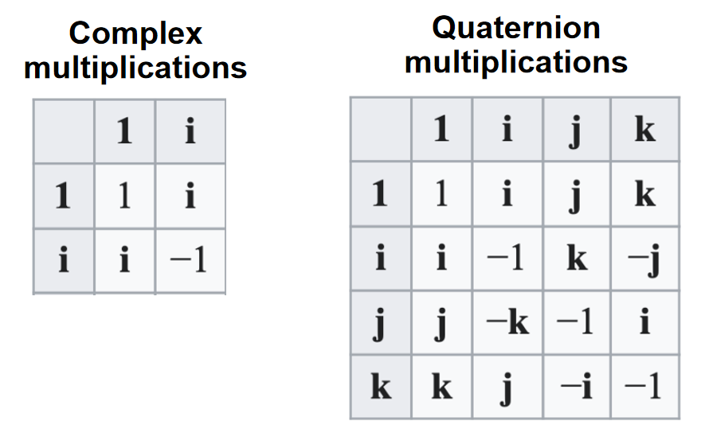
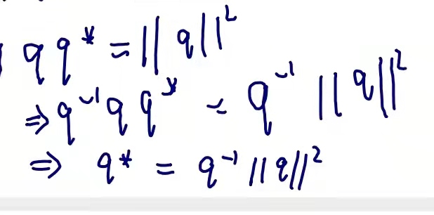
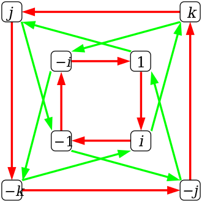
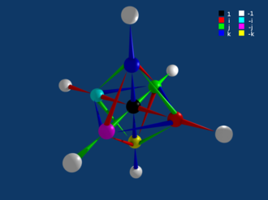
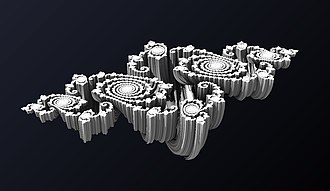
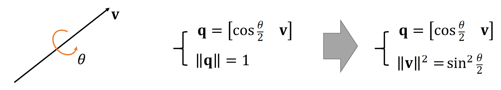

# Quaternion  四元数

   

在数学中，四元数系统扩展了复数。 四元数由爱尔兰数学家威廉·罗文·Hamilton于 1843 年[1][2] 首次描述，并应用于三维空间的力学。 Hamilton将四元数定义为三维空间中两条有向线的商，[3] 或者等效地，定义为两个向量的商。 [4] 四元数的乘法是不可交换的。

> &#x1F4CC;  
**两个向量的商**：最初引入四元数是为了定义向量的除法

四元数一般用以下形式表示

$$
{\displaystyle a+b\ \mathbf {i} +c\ \mathbf {j} +d\ \mathbf {k} }
$$

其中 a、b、c 和 d 是实数； i, j, k 是基本四元数。

四元数用于纯数学，但在应用数学中也有实际用途，特别是用于涉及三维旋转的计算，例如三维计算机图形学、计算机视觉和晶体纹理分析。 [5] 它们可以与其他旋转方法一起使用，例如欧拉角和旋转矩阵，或者作为它们的替代方法，具体取决于应用程序。

# 定义

四元数的表达形式为

$$
{\displaystyle a+b\,\mathbf {i} +c\,\mathbf {j} +d\,\mathbf {k} \ ,}
$$

其中 a、b、c、d 是实数，i、j、k 是可以解释为指向三个空间轴的单位向量的符号。 在实际应用中，如果a、b、c、d之一为0，则省略对应项； 如果a、b、c、d都为零，则该四元数是零四元数，记为0； 如果 b、c、d 中的一个等于 1，则相应的项只写为 i、j 或 k。

或

$$
\mathbf{q}  = \begin{bmatrix} \mathbf{s}   &\mathbf{v} \end{bmatrix}
$$

Hamilton 将四元数 \\({\displaystyle q=a+b\,\mathbf {i} +c\,\mathbf {j} +d\,\mathbf {k} }\\) 描述为由一个标量部分和 向量部分。 四元数 \\({\displaystyle b\,\mathbf {i} +c\,\mathbf {j} +d\,\mathbf {k} }\\) 称为 q 的向量部分（有时是虚部），并且 a 是 q 的标量部分（有时是实部）。 等于其实部（即其向量部分为零）的四元数称为标量或实数四元数，并用相应的实数标识。 也就是说，实数嵌入在四元数中。 （更准确地说，实数域同构于四元数的一个子集。复数域也同构于三个四元数子集。）[24] 等于其向量部分的四元数称为向量四元数。

四元数集在实数上构成一个 4 维向量空间，以\\({\displaystyle \left\{1,\mathbf {i} ,\mathbf {j} ,\mathbf {k} \right\} }{\displaystyle \left\{1,\mathbf {i} ,\mathbf {j} ,\mathbf {k} \right\}}\\) 作为基，使用逐分量的加法

> &#x1F4CC;  
逐分量加法：依次对每前分量前的系数做加法操作

$$
{\displaystyle (a_{1}+b_{1}\,\mathbf {i} +c_{1}\,\mathbf {j} +d_{1}\,\mathbf {k} )+(a_{2}+b_{2}\,\mathbf {i} +c_{2}\,\mathbf {j} +d_{2}\,\mathbf {k} )=(a_{1}+a_{2})+(b_{1}+b_{2})\,\mathbf {i} +(c_{1}+c_{2})\,\mathbf {j} +(d_{1}+d_{2})\,\mathbf {k} \,,}
$$

和分量标量乘法

> &#x1F4CC;  
分量标量乘：依次让每个分量的系数与一个标量相乘。  
标量即0维数字

$$
{\displaystyle \lambda (a+b\,\mathbf {i} +c\,\mathbf {j} +d\,\mathbf {k} )=\lambda a+(\lambda b)\,\mathbf {i} +(\lambda c)\,\mathbf {j} +(\lambda d)\,\mathbf {k} .}
$$

可以通过以下方式在四元数上定义乘法群结构，称为 Hamilton 积，用juxtaposition表示：

- 实四元数 1 是单位元。

- 实四元数与所有其他四元数满足交换律，即对于每一个四元数 q 和每一个实四元数 a，aq = qa。 在代数术语中，这就是说实四元数域是这个四元数代数的中心。

> &#x1F50E;  
下文3.2会解释“代数的中心”概念

- The product is first given for the basis elements (see next subsection), and then extended to all quaternions by using the distributive property and the center property of the real quaternions. The Hamilton product is not commutative, but is associative, thus the quaternions form an associative algebra over the real numbers.  
首先给出基元素的乘积（见下一小节），然后利用实四元数的分布性质和中心性质扩展到所有四元数。 Hamilton积是不可交换的，是结合的，因此四元数在实数上形成结合代数。

> &#x1F4CC; **basis element Vs identity element**
> basis element：基元素，即i, j, k，来源于四元数的定义  
> identity element：1，特点是任何数与它相乘都等于它自己，来源于乘法定义  
> &#x2753;
> [?] 实四元数的分布性质
> &#x1F4CC;
> 实四元数的中心性质：aq = qa，见本页面3.2节
> 不可交换：q2q1 != q1q2
> 结合：(q1q2)q3 = q1(q2q3)
> 在实数上形成结合代数：在其实数域上满足交换律和结合律

- Additionally, every nonzero quaternion has an inverse with respect to the Hamilton product:  
此外，根据Hamilton 积的定义每个非零四元数都有逆：

$$
{\displaystyle (a+b\,\mathbf {i} +c\,\mathbf {j} +d\,\mathbf {k} )^{-1}={\frac {1}{a^{2}+b^{2}+c^{2}+d^{2}}}\,(a-b\,\mathbf {i} -c\,\mathbf {j} -d\,\mathbf {k} ).}
$$

Thus the quaternions form a division algebra.

因此，四元数形成一个除法代数。

## 基本元素的乘法

乘法表（非交换性用彩色方块强调）

|×|1|i|j|k|
|---|---|---|---|---|
|1|1|i|j|k|
|i|i|−1|k|−j|
|j|j|−k|−1|i|
|k|k|j|−i|−1|

由于1是乘法单位，基元素 i、j 和 k 与 1 的乘法定义如下，即

$$
{\displaystyle \mathbf {i} \,1=1\,\mathbf {i} =\mathbf {i} ,\qquad \mathbf {j} \,1=1\,\mathbf {j} =\mathbf {j} ,\qquad \mathbf {k} \,1=1\,\mathbf {k} =\mathbf {k} \,.}
$$

The products of basis elements are derived from the product rules for \\({\displaystyle \mathbf {i} }\\) and \\({\displaystyle \mathbf {j}}\\)

基元素的乘积源自 \\({\displaystyle \mathbf {i} }\\) 和 \\({\displaystyle \mathbf {j} }\\) 的乘积规则：

$$
{\displaystyle \mathbf {i} ^{2}=\mathbf {j} ^{2}=-1}
$$

and 并且

$$
{\displaystyle {\begin{aligned}\mathbf {i\,j} &=\mathbf {k} \,,\quad &\mathbf {j\,i} &=-\mathbf {k} \,.\end{aligned}}}
$$

> &#x1F4CC;  
类似3D中的叉积

The remaining product rules are obtained by multiplying both sides of these latter rules by \\({\displaystyle \mathbf {j} }\\) or \\({\displaystyle \mathbf {i} }\\) from the left or right and applying associativity which gives

剩下的乘积规则是通过将上面这些规则的两边从左边或右边乘以 \\({\displaystyle \mathbf {j} }\\) 或 \\({\displaystyle \mathbf {i} }\\) 并应用关联性来获得的：

$$
{\displaystyle {\begin{aligned}\mathbf {j\,k} &=\mathbf {i} \,,\quad &\mathbf {k\,j} &=-\mathbf {i} \,,\\\mathbf {k\,i} &=\mathbf {j} \,,\quad &\mathbf {i\,k} &=-\mathbf {j} \,,\\\mathbf {i\,j\,k} &=-1\,,\quad &\mathbf {k} ^{2}&=-1\,\\\end{aligned}}}
$$

## Hamilton product  Hamilton积

For two elements a1 + b1i + c1j + d1k and a2 + b2i + c2j + d2k, their product, called the Hamilton product (a1 + b1i + c1j + d1k) (a2 + b2i + c2j + d2k), is determined by the products of the basis elements and the distributive law. The distributive law makes it possible to expand the product so that it is a sum of products of basis elements. This gives the following expression:

对于两个元素 a1 + b1i + c1j + d1k 和 a2 + b2i + c2j + d2k，它们的乘积，称为 Hamilton 乘积 (a1 + b1i + c1j + d1k) (a2 + b2i + c2j + d2k)，由基本要素的乘积和分配律推导出。 分配律使得能够扩展乘法规则，使其成为基本要素的乘积之和。 得出了以下表达式：

$$
{\displaystyle {\begin{alignedat}{4}&a_{1}a_{2}&&+a_{1}b_{2}\mathbf {i} &&+a_{1}c_{2}\mathbf {j} &&+a_{1}d_{2}\mathbf {k} \\{}+{}&b_{1}a_{2}\mathbf {i} &&+b_{1}b_{2}\mathbf {i} ^{2}&&+b_{1}c_{2}\mathbf {ij} &&+b_{1}d_{2}\mathbf {ik} \\{}+{}&c_{1}a_{2}\mathbf {j} &&+c_{1}b_{2}\mathbf {ji} &&+c_{1}c_{2}\mathbf {j} ^{2}&&+c_{1}d_{2}\mathbf {jk} \\{}+{}&d_{1}a_{2}\mathbf {k} &&+d_{1}b_{2}\mathbf {ki} &&+d_{1}c_{2}\mathbf {kj} &&+d_{1}d_{2}\mathbf {k} ^{2}\end{alignedat}}}
$$

Now the basis elements can be multiplied using the rules given above to get:[7]

现在可以使用上面给出的规则将基本元素相乘得到：[7]

$$
{\displaystyle {\begin{alignedat}{4}&a_{1}a_{2}&&-b_{1}b_{2}&&-c_{1}c_{2}&&-d_{1}d_{2}\\{}+{}(&a_{1}b_{2}&&+b_{1}a_{2}&&+c_{1}d_{2}&&-d_{1}c_{2})\mathbf {i} \\{}+{}(&a_{1}c_{2}&&-b_{1}d_{2}&&+c_{1}a_{2}&&+d_{1}b_{2})\mathbf {j} \\{}+{}(&a_{1}d_{2}&&+b_{1}c_{2}&&-c_{1}b_{2}&&+d_{1}a_{2})\mathbf {k} \end{alignedat}}}
$$

The product of two rotation quaternions[25] will be equivalent to the rotation a2 + b2i + c2j + d2k followed by the rotation a1 + b1i + c1j + d1k.

两个旋转四元数[25] 的乘积将等价于旋转 a2 + b2i + c2j + d2k，然后是旋转 a1 + b1i + c1j + d1k。

> &#x1F4CC;  
$q_1\times q_2$ 等价于先旋转$q_2$再旋转$q_1$

> &#x2753;  
q的旋转怎么定义？

## 标量部分和矢量部分

A quaternion of the form a + 0 i + 0 j + 0 k, where a is a real number, is called scalar, and a quaternion of the form 0 + b i + c j + d k, where b, c, and d are real numbers, and at least one of b, c or d is nonzero, is called a vector quaternion. If a + b i + c j + d k is any quaternion, then a is called its scalar part and b i + c j + d k is called its vector part. Even though every quaternion can be viewed as a vector in a four-dimensional vector space, it is common to refer to the vector part as vectors in three-dimensional space. With this convention, a vector is the same as an element of the vector space \\({\displaystyle \mathbb {R} ^{3}.}\\)[b]

a + 0 i + 0 j + 0 k 形式的四元数，其中 a 是实数，称为标量，0 + bi + cj + dk 形式的四元数，其中 b、c 和 d 是实数，且 b、c 或 d 中至少有一个非零，称为向量四元数。 如果 a + b i + c j + d k 是任何四元数，则 a 称为其标量部分，而 b i + c j + d k 称为其矢量部分。 尽管每个四元数都可以被视为四维向量空间中的向量，但通常**将向量部分称为三维空间中的向量**。 按照这种约定，向量与向量空间中的元素相同 \\({\displaystyle \mathbb {R} ^{3}.}\\)[b]

Hamilton also called vector quaternions right quaternions[27][28] and real numbers (considered as quaternions with zero vector part) scalar quaternions.

Hamilton还将向量四元数称为右四元数[27][28] 将实数（被认为是具有零向量部分的四元数）称为标量四元数。

If a quaternion is divided up into a scalar part and a vector part, that is,

如果将一个四元数分为标量部分和向量部分，即

$$
{\displaystyle \mathbf {q} =(r,\ {\vec {v}}),~~\mathbf {q} \in \mathbb {H} ,~~r\in \mathbb {R} ,~~{\vec {v}}\in \mathbb {R} ^{3},}
$$

then the formulas for addition and multiplication are

那么加法和乘法的公式是

$$
{\displaystyle (r_{1},\ {\vec {v}}_{1})+(r_{2},\ {\vec {v}}_{2})=(r_{1}+r_{2},\ {\vec {v}}_{1}+{\vec {v}}_{2}),}
{\displaystyle (r_{1},\ {\vec {v}}_{1})(r_{2},\ {\vec {v}}_{2})=(r_{1}r_{2}-{\vec {v}}_{1}\cdot {\vec {v}}_{2},\ r_{1}{\vec {v}}_{2}+r_{2}{\vec {v}}_{1}+{\vec {v}}_{1}\times {\vec {v}}_{2}),}
$$

where "\\({\displaystyle \cdot }\\) " and "\\({\displaystyle \times }\\) " denote respectively the dot product and the cross product.

其中“\\({\displaystyle \cdot }\\) ”和“\\({\displaystyle \times }\\) ”分别表示点积和叉积。

# Conjugation, the norm, and reciprocal  共轭、范数和倒数

Conjugation of quaternions is analogous to conjugation of complex numbers and to transposition (also known as reversal) of elements of Clifford algebras. To define it, let \\({\displaystyle q=a+b\,\mathbf {i} +c\,\mathbf {j} +d\,\mathbf {k} }\\) be a quaternion. The conjugate of q is the quaternion \\({\displaystyle q^{*}=a-b\,\mathbf {i} -c\,\mathbf {j} -d\,\mathbf {k} }.$$ It is denoted by q∗, qt, \\({\displaystyle {\tilde {q}}}\\), or q.[7] Conjugation is an involution, meaning that it is its own inverse, so conjugating an element twice returns the original element. The conjugate of a product of two quaternions is the product of the conjugates in the reverse order. That is, if p and q are quaternions, then (pq)∗ = q∗p∗, not p∗q∗.

四元数的共轭类似于复数的共轭和 Clifford 代数元素的转置（也称为反转）。 为了定义它，令 \\({\displaystyle q=a+b\,\mathbf {i} +c\,\mathbf {j} +d\,\mathbf {k} }\\) 是一个四元数。 q 的共轭是四元数 \\({\displaystyle q^{*}=a-b\,\mathbf {i} -c\,\mathbf {j} -d\,\mathbf {k} }.$$ 它可以用 q∗、qt、\\({\displaystyle {\tilde {q}}}\\) 或 q 表示。[7] 共轭是对合，这意味着它是它自己的逆，所以共轭一个元素两次返回原始元素。  

> &#x1F4CC;
> 这里的逆是指共轭的这个操作是可逆的，不是指前面定义中提到的\\(q^{-1}\\)

两个四元数乘积的共轭是共轭逆序的乘积。 也就是说，如果 p 和 q 是四元数，那么 (pq)∗ = q∗p∗，而不是 p∗q∗。

> &#x1F50E;  
**对合**：involution

The conjugation of a quaternion, in stark contrast to the complex setting, can be expressed with multiplication and addition of quaternions:

与复数不同，四元数的共轭，可以用四元数的乘法和加法来表示：

$$
{\displaystyle q^{*}=-{\frac {1}{2}}(q+\,\mathbf {i} \,q\,\mathbf {i} +\,\mathbf {j} \,q\,\mathbf {j} +\,\mathbf {k} \,q\,\mathbf {k} )~.}
$$

> &#x1F4CC;  
$$
{\displaystyle {\begin{aligned} \mathbf {i}q\mathbf {i} &= \mathbf {i} \cdot (a + b\mathbf {i} + c\mathbf {j} + d\mathbf {k}) \cdot \mathbf {i} \\
&= (a\mathbf {i} - b + c\mathbf {k} -d\mathbf {j}) \cdot \mathbf {i} \\
&= -a - b\mathbf {i} + c\mathbf {j} + d\mathbf {k}\end{aligned}}}
$$
同理  
$$
{\displaystyle
{\begin{aligned}
\mathbf {j}q\mathbf {j} &= - a + b\mathbf {i} - c\mathbf {j} + d\mathbf {k} \\
\mathbf {k}q\mathbf {k} &= - a + b\mathbf {i} + c\mathbf {j} - d\mathbf {k} \\
\end{aligned}}}
$$

Conjugation can be used to extract the scalar and vector parts of a quaternion. The scalar part of p is 
1
/
2
(p + p∗) , and the vector part of p is 
1
/
2
(p − p∗) .

共轭可用于提取四元数的标量和向量部分。 p 的标量部分是
1
/
2
(p + p∗) ，而 p 的向量部分是
1
/
2
(p - p*) 。

The square root of the product of a quaternion with its conjugate is called its norm and is denoted ||q|| (Hamilton called this quantity the tensor of q, but this conflicts with the modern meaning of "tensor"). In formulas, this is expressed as follows:

四元数与其共轭的乘积的平方根称为其范数，记为 ||q|| （Hamilton称这个量为 q 的张量，但这与“张量”的现代含义相冲突）。 在公式中，这表示如下：

$$
{\displaystyle \lVert q\rVert ={\sqrt {\,qq^{*}~}}={\sqrt {\,q^{*}q~}}={\sqrt {\,a^{2}+b^{2}+c^{2}+d^{2}~}}}
$$

This is always a non-negative real number, and it is the same as the Euclidean norm on \\({\displaystyle \mathbb {H} }\\)  considered as the vector space \\({\displaystyle \mathbb {R} ^{4}}\\). Multiplying a quaternion by a real number scales its norm by the absolute value of the number. That is, if α is real, then

这始终是一个非负实数，它与被视为向量空间 \\({\displaystyle \mathbb {H} }\\)  的 \\({\displaystyle \mathbb {R} ^{4}}\\) 上的欧几里得范数相同。 将一个四元数乘以一个实数会按该数的绝对值缩放其范数。 也就是说，如果 α 是实数，那么

\\({\displaystyle \lVert \alpha q\rVert =\left|\alpha \right|\,\lVert q\rVert ~.}\\)

This is a special case of the fact that the norm is multiplicative, meaning that

范数可以相乘是四元数的一个特例，这意味着

$$
{\displaystyle \lVert pq\rVert =\lVert p\rVert \,\lVert q\rVert }
$$

for any two quaternions p and q. Multiplicativity is a consequence of the formula for the conjugate of a product. Alternatively it follows from the identity

> &#x2753;  
> [?] identity怎么理解？

对于任何两个四元数 p 和 q。 乘法性是乘积共轭公式的结果。 或者它来自身份

> &#x2753;  
[?] 这一段没看懂？为什么行列式是这样定义的？

$$
{\displaystyle \det {\Bigl (}{\begin{array}{cc}a+ib&id+c\\id-c&a-ib\end{array}}{\Bigr )}=a^{2}+b^{2}+c^{2}+d^{2},}
$$

(where i denotes the usual imaginary unit) and hence from the multiplicative property of determinants of square matrices.

（其中 i 表示通常的虚数单位），因此来自方阵行列式的乘法性质。

> &#x2753; 
> [?] 方阵行列式的乘法性质?

This norm makes it possible to define the distance d(p, q) between p and q as the norm of their difference:

通过范数可以将 p 和 q 之间的距离 d(p, q) 定义为它们的差异的范数：

$$
{\displaystyle d(p,q)=\lVert p-q\rVert ~.}
$$

This makes \\({\displaystyle \mathbb {H} }\\)  a metric space. Addition and multiplication are continuous in regard to the associated metric topology. This follows with exacly the same proof as for the real numbers \\({\displaystyle \mathbb {R} }\\)  from the fact that \\({\displaystyle \mathbb {H} }\\) is a normed algebra.

这使得 \\({\displaystyle \mathbb {H} }\\) 成为一个度量空间。 关于相关的度量拓扑，加法和乘法是连续的。 这与实数 \\({\displaystyle \mathbb {R} }\\) 的证明完全相同，因为 \\({\displaystyle \mathbb {H} }\\) 是一个范数代数。

## 单位四元数

A unit quaternion is a quaternion of norm one. Dividing a non-zero quaternion q by its norm produces a unit quaternion Uq called the versor of q:

单位四元数是范数为一的四元数。 将非零四元数 q 除以其范数产生一个单位四元数 Uq，称为 q 的 versor：

$$
{\displaystyle \mathbf {U} q={\frac {q}{\lVert q\rVert }}.}
$$

Every quaternion has a polar decomposition \\({\displaystyle q=\lVert q\rVert \cdot \mathbf {U} q}.$$

每个四元数都有一个极分解 \\({\displaystyle q=\lVert q\rVert \cdot \mathbf {U} q}\\)

> &#x1F4CC; 分解为长度和方向

Using conjugation and the norm makes it possible to define the reciprocal of a non-zero quaternion. The product of a quaternion with its reciprocal should equal 1, and the considerations above imply that the product of \\({\displaystyle q} $$and \\({\displaystyle q^{*}/\left\Vert q\right\|^{2}}\\) is 1 (for either order of multiplication). So the reciprocal of q is defined to be

使用共轭和范数可以定义非零四元数的倒数。 四元数与其倒数的乘积应该等于 1，上述考虑意味着 \\({\displaystyle q} $$和 \\({\displaystyle q^{*}/\left\Vert q\right\|^{2}}\\)的乘积 为 1（对于任一乘法顺序）。 所以q的倒数定义为

> &#x1F4CC;  
**对于任一乘法顺序**：$||q||^2$是实数，因此乘法顺序可交换

$$
{\displaystyle q^{-1}={\frac {q^{*}}{\lVert q\rVert ^{2}}}.}.
$$

> &#x1F4CC;  
> 
> &#x2753;
\\(qq = ||q||^2\\)，是不是也可以推出\\(q^{-1}=\frac{q}{||q||^2}\\)，那\\(q^{-1}\\)的定义就有歧义了？  

This makes it possible to divide two quaternions p and q in two different ways (when q is non-zero). That is, their quotient can be either p q−1 or q−1p ; in general, those products are different, depending on the order of multiplication, except for the special case that p and q are scalar multiples of each other (which includes the case where p = 0). Hence, the notation 
p
/
q
 is ambiguous because it does not specify whether q divides on the left or the right (whether  q−1 multiplies p on its left or its right).

 这使得可以以两种不同的方式做两个四元数 p 和 q（当 q 非零时）的除法。 也就是说，它们的商可以是 p q−1 或 q−1p ； 一般来说，这些乘积是不同的，具体取决于乘法的顺序，除了 p 和 q 是彼此的标量倍数的特殊情况（包括 p = 0 的情况）。 因此，符号
p
/
q
  是模棱两可的，因为它没有指定 q 是在左除还是右除（ q−1 是从左边还是右边乘以 p）。

# 代数性质

> &#x1F446; Cayley graph of Q8. The red arrows represent multiplication on the right by i, and the green arrows represent multiplication on the right by j.  
Q8的凯莱图。 红色箭头代表右边乘以 i，绿色箭头代表右边乘以 j。

The set \\({\displaystyle \mathbb {H} }\\)  of all quaternions is a vector space over the real numbers with dimension 4.[c] Multiplication of quaternions is associative and distributes over vector addition, but with the exception of the scalar subset, it is not commutative. Therefore, the quaternions \\({\displaystyle \mathbb {H} }\\)  are a non-commutative, associative algebra over the real numbers. Even though \\({\displaystyle \mathbb {H} }\\)  contains copies of the complex numbers, it is not an associative algebra over the complex numbers.

所有四元数的集合 \\({\displaystyle \mathbb {H} }\\) 是维数为 4 的实数上的向量空间。[c] 四元数满足乘法结合律和加法分配律，不满足交换律（除了其标量子集可交换—）。 因此，四元数 \\({\displaystyle \mathbb {H} }\\) 是实数上的非交换结合代数。 尽管 \\({\displaystyle \mathbb {H} }\\) 包含复数的副本，但它不是复数上的结合代数。

> &#x2753;
四元数与复数的计算不满足结合律？

Because it is possible to divide quaternions, they form a division algebra. This is a structure similar to a field except for the non-commutativity of multiplication. Finite-dimensional associative division algebras over the real numbers are very rare. The Frobenius theorem states that there are exactly three: \\({\displaystyle \mathbb {R} }\\) , \\({\displaystyle \mathbb {C} }\\) , and \\({\displaystyle \mathbb {H} }\\) . The norm makes the quaternions into a normed algebra, and normed division algebras over the real numbers are also very rare: Hurwitz's theorem says that there are only four: \\({\displaystyle \mathbb {R} }\\) , \\({\displaystyle \mathbb {C} }\\) , \\({\displaystyle \mathbb {H} }\\) , and \\({\displaystyle \mathbb {O} }\\)  (the octonions). The quaternions are also an example of a composition algebra and of a unital Banach algebra.

因为四元数可以相除，所以它们形成了一个除法代数。 这是一个类似于域的结构，除了乘法的不可交换性。 实数上的有限维关联除法代数非常罕见。 Frobenius 定理指出正好有三个：\\({\displaystyle \mathbb {R} }\\) 、\\({\displaystyle \mathbb {C} }\\) 和 \\({\displaystyle \mathbb {H} } $$ 。 范数使四元数成为范数代数，实数上的范数除法也非常罕见：赫尔维茨定理说只有四个： \\({\displaystyle \mathbb {R} }\\) , \\({\ displaystyle \mathbb {C} }\\) 、 \\({\displaystyle \mathbb {H} }\\) 和 \\({\displaystyle \mathbb {O} }\\) （八元数）。 四元数也是合成代数和单位巴拿赫代数的一个例子。

Three-dimensional graph of Q8. Red, green and blue arrows represent multiplication by i, j, and k, respectively. Multiplication by negative numbers are omitted for clarity.

Q8的三维图。 红色、绿色和蓝色箭头分别表示乘以 i、j 和 k。 为清楚起见，省略了乘以负数。

Because the product of any two basis vectors is plus or minus another basis vector, the set {±1, ±i, ±j, ±k} forms a group under multiplication. This non-abelian group is called the quaternion group and is denoted Q8.[29] The real group ring of Q8 is a ring \\({\displaystyle \mathbb {R} [\mathrm {Q} _{8}]}\\) which is also an eight-dimensional vector space over \\({\displaystyle \mathbb {R} .}\\). It has one basis vector for each element of \\({\displaystyle \mathrm {Q} _{8}.}\\) The quaternions are isomorphic to the quotient ring of \\({\displaystyle \mathbb {R} [\mathrm {Q} _{8}]}\\) by the ideal generated by the elements 1 + (−1), i + (−i), j + (−j), and k + (−k). Here the first term in each of the differences is one of the basis elements 1, i, j, and k, and the second term is one of basis elements −1, −i, −j, and −k, not the additive inverses of 1, i, j, and k.

因为任何两个基向量的乘积是正负另一个基向量，所以集合{±1，±i，±j，±k}在乘法下形成一个群。 这个非阿贝尔群称为四元数群，记为 Q8。 [29] Q8 的实群环是一个环 \\({\displaystyle \mathbb {R} [\mathrm {Q} _{8}]}\\) 也是 \\({\displaystyle \mathbb 上的一个八维向量空间 {R} .}\\)。 \\({\displaystyle \mathrm {Q} _{8}.}\\) 的每个元素都有一个基向量。四元数同构于 \\({\displaystyle \mathbb {R} [\mathrm { Q} _{8}]}\\) 由元素 1 + (−1)、i + (−i)、j + (−j) 和 k + (−k) 生成的理想。 这里每个差的第一项是基元素 1、i、j 和 k 之一，第二项是基元素 -1、-i、-j 和 -k 之一，而不是加法逆元 1、i、j 和 k。

# 四元数和空间几何

The vector part of a quaternion can be interpreted as a coordinate vector in \\({\displaystyle \mathbb {R} ^{3};}\\) therefore, the algebraic operations of the quaternions reflect the geometry of \\({\displaystyle \mathbb {R} ^{3}.}\\) Operations such as the vector dot and cross products can be defined in terms of quaternions, and this makes it possible to apply quaternion techniques wherever spatial vectors arise. A useful application of quaternions has been to interpolate the orientations of key-frames in computer graphics.[14]

四元数的向量部分可以解释为 \\({\displaystyle \mathbb {R} ^{3};}\\) 中的坐标向量，因此，四元数的代数运算反映了 \\({\displaystyle \mathbb {R} ^{3}.}\\) 可以根据四元数定义向量点和叉积等运算，这使得**在出现空间向量的任何地方都可以应用四元数技术**。 四元数的一个有用应用是在计算机图形学中插入关键帧的方向。 [14]

For the remainder of this section, i, j, and k will denote both the three imaginary[30] basis vectors of \\({\displaystyle \mathbb {H} }\\)  and a basis for \\({\displaystyle \mathbb {R} ^{3}.}\\) Replacing i by −i, j by −j, and k by −k sends a vector to its additive inverse, so the additive inverse of a vector is the same as its conjugate as a quaternion. For this reason, conjugation is sometimes called the spatial inverse.

对于本节的接下来部分，i、j 和 k 既表示 \\({\displaystyle \mathbb {H} }\\) 的三个虚数[30] 基向量，同时也表示 \\({\displaystyle \mathbb { R} ^{3}.}\\) 将 i 替换为 -i，j 替换为 -j，k 替换为 -k 就是向量的加法逆，因此向量的加法逆与它作为四元数的共轭相同 . 

> &#x2753;
> 为什么加法逆的实部不需要取反？

因此，共轭有时被称为空间逆。

For two vector quaternions p = b1i + c1j + d1k and q = b2i + c2j + d2k their dot product, by analogy to vectors in \\({\displaystyle \mathbb {R} ^{3},}\\) is

对于两个向量四元数 p = b1i + c1j + d1k 和 q = b2i + c2j + d2k 它们的点积，类似于 \\({\displaystyle \mathbb {R} ^{3},}\\) 中的向量点积

$$
{\displaystyle p\cdot q=b_{1}b_{2}+c_{1}c_{2}+d_{1}d_{2}~.}
$$

> &#x1F4CC;
> 向量四元数的点积是实数

It can also be expressed in a component-free manner as

它也可以用无分量的方式表示为

$$
{\displaystyle p\cdot q=\textstyle {\frac {1}{2}}(p^{*}q+q^{*}p)=\textstyle {\frac {1}{2}}(pq^{*}+qp^{*}).}
$$

> &#x1F4CC;
> 点积和乘法是两个不同的定义。  
> pq* 和 qp* 的标量相同，失量相反，用这种方式提取它们的标量部分

This is equal to the scalar parts of the products pq∗, qp∗, p∗q, and q∗p. Note that their vector parts are different.

这等于乘积 pq∗、qp∗、p∗q 和 q∗p 的标量部分。 请注意，它们的矢量部分是不同的。

The cross product of p and q relative to the orientation determined by the ordered basis i, j, and k is

p 和 q 的叉积方向由有序基 i、j 和 k 确定

$$
{\displaystyle p\times q=(c_{1}d_{2}-d_{1}c_{2})\mathbf {i} +(d_{1}b_{2}-b_{1}d_{2})\mathbf {j} +(b_{1}c_{2}-c_{1}b_{2})\mathbf {k} \,.}
$$

> &#x1F4CC;
> p和q是向量四元数，不考虑a

(Recall that the orientation is necessary to determine the sign.) This is equal to the vector part of the product pq (as quaternions), as well as the vector part of −q∗p∗. It also has the formula

（回想一下，方向是确定符号所必需的。）这等于乘积 pq（作为四元数）的向量部分，以及 -q∗p∗ 的向量部分。 它也有公式

$$
{\displaystyle p\times q=\textstyle {\tfrac {1}{2}}(pq-qp).}
$$

For the commutator, [p, q] = pq − qp, of two vector quaternions one obtains

对于交换子，[p, q] = pq - qp，得到

$$
{\displaystyle [p,q]=2p\times q.}
$$

In general, let p and q be quaternions and write

一般来说，设 p 和 q 是四元数，写作

$$
{\displaystyle p=p_{\text{s}}+p_{\text{v}},}
$$

$$
{\displaystyle q=q_{\text{s}}+q_{\text{v}},}
$$

where ps and qs are the scalar parts, and pv and qv are the vector parts of p and q. Then we have the formula

其中 ps 和 qs 是标量部分，pv 和 qv 是 p 和 q 的向量部分。 然后我们有公式

$$
{\displaystyle pq=(pq)_{\text{s}}+(pq)_{\text{v}}=(p_{\text{s}}q_{\text{s}}-p_{\text{v}}\cdot q_{\text{v}})+(p_{\text{s}}q_{\text{v}}+q_{\text{s}}p_{\text{v}}+p_{\text{v}}\times q_{\text{v}}).}
$$

> &#x1F4CC;
> \\(p_{\text{v}}\times q_{\text{v}}\\)不可交换

This shows that the noncommutativity of quaternion multiplication comes from the multiplication of vector quaternions. It also shows that two quaternions commute if and only if their vector parts are collinear. Hamilton[31] showed that this product computes the third vertex of a spherical triangle from two given vertices and their associated arc-lengths, which is also an algebra of points in Elliptic geometry.

这说明四元数乘法的不可交换性来自向量四元数的乘法。 它还表明，当且仅当它们的向量部分共线时，两个四元数可以交换。 Hamilton[31] 表明，该乘积从两个给定顶点及其相关的弧长计算球面三角形的第三个顶点，这也是椭圆几何中的点代数。

> &#x1F4CC;
> 给定的顶点：pv和qv  
> 相关的弧长：ps和qs

Unit quaternions can be identified with rotations in \\({\displaystyle \mathbb {R} ^{3}}\\) and were called versors by Hamilton.[31] Also see Quaternions and spatial rotation for more information about modeling three-dimensional rotations using quaternions.

单位四元数可以用 \\({\displaystyle \mathbb {R} ^{3}}\\) 中的旋转来识别，并被 Hamilton 称为 versors。 [31] 另请参阅四元数和空间旋转，了解有关使用四元数对三维旋转进行建模的更多信息。

# Functions of a quaternion variable  四元变量的函数

*Main article: Quaternionic analysis*

*主条目：四元离子分析*

> &#x1F446; The Julia sets and Mandelbrot sets can be extended to the Quaternions, but they must use cross sections to be rendered visually in 3 dimensions. This Julia set is cross sectioned at the x y plane.  
Julia 集和 Mandelbrot 集可以扩展到四元数，但它们必须使用横截面才能在 3 维视觉上呈现。 这个 Julia 集在 x y 平面上进行横截面。

Like functions of a complex variable, functions of a quaternion variable suggest useful physical models. For example, the original electric and magnetic fields described by Maxwell were functions of a quaternion variable. Examples of other functions include the extension of the Mandelbrot set and Julia sets into 4-dimensional space.[36]

与复变量的函数一样，四元数变量的函数提出了有用的物理模型。 例如，麦克斯韦描述的原始电场和磁场是四元数变量的函数。 其他函数的示例包括将 Mandelbrot 集和 Julia 集扩展到 4 维空间。 [36]

## Exponential, logarithm, and power functions  指数、对数和幂函数

Given a quaternion,

给定一个四元数，

$$
{\displaystyle q=a+b\mathbf {i} +c\mathbf {j} +d\mathbf {k} =a+\mathbf {v} }
$$

the exponential is computed as[37]

指数计算为[37]

$$
{\displaystyle \exp(q)=\sum _{n=0}^{\infty }{\frac {q^{n}}{n!}}=e^{a}\left(\cos \|\mathbf {v} \|+{\frac {\mathbf {v} }{\|\mathbf {v} \|}}\sin \|\mathbf {v} \|\right)~~}
$$

and the logarithm is[37]

对数是[37]

$$
{\displaystyle \ln(q)=\ln \|q\|+{\frac {\mathbf {v} }{\|\mathbf {v} \|}}\arccos {\frac {a}{\|q\|}}~~}
$$

It follows that the polar decomposition of a quaternion may be written

由此可见，四元数的极分解可以写成

$$
{\displaystyle q=\|q\|e^{ {\hat {n} }\varphi }=\|q\|\left(\cos(\varphi )+{\hat {n}}\sin(\varphi )\right),}
$$

where the angle \\({\displaystyle \varphi } [e]$$

其中角度 \\({\displaystyle \varphi } [e]$$

$$
{\displaystyle a=\|q\|\cos(\varphi )}
$$

and the unit vector \\({\displaystyle {\hat {n}}}\\) is defined by:

单位向量 \\({\displaystyle {\hat {n}}}\\) 定义为：

$$
{\displaystyle \mathbf {v} ={\hat {n}}\|\mathbf {v} \|={\hat {n}}\|q\|\sin(\varphi )\,.}
$$

Any unit quaternion may be expressed in polar form as:

任何单位四元数都可以用极性形式表示为：

$$
{\displaystyle q=\exp {({\hat {n}}\varphi )}}.
$$

The power of a quaternion raised to an arbitrary (real) exponent x is given by:

提高到任意（实）指数 x 的四元数的幂由下式给出：

$$
{\displaystyle q^{x}=\|q\|^{x}e^{ {\hat {n} }x\varphi }=\|q\|^{x}\left(\cos(x\varphi )+{\hat {n}}\,\sin(x\varphi )\right)~.}
$$

## Geodesic norm  测地线范数

The geodesic distance dg(p, q) between unit quaternions p and q is defined as:

单位四元数 p 和 q 之间的测地线距离 dg(p, q) 定义为：

$$
{\displaystyle d_{\text{g}}(p,q)=\lVert \ln(p^{-1}q)\rVert .}[39]
$$

and amounts to the absolute value of half the angle subtended by p and q along a great arc of the S3 sphere. This angle can also be computed from the quaternion dot product without the logarithm as:

并且等于沿 S3 球体的大弧线的 p 和 q 对角的一半的绝对值。 这个角度也可以从没有对数的四元数点积计算为：

$$
{\displaystyle \arccos(2(p\cdot q)^{2}-1).}
$$

# 用四元数表示旋转

## 角轴转四元数

    

## 四元数转旋转

$$
\mathbf{R}=\begin{bmatrix}
s^2+x^2-y^2-z^2  & 2(xy-sz) & 2(xz+sy)\\\\
 2(xy+sz) & s^2-x^2+y^2-z^2 & 2(yz-sx) \\\\
 2(xz-sy) & 2(yz+sx) & s^2-x^2-y^2+z^2  
\end{bmatrix}
$$

# 优势与局限性

## 优势

1. 不易受到“万向节死锁”的影响。
2. 比矩阵更快、更紧凑。
3. 插值结果更稳定。