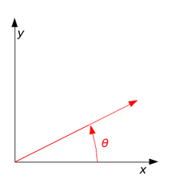
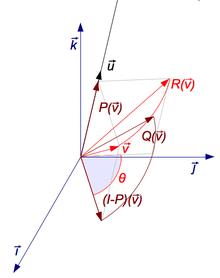
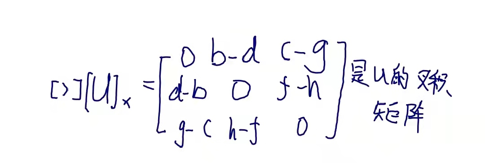
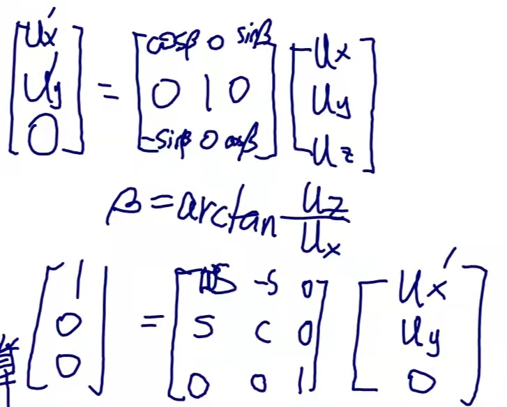
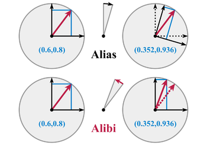
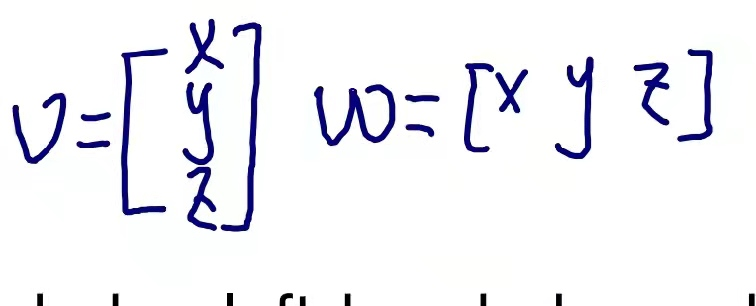
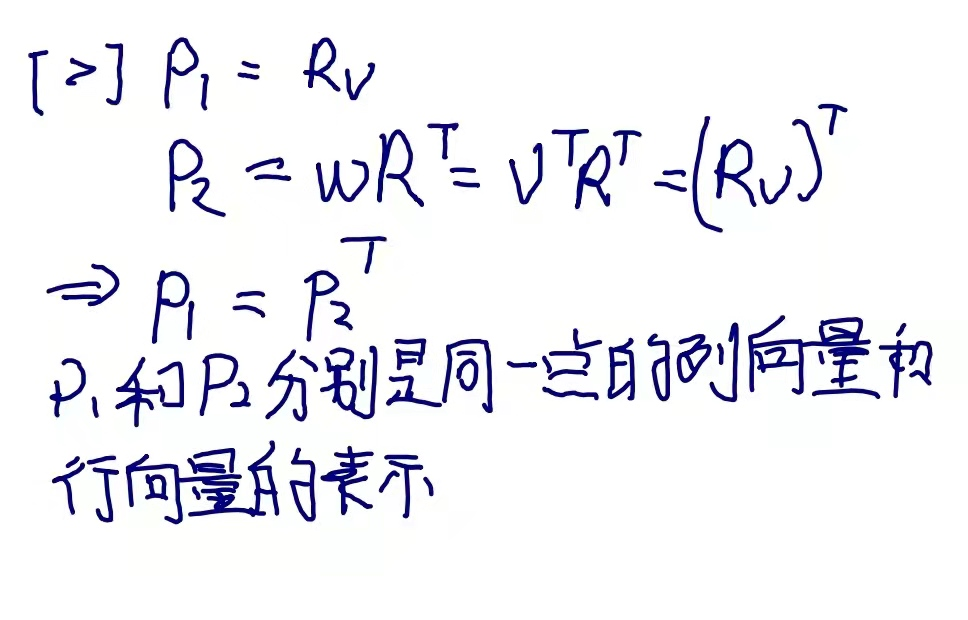

# Rotation matrix 旋转矩阵

在线性代数中，**旋转矩阵**是用于在欧几里得空间中执行旋转的变换矩阵。

旋转矩阵是行列式 1 的正交矩阵。旋转矩阵描述了围绕原点的旋转。

## 2D旋转矩阵

Contents

1 In two dimensions 

1.1 Examples 

1.2 Direction 

1.3 Non-standard orientation of the coordinate system 

1.4 Common rotations 

1.5 Relationship with complex plane 

2 In three dimensions 

2.1 Basic rotations 

2.2 General rotations 

2.3 Conversion from rotation matrix to axis–angle 

2.3.1 Determining the axis 

2.3.2 Determining the angle 

2.3.3 Rotation matrix from axis and angle 

3 Properties 

4 Examples 

5 Geometry 

6 Multiplication 

7 Ambiguities 

8 Decompositions 

8.1 Independent planes 

8.2 Sequential angles 

8.3 Nested dimensions 

8.4 Skew parameters via Cayley's formula 

8.5 Decomposition into shears 

9 Group theory 

9.1 Lie group 

9.2 Lie algebra 

9.3 Exponential map 

9.4 Baker–Campbell–Hausdorff formula 

9.5 Spin group 

9.6 Infinitesimal rotations 

10 Conversions 

10.1 Quaternion 

10.2 Polar decomposition 

10.3 Axis and angle 

10.4 Euler angles 

10.5 Vector to vector formulation 

11 Uniform random rotation matrices 

12 See also 

13 Remarks 

14 Notes 

15 References 

16 External links 

# 二维旋转矩阵

二维旋转矩阵具有以下形式：

$$
{\displaystyle R={\begin{bmatrix}\cos \theta &-\sin \theta \\\sin \theta &\cos \theta \end{bmatrix}}}
$$

通过以下矩阵乘法旋转列向量，

 $$
 {\displaystyle {\begin{bmatrix}x'\\y'\\\end{bmatrix}}={\begin{bmatrix}\cos \theta &-\sin \theta \\\sin \theta &\cos \theta \\\end{bmatrix}}{\begin{bmatrix}x\\y\\\end{bmatrix}}.}
 $$ 

因此，点 (x, y) 旋转后的新坐标 (x′, y′) 为

 $$
 {\displaystyle {\begin{aligned}x'&=x\cos \theta -y\sin \theta \,\\y'&=x\sin \theta +y\cos \theta \,\end{aligned}}.}
 $$ 

>**[success]**  
  

 

>- A counterclockwise rotation of a vector through angle θ. The vector is initially aligned with the x-axis.
向量逆时针旋转角度 θ。 该向量初始方向与 x 轴对齐。

## Examples 例子

例如，当向量

 $$
 {\displaystyle \mathbf {\hat {x}} ={\begin{bmatrix}1\\0\\\end{bmatrix}}}
 $$

旋转了一个角度$$θ$$，它的新坐标是

$$
{\displaystyle {\begin{bmatrix}\cos \theta \\\sin \theta \\\end{bmatrix}},}
$$

并且当向量

$$
{\displaystyle \mathbf {\hat {y}} ={\begin{bmatrix}0\\1\\\end{bmatrix}}} 
$$

旋转角度 $$θ$$，其新坐标为

 $$
 {\displaystyle {\begin{bmatrix}-\sin \theta \\\cos \theta \\\end{bmatrix}}.}
 $$

## Direction 方向

如果 $$θ$$ 为正（例如 90°），则矢量旋转方向为逆时针方向，如果 $$θ$$ 为负（例如 -90°），则矢量旋转方向为顺时针。 因此，顺时针旋转矩阵为

$$
{\displaystyle R(-\theta )={\begin{bmatrix}\cos \theta &\sin \theta \\-\sin \theta &\cos \theta \\\end{bmatrix}}.}
$$

The two-dimensional case is the only non-trivial (i.e. not one-dimensional) case where the rotation matrices group is commutative, so that it does not matter in which order multiple rotations are performed. An alternative convention uses rotating axes,[1] and the above matrices also represent a rotation of the *axes clockwise* through an angle $$θ$$. 

二维旋转矩阵组是唯一非平凡的（即非一维）可交换情况，因此执行多次旋转的顺序无关紧要。 另一种约定使用旋转轴，[1] 并且上述矩阵也表示*轴顺时针*旋转角度 $$θ$$。

## 常见的旋转矩阵

特别有用的矩阵是

$$
{\displaystyle {\begin{bmatrix}0&-1\\[3pt]1&0\\\end{bmatrix}},\quad {\begin{bmatrix}-1&0\\[3pt]0&-1\\\end{bmatrix}},\quad {\begin{bmatrix}0&1\\[3pt]-1&0\\\end{bmatrix}}} 
$$

# 三维旋转矩阵

基本旋转（也称为元素旋转）是围绕其中一个坐标轴的旋转。
可以使用矩阵乘法从这三个矩阵得到其他旋转矩阵。 例如，乘积

 $$
 {\displaystyle {\begin{aligned}R=R_{z}(\alpha )\,R_{y}(\beta )\,R_{x}(\gamma )&={\overset {\text{yaw}}{\begin{bmatrix}\cos \alpha &-\sin \alpha &0\\\sin \alpha &\cos \alpha &0\\0&0&1\\\end{bmatrix}}}{\overset {\text{pitch}}{\begin{bmatrix}\cos \beta &0&\sin \beta \\0&1&0\\-\sin \beta &0&\cos \beta \\\end{bmatrix}}}{\overset {\text{roll}}{\begin{bmatrix}1&0&0\\0&\cos \gamma &-\sin \gamma \\0&\sin \gamma &\cos \gamma \\\end{bmatrix}}}\\&={\begin{bmatrix}\cos \alpha \cos \beta &\cos \alpha \sin \beta \sin \gamma -\sin \alpha \cos \gamma &\cos \alpha \sin \beta \cos \gamma +\sin \alpha \sin \gamma \\\sin \alpha \cos \beta &\sin \alpha \sin \beta \sin \gamma +\cos \alpha \cos \gamma &\sin \alpha \sin \beta \cos \gamma -\cos \alpha \sin \gamma \\-\sin \beta &\cos \beta \sin \gamma &\cos \beta \cos \gamma \\\end{bmatrix}}\end{aligned}}}
 $$

表示这样一个旋转，其偏航角、俯仰角和滚动角分别为 α、β 和 γ。 更正式地说，它是一种内在旋转，其 Tait-Bryan 角分别为 α、β、γ，分别围绕轴 z、y、x。 同样，乘积

 $$
 {\displaystyle {\begin{aligned}\\R=R_{z}(\gamma )\,R_{y}(\beta )\,R_{x}(\alpha )&={\begin{bmatrix}\cos \gamma &-\sin \gamma &0\\\sin \gamma &\cos \gamma &0\\0&0&1\\\end{bmatrix}}{\begin{bmatrix}\cos \beta &0&\sin \beta \\0&1&0\\-\sin \beta &0&\cos \beta \\\end{bmatrix}}{\begin{bmatrix}1&0&0\\0&\cos \alpha &-\sin \alpha \\0&\sin \alpha &\cos \alpha \\\end{bmatrix}}\\&={\begin{bmatrix}\cos \beta \cos \gamma &\sin \alpha \sin \beta \cos \gamma -\cos \alpha \sin \gamma &\cos \alpha \sin \beta \cos \gamma +\sin \alpha \sin \gamma \\\cos \beta \sin \gamma &\sin \alpha \sin \beta \sin \gamma +\cos \alpha \cos \gamma &\cos \alpha \sin \beta \sin \gamma -\sin \alpha \cos \gamma \\-\sin \beta &\sin \alpha \cos \beta &\cos \alpha \cos \beta \\\end{bmatrix}}\end{aligned}}}
 $$

represents an extrinsic rotation whose (improper) Euler angles are α, β, γ, about axes x, y, z. 

表示这样一个外部旋转，其（非Proper）欧拉角是 α、β、γ，围绕轴 x、y、z。

>**[warning]**  
为什么内旋是右乘，外旋是左乘？

这些矩阵仅在它们用于被列向量左乘时才会产生所需的效果，并且（因为通常矩阵乘法不是可交换的）仅当它们以指定的顺序应用时才会产生所需的效果（有关详细信息，请参阅歧义）。 旋转操作的顺序是从右到左； 与列向量相邻的矩阵首先被应用，然后是左边的矩阵。 [3]

>**[success]**  
内旋从左到右，外旋从右到左

## 从旋转矩阵到轴角的转换

在3D的每个维度上的旋转都由它的**轴**（沿该轴的向量不会因旋转而改变）和它的**角度** - 围绕该轴的旋转量（欧拉旋转定理）定义。

有几种方法可以从旋转矩阵计算轴和角度（另请参见轴-角度表示）。 这里，我们只描述基于计算旋转矩阵的特征向量和特征值的方法。 也可以使用旋转矩阵的trace。

### Determining the axis 确定轴

> A rotation R around axis **u** can be decomposed using 3 endomorphisms P, (I − P), and Q (click to enlarge).
可以使用 3 个自同态 P、(I-P) 和 Q 来分解围绕轴 **u** 的旋转 R（点击放大）。  
>**[warning]**  
**自同态**：？

给定一个 3 × 3 的旋转矩阵 $$R$$，平行于旋转轴的向量 **u** 必须满足

$$
{\displaystyle R\mathbf {u} =\mathbf {u} ,}
$$

>**[success]**  
沿旋转轴的向量不会因旋转而改变  

>**[success]**  
方法一：R的λ = 1对应的特征向量

因为 **u** 围绕旋转轴的旋转仍然是 **u**。 上面的等式可以求解**u**，除非$$R = I$$，否则它在标量因子上是唯一的。

>**[success]**  
当标量因子确定时，u有唯一解。$${\displaystyle R\mathbf {u} =\displaystyle λ\mathbf {u} ,}$$ 特征值λ即标量因子，此处λ=1，此处隐含u是单位向量，因此u是唯一的。

此外，方程可以重写

$$ 
{\displaystyle R\mathbf {u} =I\mathbf {u} \implies \left(R-I\right)\mathbf {u} =0,}
$$

这表明 **u** 位于 $$R - I$$ 的零空间中。

>**[success]**  
**零空间**：见《线性代数》定义null space

Viewed in another way, **u** is an eigenvector of $$R$$ corresponding to the eigenvalue $$λ = 1$$. Every rotation matrix must have this eigenvalue, the other two eigenvalues being complex conjugates of each other. It follows that a general rotation matrix in three dimensions has, up to a multiplicative constant, only one real eigenvector. 

>**[warning]**  
**up to a multiplicative constant**:这句怎么理解？

换个角度看，**u** 是 $$R$$ 的特征向量，对应于特征值 $$λ = 1$$。 每个旋转矩阵都必须有这个特征值，其他两个特征值是彼此的复共轭。 由此可见，一个三维的一般旋转矩阵在乘法常数之前只有一个实特征向量。

>**[warning]**  
**复共轭**：？  
**在乘法常数之前**：？

One way to determine the rotation axis is by showing that: 

>**[success]**  
方法二：套用显式的公式

确定旋转轴的一种方法是显示：

 $$
 {\displaystyle {\begin{aligned}0&=R^{\mathsf {T}}0+0\\&=R^{\mathsf {T}}\left(R-I\right)\mathbf {u} +\left(R-I\right)\mathbf {u} \\&=\left(R^{\mathsf {T}}R-R^{\mathsf {T}}+R-I\right)\mathbf {u} \\&=\left(I-R^{\mathsf {T}}+R-I\right)\mathbf {u} \\&=\left(R-R^{\mathsf {T}}\right)\mathbf {u} \end{aligned}}} 
 $$

Since $$(R − RT)$$ is a skew-symmetric matrix, we can choose **u** such that 

由于 $$(R − RT)$$ 是一个斜对称矩阵，我们可以选择 **u** 使得

$$
{\displaystyle [\mathbf {u} ]_{\times }=\left(R-R^{\mathsf {T}}\right).}
$$ 

The matrix–vector product becomes a cross product of a vector with itself, ensuring that the result is zero: 

矩阵-向量积成为向量与其自身的叉积，确保结果为零：

$$
{\displaystyle \left(R-R^{\mathsf {T}}\right)\mathbf {u} =[\mathbf {u} ]_{\times }\mathbf {u} =\mathbf {u} \times \mathbf {u} =0\,} 
$$

Therefore, if 因此，如果

 $$
 {\displaystyle R={\begin{bmatrix}a&b&c\\d&e&f\\g&h&i\\\end{bmatrix}},} 
 $$

  

then 然后

$$ 
{\displaystyle \mathbf {u} ={\begin{bmatrix}h-f\\c-g\\d-b\\\end{bmatrix}}.} 
$$

>**[warning]**   **$$ 
{\displaystyle \mathbf {u} ={\begin{bmatrix}h-f\\c-g\\d-b\\\end{bmatrix}}} $$**：？

>**[warning]**  
怎么根据$[u]_×$得到u？见3.6

The magnitude of **u** computed this way is ||**u**|| = 2 sin $$θ$$, where $$θ$$ is the angle of rotation. 

以这种方式计算的 **u** 的大小是 ||**u**|| = 2 sin $$θ$$，其中 $$θ$$ 是旋转角度。

This **does not work** if $$R$$ is symmetric. Above, if $$R − RT$$ is zero, then all subsequent steps are invalid. In this case, it is necessary to diagonalize $$R$$ and find the eigenvector corresponding to an eigenvalue of 1. 

如果 R 是对称的，这**不起作用**。 上面，如果 R - RT 为零，则所有后续步骤均无效。 在这种情况下，只能对 R 进行对角化并找到与特征值 1 对应的特征向量。

>**[success]**  
对于对称矩阵，方法二不适用，只能用方法一

### Determining the angle 确定角度

要找到旋转的角度，一旦知道旋转的轴，选择一个垂直于轴的向量**v**。 那么旋转的角度就是**v**和R**v**之间的角度。

然而，更直接的方法是计算trace：旋转矩阵的对角线元素之和。 应注意为角度 θ 选择正确的符号以匹配所选轴：

$$
{\displaystyle \operatorname {tr} (R)=1+2\cos \theta ,} 
$$

由此得出角度的绝对值为

$$
{\displaystyle |\theta |=\arccos \left({\frac {\operatorname {tr} (R)-1}{2}}\right).}
$$

>**[success]**  
要确定θ的符号

### Rotation matrix from axis and angle 从轴和角度计算旋转矩阵

The matrix of a proper rotation $$R$$ by angle $$θ$$ around the axis **u** = $$(ux, uy, uz)$$, a unit vector with $$u2x + u2y + u2z = 1$$,is given by:[4]

围绕轴 **u** = (ux, uy, uz) 旋转角度 θ 的旋转矩阵 R ，其中u是满足u2x + u2y + u2z = 1 的单位向量由下式给出 :[4]

$$
{\displaystyle R={\begin{bmatrix}\cos \theta +u_{x}^{2}\left(1-\cos \theta \right)&u_{x}u_{y}\left(1-\cos \theta \right)-u_{z}\sin \theta &u_{x}u_{z}\left(1-\cos \theta \right)+u_{y}\sin \theta \\u_{y}u_{x}\left(1-\cos \theta \right)+u_{z}\sin \theta &\cos \theta +u_{y}^{2}\left(1-\cos \theta \right)&u_{y}u_{z}\left(1-\cos \theta \right)-u_{x}\sin \theta \\u_{z}u_{x}\left(1-\cos \theta \right)-u_{y}\sin \theta &u_{z}u_{y}\left(1-\cos \theta \right)+u_{x}\sin \theta &\cos \theta +u_{z}^{2}\left(1-\cos \theta \right)\end{bmatrix}}.}
$$

A derivation of this matrix from first principles can be found in section 9.2 here.[5] The basic idea to derive this matrix is dividing the problem into few known simple steps.

可以在此处的第 9.2 节中找到从第一原理推导该矩阵。 [5] 推导该矩阵的基本思想是将问题划分为几个已知的简单步骤。

1. First rotate the given axis and the point such that the axis lies in one of the coordinate planes ($$xy, yz$$ or $$zx$$)
首先旋转给定轴和点，使轴位于坐标平面之一（$$xy、yz$$ 或 $$zx$$）

2. Then rotate the given axis and the point such that the axis is aligned with one of the two coordinate axes for that particular coordinate plane ($$x, y$$ or $$z$$)然后旋转给定轴和点，使轴与该特定坐标平面（$$x、y$$ 或 $$z$$）的两个坐标轴之一对齐

3. Use one of the fundamental rotation matrices to rotate the point depending on the coordinate axis with which the rotation axis is aligned.使用基本旋转矩阵之一根据与旋转轴对齐的坐标轴旋转点。

4. Reverse rotate the axis-point pair such that it attains the final configuration as that was in step 2 (Undoing step 2)反向旋转轴点对，使其达到步骤 2 中的最终配置（撤消步骤 2）

5. Reverse rotate the axis-point pair which was done in step 1 (undoing step 1)反向旋转在步骤 1 中完成的轴点对（撤消步骤 1）

This can be written more concisely as

这可以更简洁地写成

$$
{\displaystyle R=(\cos \theta )\,I+(\sin \theta )\,[\mathbf {u} ]_{\times }+(1-\cos \theta )\,(\mathbf {u} \otimes \mathbf {u} ),}
$$

where [u]× is the cross product matrix of **u**; the expression **u ⊗ u** is the outer product, and $$I$$ is the identity matrix. Alternatively, the matrix entries are:

其中[u]×是**u**的叉积矩阵； 表达式 **u ⊗ u** 是外积，$$I$$ 是单位矩阵。 或者，矩阵条目是：

>**[warning]**  
**叉积矩阵**：？

$$
{\displaystyle R_{jk}={\begin{cases}\cos ^{2}{\frac {\theta }{2}}+\sin ^{2}{\frac {\theta }{2}}\left(2u_{j}^{2}-1\right),\quad &{\text{if }}j=k\\2u_{j}u_{k}\sin ^{2}{\frac {\theta }{2}}-\varepsilon _{jkl}u_{l}\sin \theta ,\quad &{\text{if }}j\neq k\end{cases}}}
$$

where εjkl is the Levi-Civita symbol with ε123 = 1. This is a matrix form of Rodrigues' rotation formula, (or the equivalent, differently parametrized Euler–Rodrigues formula) with[nb 2]

其中 $ε_{jkl}$ 是 Levi-Civita 符号，$ε_{123} = 1$。 这是 Rodrigues 旋转公式的矩阵形式，（或等效的、不同参数化的 Euler-Rodrigues 公式）与 [nb 2]

$$
{\displaystyle \mathbf {u} \otimes \mathbf {u} =\mathbf {u} \mathbf {u} ^{\mathsf {T}}={\begin{bmatrix}u_{x}^{2}&u_{x}u_{y}&u_{x}u_{z}\\[3pt]u_{x}u_{y}&u_{y}^{2}&u_{y}u_{z}\\[3pt]u_{x}u_{z}&u_{y}u_{z}&u_{z}^{2}\end{bmatrix}},\qquad [\mathbf {u} ]_{\times }={\begin{bmatrix}0&-u_{z}&u_{y}\\[3pt]u_{z}&0&-u_{x}\\[3pt]-u_{y}&u_{x}&0\end{bmatrix}}.}
$$

In $$\mathbb {R} ^{3}$$ the rotation of a vector **x** around the axis **u** by an angle $$θ$$ can be written as:

在 $$\mathbb {R} ^{3}$$ 中，向量 **x** 绕轴 **u** 旋转角度 $$θ$$ 可以写成：

$$
{\displaystyle R_{\mathbf {u} }(\theta )\mathbf {x} =\mathbf {u} (\mathbf {u} \cdot \mathbf {x} )+\cos \left(\theta \right)(\mathbf {u} \times \mathbf {x} )\times \mathbf {u} +\sin \left(\theta \right)(\mathbf {u} \times \mathbf {x} )}
$$

If the 3D space is right-handed and $$θ > 0$$, this rotation will be counterclockwise when **u** points towards the observer (Right-hand rule). Explicitly, with $${\displaystyle ({\boldsymbol {\alpha }},{\boldsymbol {\beta }},\mathbf {u} )}$$ a right-handed orthonormal basis,

如果 3D 空间是右手的并且 $$θ > 0$$，当 **u** 指向观察者时，这个旋转将是逆时针的（右手法则）。 明确地，$${\displaystyle ({\boldsymbol {\alpha }},{\boldsymbol {\beta }},\mathbf {u} )}$$ 是右手正交基，

$$
{\displaystyle R_{\mathbf {u} }(\theta ){\boldsymbol {\alpha }}=\cos \left(\theta \right){\boldsymbol {\alpha }}+\sin \left(\theta \right){\boldsymbol {\beta }},\quad R_{\mathbf {u} }(\theta ){\boldsymbol {\beta }}=-\sin \left(\theta \right){\boldsymbol {\alpha }}+\cos \left(\theta \right){\boldsymbol {\beta }},\quad R_{\mathbf {u} }(\theta )\mathbf {u} =\mathbf {u} .}
$$

Note the striking *merely apparent differences* to the *equivalent* Lie-algebraic formulation below.

请注意以下*等效*李代数公式的*仅仅是看上去明显的差异*。

# Properties 特性

对于任何作用于 $${\displaystyle \mathbb {R} ^{n},}$$ 的 n 维旋转矩阵 $$R$$

$$
{\displaystyle R^{\mathsf {T}}=R^{-1}}
$$ 
(The rotation is an orthogonal matrix旋转是一个正交矩阵）)

It follows that: 它遵循：

$$
\det R=\pm 1
$$

A rotation is termed proper if det R = 1, and improper (or a roto-reflection) if det R = –1. For even dimensions $$n = 2k$$, the $$n$$ eigenvalues $$λ$$ of a proper rotation occur as pairs of complex conjugates which are roots of unity:$$ λ = e±iθj$$ for $$j = 1, ..., k$$, which is real only for $$λ = ±1$$. Therefore, there may be no vectors fixed by the rotation ($$λ = 1$$), and thus no axis of rotation. Any fixed eigenvectors occur in pairs, and the axis of rotation is an even-dimensional subspace.

如果 det R = 1，则称为proper旋转，如果 det R = –1，则称为improper旋转（或旋转反射）。 对于偶数维 n = 2k，proper旋转的 n 特征值 λ 作为复共轭对出现，它们是单位根： λ = e±iθj for j = 1, ..., k，仅当 λ = ±1 时为实数。 因此，可能没有固定的旋转向量（λ = 1），也没有旋转轴。 任何固定的特征向量都是成对出现的，旋转轴是一个偶数维子空间。

For odd dimensions $$n = 2k + 1$$, a proper rotation *R* will have an odd number of eigenvalues, with at least one $$λ = 1$$ and the axis of rotation will be an odd dimensional subspace. Proof:

对于奇数维度 n = 2k + 1，proper旋转 *R* 将具有奇数个特征值，至少有一个 $$λ = 1$$，并且旋转轴将是奇数维子空间。 证明：

$$
{\displaystyle {\begin{aligned}\det \left(R-I\right)&=\det \left(R^{\mathsf {T}}\right)\det \left(R-I\right)=\det \left(R^{\mathsf {T}}R-R^{\mathsf {T}}\right)=\det \left(I-R^{\mathsf {T}}\right)\\&=\det(I-R)=\left(-1\right)^{n}\det \left(R-I\right)=-\det \left(R-I\right).\end{aligned}}}
$$

Here I is the identity matrix, and we use det(RT) = det(R) = 1, as well as (−1)n = −1 since $$n$$ is odd. Therefore, det(R – I) = 0, meaning there is a null vector **v** with (R – I)v = 0, that is Rv = v, a fixed eigenvector. There may also be pairs of fixed eigenvectors in the even-dimensional subspace orthogonal to v, so the total dimension of fixed eigenvectors is odd.

这里I 是单位矩阵，我们使用det(RT) = det(R) = 1，以及$$(-1)^n = -1$$，因为$$n$$ 是奇数。 因此，det(R – I) = 0，意味着存在一个 (R – I)v = 0 的空向量**v**，即 Rv = v，**一个固定的特征向量**。 在与 v 正交的偶数维子空间中也可能存在固定特征向量对，因此固定特征向量的总维数是奇数。

For example, in 2-space n = 2, a rotation by angle θ has eigenvalues $$λ = eiθ$$ and $$λ = e−iθ$$, so there is no axis of rotation except when θ = 0, the case of the null rotation. In 3-space n = 3, the axis of a non-null proper rotation is always a unique line, and a rotation around this axis by angle θ has eigenvalues λ = 1, eiθ, e−iθ. In 4-space n = 4, the four eigenvalues are of the form $$e±iθ, e±iφ$$. The null rotation has $$θ = φ = 0$$. The case of $$θ = 0$$, $$φ ≠ 0$$ is called a *simple rotation*, with two unit eigenvalues forming an *axis plane*, and a two-dimensional rotation orthogonal to the axis plane. Otherwise, there is no axis plane. The case of $$θ = φ$$ is called an *isoclinic rotation*, having eigenvalues $$e±iθ$$ repeated twice, so every vector is rotated through an angle $$θ$$.

例如，在 2维 空间 n = 2 中，角度 $$θ$$ 的旋转具有特征值 $$λ = eiθ$$ 和 $$λ = e−iθ$$，因此除了 θ = 0 时以外没有旋转轴， θ = 0为零旋转。 在 3 空间 n = 3 中，非零proper旋转的轴始终是一条唯一的线，并且围绕该轴旋转角度 θ 具有特征值 λ = 1，eiθ，e−iθ。 在 4 空间 n = 4 中，四个特征值的形式为 $$e±iθ，e±iφ$$。 零旋转有 $$θ = φ = 0$$。 $$θ=0$$,$$φ≠0$$的情况称为*简单旋转*，两个单位特征值形成*轴平面*，与轴平面正交的二维旋转。 否则，没有轴平面。 $$θ = φ$$ 的情况称为*等斜旋转*，特征值 $$e±iθ$$ 重复两次，因此每个向量都旋转角度 $$θ$$。

The trace of a rotation matrix is equal to the sum of its eigenvalues. For n = 2, a rotation by angle θ has trace 2 cos θ. For n = 3, a rotation around any axis by angle $$θ$$ has trace 1 + 2 cos θ. For $$n$$ = 4, and the trace is 2(cos θ + cos φ), which becomes 4 cos $$θ$$ for an isoclinic rotation.

旋转矩阵的迹等于其特征值之和。 对于 n = 2，角度 θ 的旋转矩阵的迹为 2 cos θ。 对于 n = 3，绕任意轴旋转角度 θ 的轨迹为 1 + 2 cos θ。 对于 n = 4，迹线为 2(cos θ + cos φ)，对于等斜旋转变为 4 cos θ。

# Examples 例子

- 2 × 2 旋转矩阵

$$
Q={\begin{bmatrix}0&1\\-1&0\end{bmatrix}}
$$

corresponds to a 90° planar rotation clockwise about the origin.

对应于绕原点顺时针旋转 90° 平面。

- The transpose of the 2 × 2 matrix

2 × 2 矩阵
$$
M={\begin{bmatrix}0.936&0.352\\0.352&-0.936\end{bmatrix}}
$$

is its inverse, but since its determinant is −1, this is not a proper rotation matrix; it is a reflection across the line 11y = 2x.

的转置是它的逆矩阵，但是因为它的行列式是-1，所以这不是一个proper旋转矩阵； 它是对 11y = 2x 的反射。

>**[warning]**  
**它是对 11y = 2x 的反射**：reflection across the line怎么理解？

- The 3 × 3 rotation matrix  
3 × 3 旋转矩阵

$$
{\displaystyle Q={\begin{bmatrix}1&0&0\\0&{\frac {\sqrt {3}}{2}}&{\frac {1}{2}}\\0&-{\frac {1}{2}}&{\frac {\sqrt {3}}{2}}\end{bmatrix}}={\begin{bmatrix}1&0&0\\0&\cos 30^{\circ }&\sin 30^{\circ }\\0&-\sin 30^{\circ }&\cos 30^{\circ }\\\end{bmatrix}}}
$$

corresponds to a −30° rotation around the x-axis in three-dimensional space.

对应于在三维空间中围绕 x 轴旋转 -30°。

- The 3 × 3 rotation matrix  
3 × 3 旋转矩阵

$$
Q={\begin{bmatrix}0.36&0.48&-0.8\\-0.8&0.60&0\\0.48&0.64&0.60\end{bmatrix}}
$$

corresponds to a rotation of approximately −74° around the axis (−
1
/
2
,1,1) in three-dimensional space.

对应于在三维空间中围绕轴(-1/2,1,1)旋转大约 -74°。

- 3 × 3 置换矩阵

$$
P={\begin{bmatrix}0&0&1\\1&0&0\\0&1&0\end{bmatrix}}
$$

是一个旋转矩阵，与任何偶数排列的矩阵一样，它围绕轴 $$x = y = z$$ 旋转 120°。

- The 3 × 3 matrix

3 × 3 矩阵

$$
M={\begin{bmatrix}3&-4&1\\5&3&-7\\-9&2&6\end{bmatrix}}
$$

的行列式为+1，但不是正交的（它的转置不是它的逆），所以它不是一个旋转矩阵。

- The 4 × 3 matrix

4 × 3 矩阵

$$
M={\begin{bmatrix}0.5&-0.1&0.7\\0.1&0.5&-0.5\\-0.7&0.5&0.5\\-0.5&-0.7&-0.1\end{bmatrix}}
$$

is not square, and so cannot be a rotation matrix; yet MTM yields a 3 × 3 identity matrix (the columns are orthonormal).

不是正方形的，因此不是旋转矩阵； 然而 $M^TM$ 是一个 3 × 3 单位矩阵（列是正交的）。

- The 4 × 4 matrix

4 × 4 矩阵
$$
{\displaystyle Q=-I={\begin{bmatrix}-1&0&0&0\\0&-1&0&0\\0&0&-1&0\\0&0&0&-1\end{bmatrix}}}
$$

describes an isoclinic rotation in four dimensions, a rotation through equal angles (180°) through two orthogonal planes.

描述了四维中的等斜旋转，两个正交平面通过相等角度（180°）的旋转。

- 5 × 5 旋转矩阵

$$
Q={\begin{bmatrix}0&-1&0&0&0\\1&0&0&0&0\\0&0&-1&0&0\\0&0&0&-1&0\\0&0&0&0&1\end{bmatrix}}
$$

rotates vectors in the plane of the first two coordinate axes 90°, rotates vectors in the plane of the next two axes 180°, and leaves the last coordinate axis unmoved.

将前两个坐标轴平面中的矢量旋转 90°，将后两个坐标轴平面中的矢量旋转 180°，最后一个坐标轴保持不动。

>**[success]**  
**矢量**：矢量和向量是一个意思

# Geometry 几何学

在欧几里得几何中，旋转是等距的一个例子，一种在不改变点之间距离的情况下移动点的变换。 旋转与其他等距的区别在于两个附加属性：它们使（至少）一个点保持不变，并且它们使“手性”保持不变。 相反，平移会移动每个点，反射会交换左手和右手顺序，滑翔反射会同时进行，proper旋转将手性变化与正常旋转结合在一起。

If a fixed point is taken as the origin of a Cartesian coordinate system, then every point can be given coordinates as a displacement from the origin. Thus one may work with the vector space of displacements instead of the points themselves. Now suppose $$(p1, ..., pn)$$ are the coordinates of the vector **p** from the origin $$O$$ to point $$P$$. Choose an orthonormal basis for our coordinates; then the squared distance to $$P$$, by Pythagoras, is

如果将一个固定点作为笛卡尔坐标系的原点，则可以给每个点坐标定义为距原点的位移。 因此，可以使用位移向量空间而不是点本身。 现在假设 $$(p1, ..., pn)$$ 是向量 **p** 从原点 $$O$$ 到点 $$P$$ 的坐标。 为我们的坐标选择标准正交基； 那么到$$P$$的毕达哥拉斯平方距离是

>**[success]**  
**可以使用位移向量空间而不是点本身**：点本身：以（0,0）为原点O，点坐标距离（0,0）的位移  
位移向量空间：以任意一个固定点作为原点O，点坐标距离这个固定点的位移。

$$
{\displaystyle d^{2}(O,P)=\|\mathbf {p} \|^{2}=\sum _{r=1}^{n}p_{r}^{2}}
$$

which can be computed using the matrix multiplication

可以使用矩阵乘法计算

$$
{\displaystyle \|\mathbf {p} \|^{2}={\begin{bmatrix}p_{1}\cdots p_{n}\end{bmatrix}}{\begin{bmatrix}p_{1}\\\vdots \\p_{n}\end{bmatrix}}=\mathbf {p} ^{\mathsf {T}}\mathbf {p} .}
$$

A geometric rotation transforms lines to lines, and preserves ratios of distances between points. From these properties it can be shown that a rotation is a linear transformation of the vectors, and thus can be written in matrix form, $$Qp$$. The fact that a rotation preserves, not just ratios, but distances themselves, is stated as

几何旋转是线之间的转换 ，并保持点之间的距离比率。 从这些性质可以看出，旋转是向量的线性变换，因此可以写成矩阵形式，$$Qp$$。 旋转不仅保留了比率，而且保留了距离本身，这一事实被表述为

$$
{\displaystyle \mathbf {p} ^{\mathsf {T}}\mathbf {p} =(Q\mathbf {p} )^{\mathsf {T}}(Q\mathbf {p} ),}
$$

>**[success]**  
P：旋转前点P在位移向量空间的坐标  
Qp：旋转后点P在位移向量空间的坐标  注意区分点P和坐标P  
$$
{\displaystyle \mathbf {p} ^{\mathsf {T}}\mathbf {p}}
$$  
旋转前OP的距离  
$${(Q\mathbf {p} )^{\mathsf {T}}(Q\mathbf {p} )}$$ 
旋转后OP的距离

>**[success]**  
公式想说明的是：以O为原点的旋转，旋转前后OP距离不变

or 或

$$
{\displaystyle {\begin{aligned}\mathbf {p} ^{\mathsf {T}}I\mathbf {p} &{}=\left(\mathbf {p} ^{\mathsf {T}}Q^{\mathsf {T}}\right)(Q\mathbf {p} )\\&{}=\mathbf {p} ^{\mathsf {T}}\left(Q^{\mathsf {T}}Q\right)\mathbf {p} .\end{aligned}}}
$$

因为这个等式适用于所有向量**p**，所以可以得出结论，每个旋转矩阵 Q 都满足正交性条件，

$$
{\displaystyle Q^{\mathsf {T}}Q=I.}
$$

旋转保留了手性，因为它们不能改变轴的顺序，这意味着特殊的矩阵条件，

$$
{\displaystyle \det Q=+1.}
$$

>**[success]**  
改变轴的顺序可能得到$${\displaystyle \det Q=-1.}$$

同样重要的是，可以证明满足这两个条件的任何矩阵都可以作为旋转矩阵。

# Multiplication 乘法

旋转矩阵的逆是它的转置，也是一个旋转矩阵：

$$
{\displaystyle {\begin{aligned}\left(Q^{\mathsf {T}}\right)^{\mathsf {T}}\left(Q^{\mathsf {T}}\right)&=QQ^{\mathsf {T}}=I\\\det Q^{\mathsf {T}}&=\det Q=+1.\end{aligned}}}
$$

两个旋转矩阵的乘积是一个旋转矩阵：

$$
{\displaystyle {\begin{aligned}\left(Q_{1}Q_{2}\right)^{\mathsf {T}}\left(Q_{1}Q_{2}\right)&=Q_{2}^{\mathsf {T}}\left(Q_{1}^{\mathsf {T}}Q_{1}\right)Q_{2}=I\\\det \left(Q_{1}Q_{2}\right)&=\left(\det Q_{1}\right)\left(\det Q_{2}\right)=+1.\end{aligned}}}
$$

对于 n > 2，n × n 旋转矩阵的乘法通常是不可交换的。

$$
{\displaystyle {\begin{aligned}Q_{1}&={\begin{bmatrix}0&-1&0\\1&0&0\\0&0&1\end{bmatrix}}&Q_{2}&={\begin{bmatrix}0&0&1\\0&1&0\\-1&0&0\end{bmatrix}}\\Q_{1}Q_{2}&={\begin{bmatrix}0&-1&0\\0&0&1\\-1&0&0\end{bmatrix}}&Q_{2}Q_{1}&={\begin{bmatrix}0&0&1\\1&0&0\\0&1&0\end{bmatrix}}.\end{aligned}}}
$$

Noting that any identity matrix is a rotation matrix, and that matrix multiplication is associative, we may summarize all these properties by saying that the n × n rotation matrices form a group, which for $$n$$ > 2 is non-abelian, called a special orthogonal group, and denoted by $$SO(n)$$, $$SO(n,R)$$, $$SOn$$, or $$SOn(R)$$, the group of $$n × n$$ rotation matrices is isomorphic to the group of rotations in an $$n$$-dimensional space. This means that multiplication of rotation matrices corresponds to composition of rotations, applied in left-to-right order of their corresponding matrices.

注意到任何单位矩阵都是旋转矩阵，并且矩阵乘法是关联的，我们可以总结所有这些性质，说 n × n 旋转矩阵形成一个群，对于 $$n$$ > 2 是非阿贝尔矩阵，称为 a 特殊正交群，记作 $$SO(n)$$、$$SO(n,R)$$、$$SOn$$ 或 $$SOn(R)$$，$$n × n$$ 旋转矩阵的群同构于群 在 $$n$$ 维空间中的旋转。 这意味着旋转矩阵的乘法对应于旋转的组合，以对应矩阵的从左到右的顺序应用。

# Ambiguities 歧义

>- Alias and alibi rotations 
Alias旋转和alibi旋转

旋转矩阵的解释可能存在许多歧义。

在大多数情况下，歧义的影响等同于旋转矩阵求逆的影响（由于旋转矩阵都是正交矩阵等价于矩阵转置）。

## Alias or alibi (passive or active) transformation Alias或alibi（被动或主动）旋转

The coordinates of a point $$P$$ may change due to either a rotation of the coordinate system $$CS$$ (alias), or a rotation of the point $$P$$ (alibi). In the latter case, the rotation of $$P$$ also produces a rotation of the vector **v** representing $$P$$. In other words, either $$P$$ and **v** are fixed while $$CS$$ rotates (alias), or $$CS$$ is fixed while $$P$$ and **v** rotate (alibi). Any given rotation can be legitimately described both ways, as vectors and coordinate systems actually rotate with respect to each other, about the same axis but in opposite directions. Throughout this article, we chose the alibi approach to describe rotations. For instance,

点 $$P$$ 的坐标可能由于坐标系 $$CS$$（alias）的旋转或点 $$P$$（alibi）的旋转而改变。 在后一种情况下，$$P$$ 的旋转也会产生代表 $$P$$ 的向量 **v** 的旋转。 换句话说，$$P$$ 和 **v** 在 $$CS$$ 旋转（alias）时固定，或者 $$CS$$ 在 $$P$$ 和 **v** 旋转时固定 （alibi）。 任何给定的旋转都可以用两种方式进行合理的描述，因为矢量和坐标系实际上是相对于彼此旋转的，围绕同一轴但方向相反。 在整篇文章中，我们选择了alibi的方法来描述旋转。 例如，

$$
R(\theta )={\begin{bmatrix}\cos \theta &-\sin \theta \\\sin \theta &\cos \theta \\\end{bmatrix}}
$$

represents a counterclockwise rotation of a vector **v** by an angle θ, or a rotation of $$CS$$ by the same angle but in the opposite direction (i.e. clockwise). Alibi and alias transformations are also known as active and passive transformations, respectively.

表示向量 **v** 逆时针旋转角度 θ，或 CS 旋转相同角度但方向相反（即顺时针）。 Alibi 和alias转换也分别称为主动和被动旋转。

## Pre-multiplication or post-multiplication 左乘或右乘

The same point $$P$$ can be represented either by a column vector **v** or a row vector **w**. Rotation matrices can either pre-multiply column vectors (R**v**), or post-multiply row vectors (**w**R). However, R**v** produces a rotation in the opposite direction with respect to **w**R. Throughout this article, rotations produced on column vectors are described by means of a pre-multiplication. To obtain exactly the same rotation (i.e. the same final coordinates of point P), the equivalent row vector must be post-multiplied by the transpose of R (i.e. **w**RT).

同一点 $$P$$ 可以用列向量 **v** 或行向量 **w** 表示。 旋转矩阵可以左乘列向量 (R**v**) 或右乘行向量 (**w**R)。 但是，R**v** 产生相对于 **w**R 的相反方向的旋转。 在整篇文章中，列向量上产生的旋转是通过左乘法来描述的。 为了获得完全相同的旋转（即点 P 的相同最终坐标），等效行向量必须右乘以 R 的转置（即 **w**RT）。

>**[success]**  
**为了获得完全相同的旋转（即点 P 的相同最终坐标）**：即向量与坐标系的相对关系一致

>**[success]**  

## Right- or left-handed coordinates 右手或左手坐标

矩阵和向量可以相对于右手或左手坐标系来表示。 在整篇文章中，除非另有说明，否则我们假定为右手方向。

>**[success]**  
**右手方向**：右手螺旋法则

## Vectors or forms 向量或形式

>**[warning]**  
**形式**：forms是什么？

The vector space has a dual space of linear forms, and the matrix can act on either vectors or forms.

向量空间具有线性形式的对偶空间，矩阵可以作用于向量或形式。

>**[warning]**  
**对偶空间**：什么是对偶空间？

>**[success]**  

# Decompositions 分解

## Independent planes 独立平面

考虑 3 × 3 旋转矩阵

$$
{\displaystyle Q={\begin{bmatrix}0.36&0.48&-0.80\\-0.80&0.60&0.00\\0.48&0.64&0.60\end{bmatrix}}.}
$$

如果 Q 作用于某个方向，**v**，纯粹作为一个因子 λ 的缩放，那么我们有

$$
{\displaystyle Q\mathbf {v} =\lambda \mathbf {v} ,}
$$
so that 因此

$$
{\displaystyle \mathbf {0} =(\lambda I-Q)\mathbf {v} .}
$$

Thus $$λ$$ is a root of the characteristic polynomial for $$Q$$,

因此 $$λ$$ 是 $$Q$$ 的特征多项式的根，

$$
{\displaystyle {\begin{aligned}0&{}=\det(\lambda I-Q)\\&{}=\lambda ^{3}-{\tfrac {39}{25}}\lambda ^{2}+{\tfrac {39}{25}}\lambda -1\\&{}=(\lambda -1)\left(\lambda ^{2}-{\tfrac {14}{25}}\lambda +1\right).\end{aligned}}}
$$

Two features are noteworthy. First, one of the roots (or eigenvalues) is 1, which tells us that some direction is unaffected by the matrix. For rotations in three dimensions, this is the axis of the rotation (a concept that has no meaning in any other dimension). Second, the other two roots are a pair of complex conjugates, whose product is 1 (the constant term of the quadratic), and whose sum is 2 cos θ (the negated linear term). This factorization is of interest for 3 × 3 rotation matrices because the same thing occurs for all of them. (As special cases, for a null rotation the "complex conjugates" are both 1, and for a 180° rotation they are both −1.) Furthermore, a similar factorization holds for any n × n rotation matrix. If the dimension, n, is odd, there will be a "dangling" eigenvalue of 1; and for any dimension the rest of the polynomial factors into quadratic terms like the one here (with the two special cases noted). We are guaranteed that the characteristic polynomial will have degree n and thus n eigenvalues. And since a rotation matrix commutes with its transpose, it is a normal matrix, so can be diagonalized. We conclude that every rotation matrix, when expressed in a suitable coordinate system, partitions into independent rotations of two-dimensional subspaces, at most n/2 of them.

>**[warning]**  
**We conclude that every rotation matrix, when expressed in a suitable coordinate system, partitions into independent rotations of two-dimensional subspaces, at most n/2 of them**：？

 有两个特点值得注意。首先，其中一个根（或特征值）是 1，这告诉我们某个方向不受矩阵的影响。对于三个维度的旋转，这是旋转的轴（一个在任何其他维度都没有意义的概念）。其次，另外两个根是一对复共轭，其乘积为 1（二次的常数项），其和为 2 cos θ（取反的线性项）。这种分解对于 3 × 3 旋转矩阵很有意义，因为它对所有的旋转都适用。 （作为特殊情况，对于零旋转，“复共轭”都是 1，对于 180° 旋转，它们都是 -1。）此外，类似的分解适用于任何 n × n 旋转矩阵。如果维度 n 是奇数，则将有一个“悬空”特征值 1；并且对于任何维度，其余多项式因数转换为二次项，例如此处的项（注意两种特殊情况）。我们保证特征多项式将具有 n 次，因此具有 n 个特征值。并且由于旋转矩阵与其转置对易，因此它是一个正规矩阵，因此可以对角化。我们得出结论，每个旋转矩阵，当在合适的坐标系中表示时，最多划分为二维子空间的独立旋转n/2其中。

 >**[warning]**  
 **与其转置对易**：？  
 **正规矩阵**：？

 >**[success]**  
 $$llambda=1$$  
 对应的特征向量是旋转轴

The sum of the entries on the main diagonal of a matrix is called the trace; it does not change if we reorient the coordinate system, and always equals the sum of the eigenvalues. This has the convenient implication for 2 × 2 and 3 × 3 rotation matrices that the trace reveals the angle of rotation, θ, in the two-dimensional space (or subspace). For a 2 × 2 matrix the trace is 2 cos θ, and for a 3 × 3 matrix it is 1 + 2 cos θ. In the three-dimensional case, the subspace consists of all vectors perpendicular to the rotation axis (the invariant direction, with eigenvalue 1). Thus we can extract from any 3 × 3 rotation matrix a rotation axis and an angle, and these completely determine the rotation.

矩阵主对角线上的元素之和称为迹； 如果我们重新定位坐标系，它不会改变，并且总是等于特征值的总和。 这对于 2 × 2 和 3 × 3 旋转矩阵具有方便的含义，即迹揭示了二维空间（或子空间）中的旋转角度 θ。 对于 2 × 2 矩阵，迹是 2 cos θ，而对于 3 × 3 矩阵，迹是 1 + 2 cos θ。 在三维情况下，子空间由垂直于旋转轴（不变方向，特征值为 1）的所有向量组成。 因此，我们可以从任何 3 × 3 旋转矩阵中提取一个旋转轴和一个角度，而这些完全决定了旋转。

## Sequential angles 连续角度

>**[warning]**  
这一节没有懂

The constraints on a 2 × 2 rotation matrix imply that it must have the form

对 2 × 2 旋转矩阵的约束意味着它必须具有以下形式

$$
Q={\begin{bmatrix}a&-b\\b&a\end{bmatrix}}
$$

with a2 + b2 = 1. Therefore, we may set a = cos θ and b = sin θ, for some angle θ. To solve for θ it is not enough to look at a alone or b alone; we must consider both together to place the angle in the correct quadrant, using a two-argument arctangent function.

其中 a2 + b2 = 1。因此，对于某个角度 θ，我们可以设置 a = cos θ 和 b = sin θ。 要求解 θ，只看 a 或 b 是不够的； 我们必须同时考虑两者，以使用双参数反正切函数将角度置于正确的象限中。

>**[success]**  
**其中 a2 + b2 = 1**：因为要满足$$QQ^T=1$$

Now consider the first column of a 3 × 3 rotation matrix,

现在考虑一个 3 × 3 旋转矩阵的第一列，

$$
{\begin{bmatrix}a\\b\\c\end{bmatrix}}.
$$

Although a2 + b2 will probably not equal 1, but some value r2 < 1, we can use a slight variation of the previous computation to find a so-called Givens rotation that transforms the column to

虽然 a2 + b2 可能不等于 1，而是某个 r2 < 1的值，我们可以稍微改变一下先前的计算来找到所谓的 Givens 旋转，它能将列转换为

>**[warning]**  
**Givens 旋转**：什么是Givens 旋转？

$$
{\begin{bmatrix}r\\0\\c\end{bmatrix}},
$$

zeroing b. This acts on the subspace spanned by the x- and y-axes. We can then repeat the process for the xz-subspace to zero c. Acting on the full matrix, these two rotations produce the schematic form

归零 b. 这作用于由 x 轴和 y 轴扩展的子空间。 然后我们可以将过程重复应用到 xz 子空间使c归零。 作用于全矩阵，这两个旋转产生示意图形式

$$
Q_{xz}Q_{xy}Q={\begin{bmatrix}1&0&0\\0&\ast &\ast \\0&\ast &\ast \end{bmatrix}}.
$$

Shifting attention to the second column, a Givens rotation of the yz-subspace can now zero the z value. This brings the full matrix to the form

将注意力转移到第二列，对yz 子空间的 Givens 旋转现在可以将 z 值归零。 这将完整的矩阵变成以下形式

$$
Q_{yz}Q_{xz}Q_{xy}Q={\begin{bmatrix}1&0&0\\0&1&0\\0&0&1\end{bmatrix}},
$$

这是一个单位矩阵。 因此，我们将 Q 分解为

$$
Q=Q_{xy}^{-1}Q_{xz}^{-1}Q_{yz}^{-1}.
$$

An n × n rotation matrix will have (n − 1) + (n − 2) + ⋯ + 2 + 1, or

一个 n × n 旋转矩阵将有 (n − 1) + (n − 2) +⋯ + 2 + 1，或者

$$
{\displaystyle \sum _{k=1}^{n-1}k={\frac {1}{2}}n(n-1)}
$$

entries below the diagonal to zero. We can zero them by extending the same idea of stepping through the columns with a series of rotations in a fixed sequence of planes. We conclude that the set of n × n rotation matrices, each of which has n2 entries, can be parameterized by 
1
/
2
n(n − 1) angles.

对角线以下的条目为零。 我们可以通过在固定的平面序列中通过一系列旋转来扩展相同的想法来将它们归零。 我们得出结论，n × n 旋转矩阵的集合，每个都有 n2 个条目，可以通过以下方式参数化：
1
/
2
n(n - 1) 个角度。

In three dimensions this restates in matrix form an observation made by Euler, so mathematicians call the ordered sequence of three angles Euler angles. However, the situation is somewhat more complicated than we have so far indicated. Despite the small dimension, we actually have considerable freedom in the sequence of axis pairs we use; and we also have some freedom in the choice of angles. Thus we find many different conventions employed when three-dimensional rotations are parameterized for physics, or medicine, or chemistry, or other disciplines. When we include the option of world axes or body axes, 24 different sequences are possible. And while some disciplines call any sequence Euler angles, others give different names (Cardano, Tait–Bryan, roll-pitch-yaw) to different sequences.

在三维中，以矩阵形式重述了欧拉所做的观察，因此数学家称这个有序序列为三角欧拉角。 然而，情况比我们迄今为止所指出的要复杂一些。 尽管维度很小，但实际上我们在使用的轴对序列上具有相当大的自由度； 我们在角度的选择上也有一定的自由度。 因此，我们发现当为物理、医学、化学或其他学科对三维旋转进行参数化时，采用了许多不同的约定。 再加上世界坐标和固有坐标系的不同，有24 种不同的序列。 虽然有些学科使用任意序列欧拉角，但其他学科给不同的序列赋予不同的名称（Cardano、Tait-Bryan、roll-pitch-yaw）。

|xzxw|xzyw|xyxw|xyzw|
|---|---|---|---|
|yxyw|yxzw|yzyw|yzxw|
|zyzw|zyxw|zxzw|zxyw|
|xzxb|yzxb|xyxb|zyxb|
|yxyb|zxyb|yzyb|xzyb|
|zyzb|xyzb|zxzb|yxzb|

One reason for the large number of options is that, as noted previously, rotations in three dimensions (and higher) do not commute. If we reverse a given sequence of rotations, we get a different outcome. This also implies that we cannot compose two rotations by adding their corresponding angles. Thus Euler angles are not vectors, despite a similarity in appearance as a triplet of numbers.

大量选项的一个原因是，如前所述，三个维度（及更高维度）的旋转不通用。 如果我们反转给定的旋转序列，我们会得到不同的结果。 这也意味着我们不能通过添加相应的角度来组合两个旋转。 因此，欧拉角不是向量，尽管在外观上与数字的三元组相似。

>**[success]**  
**欧拉角不是向量**：向量的各个维度是独立的，而欧拉角的各个角度不独立

## Nested dimensions 嵌套维度

一个 3 × 3 的旋转矩阵，例如

$$
{\displaystyle Q_{3\times 3}={\begin{bmatrix}\cos \theta &-\sin \theta &{\color {CadetBlue}0}\\\sin \theta &\cos \theta &{\color {CadetBlue}0}\\{\color {CadetBlue}0}&{\color {CadetBlue}0}&{\color {CadetBlue}1}\end{bmatrix}}}
$$

suggests a 2 × 2 rotation matrix,

将包含一个 2 × 2 的旋转矩阵，

$$
{\displaystyle Q_{2\times 2}={\begin{bmatrix}\cos \theta &-\sin \theta \\\sin \theta &\cos \theta \end{bmatrix}},}
$$

is embedded in the upper left corner:

嵌入在左上角：

$$
{\displaystyle Q_{3\times 3}=\left[{\begin{matrix}Q_{2\times 2}&\mathbf {0} \\\mathbf {0} ^{\mathsf {T}}&1\end{matrix}}\right].}
$$

This is no illusion; not just one, but many, copies of n-dimensional rotations are found within (n + 1)-dimensional rotations, as subgroups. Each embedding leaves one direction fixed, which in the case of 3 × 3 matrices is the rotation axis. For example, we have

这不是假象，也不只有一个，有很多，在 (n + 1) 维旋转矩阵中发现 n 维旋转矩阵，而是许多副本，作为子组。 每个嵌入都留下一个方向作为固定方向，在 3 × 3 矩阵的情况下，该方向是旋转轴。 例如，我们有

$$
{\displaystyle {\begin{aligned}Q_{\mathbf {x} }(\theta )&={\begin{bmatrix}{\color {CadetBlue}1}&{\color {CadetBlue}0}&{\color {CadetBlue}0}\\{\color {CadetBlue}0}&\cos \theta &-\sin \theta \\{\color {CadetBlue}0}&\sin \theta &\cos \theta \end{bmatrix}},\\[8px]Q_{\mathbf {y} }(\theta )&={\begin{bmatrix}\cos \theta &{\color {CadetBlue}0}&\sin \theta \\{\color {CadetBlue}0}&{\color {CadetBlue}1}&{\color {CadetBlue}0}\\-\sin \theta &{\color {CadetBlue}0}&\cos \theta \end{bmatrix}},\\[8px]Q_{\mathbf {z} }(\theta )&={\begin{bmatrix}\cos \theta &-\sin \theta &{\color {CadetBlue}0}\\\sin \theta &\cos \theta &{\color {CadetBlue}0}\\{\color {CadetBlue}0}&{\color {CadetBlue}0}&{\color {CadetBlue}1}\end{bmatrix}},\end{aligned}}}
$$

分别固定 x 轴、y 轴和 z 轴。 旋转轴不必是坐标轴； 如果 u = (x,y,z) 是旋转轴方向的单位向量，则

$$
{\displaystyle {\begin{aligned}Q_{\mathbf {u} }(\theta )&={\begin{bmatrix}0&-z&y\\z&0&-x\\-y&x&0\end{bmatrix}}\sin \theta +\left(I-\mathbf {u} \mathbf {u} ^{\mathsf {T}}\right)\cos \theta +\mathbf {u} \mathbf {u} ^{\mathsf {T}}\\[8px]&={\begin{bmatrix}\left(1-x^{2}\right)c_{\theta }+x^{2}&-zs_{\theta }-xyc_{\theta }+xy&ys_{\theta }-xzc_{\theta }+xz\\zs_{\theta }-xyc_{\theta }+xy&\left(1-y^{2}\right)c_{\theta }+y^{2}&-xs_{\theta }-yzc_{\theta }+yz\\-ys_{\theta }-xzc_{\theta }+xz&xs_{\theta }-yzc_{\theta }+yz&\left(1-z^{2}\right)c_{\theta }+z^{2}\end{bmatrix}}\\[8px]&={\begin{bmatrix}x^{2}(1-c_{\theta })+c_{\theta }&xy(1-c_{\theta })-zs_{\theta }&xz(1-c_{\theta })+ys_{\theta }\\xy(1-c_{\theta })+zs_{\theta }&y^{2}(1-c_{\theta })+c_{\theta }&yz(1-c_{\theta })-xs_{\theta }\\xz(1-c_{\theta })-ys_{\theta }&yz(1-c_{\theta })+xs_{\theta }&z^{2}(1-c_{\theta })+c_{\theta }\end{bmatrix}},\end{aligned}}}
$$

where cθ = cos θ, sθ = sin θ, is a rotation by angle θ leaving axis u fixed.

其中 cθ = cos θ, sθ = sin θ, θ是旋转角度，轴 u 固定。

A direction in (n + 1)-dimensional space will be a unit magnitude vector, which we may consider a point on a generalized sphere, Sn. Thus it is natural to describe the rotation group SO(n + 1) as combining SO(n) and Sn. A suitable formalism is the fiber bundle,

(n + 1) 维空间中的一个方向是一个单位向量，我们可以将其视为广义球面 Sn 上的一个点。 因此很自然地将旋转群 SO(n + 1) 描述为 SO(n) 和 Sn 的组合。 一个合适的形式是纤维束，

>**[warning]**  
**纤维束**：？

$$
{\displaystyle SO(n)\hookrightarrow SO(n+1)\to S^{n},}
$$

where for every direction in the base space, Sn, the fiber over it in the total space, SO(n + 1), is a copy of the fiber space, SO(n), namely the rotations that keep that direction fixed.

其中，对于基本空间 Sn 中的每个方向，其上的光纤在总空间 SO(n + 1) 是光纤空间 SO(n) 的副本，即保持该方向固定的旋转。

>**[warning]**  
**其中，对于基本空间 Sn 中的每个方向，其上的光纤在总空间 SO(n + 1) 是光纤空间 SO(n) 的副本，即保持该方向固定的旋转。**：？

Thus we can build an n × n rotation matrix by starting with a 2 × 2 matrix, aiming its fixed axis on S2 (the ordinary sphere in three-dimensional space), aiming the resulting rotation on S3, and so on up through Sn−1. A point on Sn can be selected using n numbers, so we again have 
1
/
2
n(n − 1) numbers to describe any n × n rotation matrix.

因此，我们可以从一个 2 × 2 矩阵开始构建一个 n × n 旋转矩阵，将其固定轴对准 S2（三维空间中的普通球体），将生成的旋转对准 S3，依此类推，直到 Sn− 1. 可以使用 n 个数字选择 Sn 上的一个点，所以我们再次有
1
/
2
n(n − 1) 个数字来描述任何 n × n 旋转矩阵。

In fact, we can view the sequential angle decomposition, discussed previously, as reversing this process. The composition of n − 1 Givens rotations brings the first column (and row) to (1, 0, ..., 0), so that the remainder of the matrix is a rotation matrix of dimension one less, embedded so as to leave (1, 0, ..., 0) fixed.

事实上，我们可以将前面讨论的顺序角分解视为反转这个过程。 n − 1 个 Givens 旋转的组合使第一列（和第一行）变为 (1, 0, ..., 0)，因此矩阵的其余部分是一个少一维的旋转矩阵，嵌入以便离开 (1, 0, ..., 0) 固定。

## Skew parameters via Cayley's formula 通过 Cayley 公式倾斜参数

*Main articles: Cayley transform and Skew-symmetric matrix* 

*主条目：凯莱变换和斜对称矩阵*

When an n × n rotation matrix Q, does not include a −1 eigenvalue, thus none of the planar rotations which it comprises are 180° rotations, then Q + I is an invertible matrix. Most rotation matrices fit this description, and for them it can be shown that (Q − I)(Q + I)−1 is a skew-symmetric matrix, A. Thus AT = −A; and since the diagonal is necessarily zero, and since the upper triangle determines the lower one, A contains 
1
/
2
n(n − 1) independent numbers.

当一个 n × n 旋转矩阵 Q 不包含 -1 特征值，即它所包含的平面旋转都不是 180° 旋转时，则 Q + I 是一个可逆矩阵。 大多数旋转矩阵都符合这个描述，对于它们来说，可以证明 (Q - I)(Q + I)-1 是一个斜对称矩阵 A。因此 AT = -A; 并且由于对角线必然为零，并且由于上三角形确定下三角形，因此 A 包含1/2n(n - 1) 个独立数。

>**[success]**  
对称矩阵：A=$$A^T$$  
斜对称矩阵：A+$$A^T$$=0

Conveniently, I − A is invertible whenever A is skew-symmetric; thus we can recover the original matrix using the Cayley transform,

方便的是，只要 A 是斜对称的，I - A 就是可逆的； 因此我们可以使用凯莱变换恢复原始矩阵，

$$
{\displaystyle A\mapsto (I+A)(I-A)^{-1},}
$$

which maps any skew-symmetric matrix A to a rotation matrix. In fact, aside from the noted exceptions, we can produce any rotation matrix in this way. Although in practical applications we can hardly afford to ignore 180° rotations, the Cayley transform is still a potentially useful tool, giving a parameterization of most rotation matrices without trigonometric functions.

它将任何斜对称矩阵 A 映射到旋转矩阵。 事实上，除了提到的例外，我们可以用这种方式生成任何旋转矩阵。 尽管在实际应用中我们几乎不能忽略 180° 旋转，但 Cayley 变换仍然是一种潜在有用的工具，它可以在没有三角函数的情况下对**大多数旋转矩阵进行参数化**。

In three dimensions, for example, we have (Cayley 1846)

例如，在三个维度上，我们有 (Cayley 1846)

$$
{\displaystyle {\begin{aligned}&{\begin{bmatrix}0&-z&y\\z&0&-x\\-y&x&0\end{bmatrix}}\mapsto \\[3pt]\quad {\frac {1}{1+x^{2}+y^{2}+z^{2}}}&{\begin{bmatrix}1+x^{2}-y^{2}-z^{2}&2xy-2z&2y+2xz\\2xy+2z&1-x^{2}+y^{2}-z^{2}&2yz-2x\\2xz-2y&2x+2yz&1-x^{2}-y^{2}+z^{2}\end{bmatrix}}.\end{aligned}}}
$$

If we condense the skew entries into a vector, (x,y,z), then we produce a 90° rotation around the x-axis for (1, 0, 0), around the y-axis for (0, 1, 0), and around the z-axis for (0, 0, 1). The 180° rotations are just out of reach; for, in the limit as x → ∞, (x, 0, 0) does approach a 180° rotation around the x axis, and similarly for other directions.

如果我们将矩阵元素压缩成一个向量 (x,y,z)，那么我们产生一个围绕 x 轴(1, 0, 0)，y 轴(0, 1, 0) 和z 轴的 (0, 0, 1)分别旋转90°的旋转。180°的旋转是遥不可及的； 因为，在 x → ∞ 的极限内，(x, 0, 0) 确实接近绕 x 轴旋转 180°，其他方向也类似。

## Decomposition into shears 分解成剪刀矩阵

For the 2D case, a rotation matrix can be decomposed into three shear matrices (Paeth 1986):

对于二维情况，一个旋转矩阵可以分解为三个剪切矩阵（Paeth 1986）：

$$
{\displaystyle {\begin{aligned}R(\theta )&{}={\begin{bmatrix}1&-\tan {\frac {\theta }{2}}\\0&1\end{bmatrix}}{\begin{bmatrix}1&0\\\sin \theta &1\end{bmatrix}}{\begin{bmatrix}1&-\tan {\frac {\theta }{2}}\\0&1\end{bmatrix}}\end{aligned}}}
$$

This is useful, for instance, in computer graphics, since shears can be implemented with fewer multiplication instructions than rotating a bitmap directly. On modern computers, this may not matter, but it can be relevant for very old or low-end microprocessors.

这在计算机图形学中很有用，因为可以使用比直接旋转位图更少的乘法指令来实现剪切。 在现代计算机上，这可能无关紧要，但它对非常古老或低端的微处理器很有用。

A rotation can also be written as two shears and scaling (Daubechies & Sweldens 1998):

旋转也可以写成两个剪切和缩放（Daubechies & Sweldens 1998）：

$$
{\displaystyle {\begin{aligned}R(\theta )&{}={\begin{bmatrix}1&0\\\tan \theta &1\end{bmatrix}}{\begin{bmatrix}1&-\sin \theta \cos \theta \\0&1\end{bmatrix}}{\begin{bmatrix}\cos \theta &0\\0&{\frac {1}{\cos \theta }}\end{bmatrix}}\end{aligned}}}
$$

# Conversions 转换

*See also: Rotation formalisms in three dimensions § Conversion formulae between formalisms*

*另见：三个维度的旋转形式§形式之间的转换公式*

We have seen the existence of several decompositions that apply in any dimension, namely independent planes, sequential angles, and nested dimensions. In all these cases we can either decompose a matrix or construct one. We have also given special attention to 3 × 3 rotation matrices, and these warrant further attention, in both directions (Stuelpnagel 1964).

我们已经看到了适用于任何维度的几种分解的存在，即独立平面、连续角度和嵌套维度。 在所有这些情况下，我们可以分解矩阵或构造一个矩阵。 我们还特别关注了 3 × 3 旋转矩阵，这些值得进一步关注，在两个方向上 (Stuelpnagel 1964)。

## Quaternion 四元数

*Main article: Quaternions and spatial rotation*

*主条目：四元数和空间旋转*

Given the unit quaternion q = w + xi + yj + zk, the equivalent pre-multiplied (to be used with column vectors) 3 × 3 rotation matrix is

给定单位四元数 q = w + xi + yj + zk，等效的左乘（与列向量一起使用）3 × 3 旋转矩阵为

$$
{\displaystyle Q={\begin{bmatrix}1-2y^{2}-2z^{2}&2xy-2zw&2xz+2yw\\2xy+2zw&1-2x^{2}-2z^{2}&2yz-2xw\\2xz-2yw&2yz+2xw&1-2x^{2}-2y^{2}\end{bmatrix}}.}
$$

Now every quaternion component appears multiplied by two in a term of degree two, and if all such terms are zero what is left is an identity matrix. This leads to an efficient, robust conversion from any quaternion – whether unit or non-unit – to a 3 × 3 rotation matrix. Given:

现在每个四元数分量在二次项中出现乘以 2，如果所有这些项都为零，则剩下的就是一个单位矩阵。 这导致从任何四元数（无论是单位还是非单位）到 3 × 3 旋转矩阵的高效、稳健的转换。 鉴于：

$$
{\displaystyle {\begin{aligned}n&=w\times w+x\times x+y\times y+z\times z\\s&={\begin{cases}0&{\text{if }}n=0\\{\frac {2}{n}}&{\text{otherwise}}\end{cases}}\\\end{aligned}}}
$$

we can calculate

我们可以计算

$$
{\displaystyle Q={\begin{bmatrix}1-s(yy+zz)&s(xy-wz)&s(xz+wy)\\s(xy+wz)&1-s(xx+zz)&s(yz-wx)\\s(xz-wy)&s(yz+wx)&1-s(xx+yy)\end{bmatrix}}}
$$

Freed from the demand for a unit quaternion, we find that nonzero quaternions act as homogeneous coordinates for 3 × 3 rotation matrices. The Cayley transform, discussed earlier, is obtained by scaling the quaternion so that its w component is 1. For a 180° rotation around any axis, w will be zero, which explains the Cayley limitation.

摆脱对单位四元数的需求，我们发现非零四元数充当 3 × 3 旋转矩阵的齐次坐标。 前面讨论过的 Cayley 变换是通过缩放四元数使其 w 分量为 1 获得的。对于绕任何轴旋转 180°，w 将为零，这解释了 Cayley 限制。

The sum of the entries along the main diagonal (the trace), plus one, equals 4 − 4(x2 + y2 + z2), which is 4w2. Thus we can write the trace itself as 2w2 + 2w2 − 1; and from the previous version of the matrix we see that the diagonal entries themselves have the same form: 2x2 + 2w2 − 1, 2y2 + 2w2 − 1, and 2z2 + 2w2 − 1. So we can easily compare the magnitudes of all four quaternion components using the matrix diagonal. We can, in fact, obtain all four magnitudes using sums and square roots, and choose consistent signs using the skew-symmetric part of the off-diagonal entries:

沿主对角线（迹线）的条目之和加上 1，等于 4 − 4(x2 + y2 + z2)，即 4w2。 因此，我们可以将迹线本身写为 2w2 + 2w2 - 1； 从先前版本的矩阵中，我们看到对角线元素本身具有相同的形式：2x2 + 2w2 - 1、2y2 + 2w2 - 1 和 2z2 + 2w2 - 1。所以我们可以很容易地比较所有四个四元数的大小 使用矩阵对角线的组件。 事实上，我们可以使用总和和平方根来获得所有四个量值，并使用非对角项的斜对称部分选择一致的符号：

$$
{\displaystyle {\begin{aligned}t&=\operatorname {tr} Q=Q_{xx}+Q_{yy}+Q_{zz}\quad ({\text{the trace of }}Q)\\r&={\sqrt {1+t}}\\w&={\tfrac {1}{2}}r\\x&=\operatorname {sgn} \left(Q_{zy}-Q_{yz}\right)\left|{\tfrac {1}{2}}{\sqrt {1+Q_{xx}-Q_{yy}-Q_{zz}}}\right|\\y&=\operatorname {sgn} \left(Q_{xz}-Q_{zx}\right)\left|{\tfrac {1}{2}}{\sqrt {1-Q_{xx}+Q_{yy}-Q_{zz}}}\right|\\z&=\operatorname {sgn} \left(Q_{yx}-Q_{xy}\right)\left|{\tfrac {1}{2}}{\sqrt {1-Q_{xx}-Q_{yy}+Q_{zz}}}\right|\end{aligned}}}
$$

Alternatively, use a single square root and division

或者，使用单个平方根和除法

$$
{\displaystyle {\begin{aligned}t&=\operatorname {tr} Q=Q_{xx}+Q_{yy}+Q_{zz}\\r&={\sqrt {1+t}}\\s&={\tfrac {1}{2r}}\\w&={\tfrac {1}{2}}r\\x&=\left(Q_{zy}-Q_{yz}\right)s\\y&=\left(Q_{xz}-Q_{zx}\right)s\\z&=\left(Q_{yx}-Q_{xy}\right)s\end{aligned}}}
$$

This is numerically stable so long as the trace, t, is not negative; otherwise, we risk dividing by (nearly) zero. In that case, suppose Qxx is the largest diagonal entry, so x will have the largest magnitude (the other cases are derived by cyclic permutation); then the following is safe.

只要迹线 t 不是负数，这在数值上是稳定的； 否则，我们有被（几乎）零除的风险。 在这种情况下，假设 Qxx 是最大的对角线项，因此 x 将具有最大的量级（其他情况是通过循环置换得出的）； 那么以下是安全的。

$$
{\displaystyle {\begin{aligned}r&={\sqrt {1+Q_{xx}-Q_{yy}-Q_{zz}}}\\s&={\tfrac {1}{2r}}\\w&=\left(Q_{zy}-Q_{yz}\right)s\\x&={\tfrac {1}{2}}r\\y&=\left(Q_{xy}+Q_{yx}\right)s\\z&=\left(Q_{zx}+Q_{xz}\right)s\end{aligned}}}
$$

If the matrix contains significant error, such as accumulated numerical error, we may construct a symmetric 4 × 4 matrix,

如果矩阵包含显着误差，例如累积数值误差，我们可以构造一个对称的 4 × 4 矩阵，

$$
{\displaystyle K={\frac {1}{3}}{\begin{bmatrix}Q_{xx}-Q_{yy}-Q_{zz}&Q_{yx}+Q_{xy}&Q_{zx}+Q_{xz}&Q_{zy}-Q_{yz}\\Q_{yx}+Q_{xy}&Q_{yy}-Q_{xx}-Q_{zz}&Q_{zy}+Q_{yz}&Q_{xz}-Q_{zx}\\Q_{zx}+Q_{xz}&Q_{zy}+Q_{yz}&Q_{zz}-Q_{xx}-Q_{yy}&Q_{yx}-Q_{xy}\\Q_{zy}-Q_{yz}&Q_{xz}-Q_{zx}&Q_{yx}-Q_{xy}&Q_{xx}+Q_{yy}+Q_{zz}\end{bmatrix}},}
$$

and find the eigenvector, (x, y, z, w), of its largest magnitude eigenvalue. (If Q is truly a rotation matrix, that value will be 1.) The quaternion so obtained will correspond to the rotation matrix closest to the given matrix (Bar-Itzhack 2000) (Note: formulation of the cited article is post-multiplied, works with row vectors).

并找到其最大量级特征值的特征向量 (x, y, z, w)。 （如果 Q 确实是一个旋转矩阵，该值将为 1。）如此获得的四元数将对应于最接近给定矩阵的旋转矩阵（Bar-Itzhack 2000）（注意：引用文章的公式是右乘的， 适用于行向量）。

## Polar decomposition 极性分解

If the n × n matrix M is nonsingular, its columns are linearly independent vectors; thus the Gram–Schmidt process can adjust them to be an orthonormal basis. Stated in terms of numerical linear algebra, we convert M to an orthogonal matrix, Q, using QR decomposition. However, we often prefer a Q closest to M, which this method does not accomplish. For that, the tool we want is the polar decomposition (Fan & Hoffman 1955; Higham 1989).

如果 n × n 矩阵 M 是非奇异的，则它的列是线性独立向量； 因此，Gram-Schmidt 过程可以将它们调整为正交基。 就数值线性代数而言，我们使用 QR 分解将 M 转换为正交矩阵 Q。 但是，我们通常更喜欢最接近 M 的 Q，而这种方法无法做到这一点。 为此，我们想要的工具是极分解（Fan & Hoffman 1955；Higham 1989）。

To measure closeness, we may use any matrix norm invariant under orthogonal transformations. A convenient choice is the Frobenius norm, ||Q − M||F, squared, which is the sum of the squares of the element differences. Writing this in terms of the trace, Tr, our goal is,

为了测量接近度，我们可以使用正交变换下的任何矩阵范数不变量。 一个方便的选择是 Frobenius 范数，||Q - M||F，平方，它是元素差的平方和。 用迹线 Tr 来写这个，我们的目标是，

Find Q minimizing Tr( (Q − M)T(Q − M) ), subject to QTQ = I.

求 Q 最小化 Tr( (Q − M)T(Q − M) )，服从 QTQ = I。

Though written in matrix terms, the objective function is just a quadratic polynomial. We can minimize it in the usual way, by finding where its derivative is zero. For a 3 × 3 matrix, the orthogonality constraint implies six scalar equalities that the entries of Q must satisfy. To incorporate the constraint(s), we may employ a standard technique, Lagrange multipliers, assembled as a symmetric matrix, Y. Thus our method is:

虽然用矩阵形式编写，但目标函数只是一个二次多项式。 我们可以用通常的方式最小化它，通过找到它的导数为零的地方。 对于 3 × 3 矩阵，正交约束意味着 Q 的条目必须满足的六个标量等式。 为了合并约束，我们可以使用标准技术，拉格朗日乘数，组装成一个对称矩阵，Y。因此我们的方法是：

Differentiate Tr( (Q − M)T(Q − M) + (QTQ − I)Y ) with respect to (the entries of) Q, and equate to zero.

将 Tr( (Q - M)T(Q - M) + (QTQ - I)Y ) 相对于 Q 的（的条目）微分，并等于零。

Consider a 2 × 2 example. Including constraints, we seek to minimize

考虑一个 2 × 2 的例子。 包括约束，我们寻求最小化

$$
{\displaystyle {\begin{aligned}&\left(Q_{xx}-M_{xx}\right)^{2}+\left(Q_{xy}-M_{xy}\right)^{2}+\left(Q_{yx}-M_{yx}\right)^{2}+\left(Q_{yy}-M_{yy}\right)^{2}\\&\quad {}+\left(Q_{xx}^{2}+Q_{yx}^{2}-1\right)Y_{xx}+\left(Q_{xy}^{2}+Q_{yy}^{2}-1\right)Y_{yy}+2\left(Q_{xx}Q_{xy}+Q_{yx}Q_{yy}\right)Y_{xy}.\end{aligned}}}
$$

Taking the derivative with respect to Qxx, Qxy, Qyx, Qyy in turn, we assemble a matrix.

依次对 Qxx、Qxy、Qyx、Qyy 求导，我们组装一个矩阵。

$$
{\displaystyle 2{\begin{bmatrix}Q_{xx}-M_{xx}+Q_{xx}Y_{xx}+Q_{xy}Y_{xy}&Q_{xy}-M_{xy}+Q_{xx}Y_{xy}+Q_{xy}Y_{yy}\\Q_{yx}-M_{yx}+Q_{yx}Y_{xx}+Q_{yy}Y_{xy}&Q_{yy}-M_{yy}+Q_{yx}Y_{xy}+Q_{yy}Y_{yy}\end{bmatrix}}}
$$

In general, we obtain the equation

一般来说，我们得到方程

$$
{\displaystyle 0=2(Q-M)+2QY,}
$$

so that 得出

$$
{\displaystyle M=Q(I+Y)=QS,}
$$

where Q is orthogonal and S is symmetric. To ensure a minimum, the Y matrix (and hence S) must be positive definite. Linear algebra calls QS the polar decomposition of M, with S the positive square root of S2 = MTM.

其中Q是正交的，S是对称的。 为了确保最小值，Y 矩阵（以及因此 S）必须是正定的。 线性代数将 QS 称为 M 的极分解，其中 S 是 S2 = MTM 的正平方根。

$$
{\displaystyle S^{2}=\left(Q^{\mathsf {T}}M\right)^{\mathsf {T}}\left(Q^{\mathsf {T}}M\right)=M^{\mathsf {T}}QQ^{\mathsf {T}}M=M^{\mathsf {T}}M}
$$

When M is non-singular, the Q and S factors of the polar decomposition are uniquely determined. However, the determinant of S is positive because S is positive definite, so Q inherits the sign of the determinant of M. That is, Q is only guaranteed to be orthogonal, not a rotation matrix. This is unavoidable; an M with negative determinant has no uniquely defined closest rotation matrix.

当 M 非奇异时，极分解的 Q 和 S 因子是唯一确定的。 但是S的行列式是正的，因为S是正定的，所以Q继承了M的行列式的符号。也就是说，Q只保证正交，而不是旋转矩阵。 这是不可避免的； 具有负行列式的 M 没有唯一定义的最近旋转矩阵。

## Axis and angle 轴和角度

*Main article: Axis–angle representation*

*主条目：轴-角度表示*

To efficiently construct a rotation matrix Q from an angle θ and a unit axis u, we can take advantage of symmetry and skew-symmetry within the entries. If x, y, and z are the components of the unit vector representing the axis, and

为了从角度 θ 和单位轴 u 有效地构造旋转矩阵 Q，我们可以利用条目内的对称性和斜对称性。 如果 x、y 和 z 是表示轴的单位向量的分量，并且

$$
{\displaystyle {\begin{aligned}c&=\cos \theta \\s&=\sin \theta \\C&=1-c\end{aligned}}}
$$

then 然后

$$
Q(\theta )={\begin{bmatrix}xxC+c&xyC-zs&xzC+ys\\yxC+zs&yyC+c&yzC-xs\\zxC-ys&zyC+xs&zzC+c\end{bmatrix}}
$$

Determining an axis and angle, like determining a quaternion, is only possible up to the sign; that is, (u, θ) and (−u, −θ) correspond to the same rotation matrix, just like q and −q. Additionally, axis–angle extraction presents additional difficulties. The angle can be restricted to be from 0° to 180°, but angles are formally ambiguous by multiples of 360°. When the angle is zero, the axis is undefined. When the angle is 180°, the matrix becomes symmetric, which has implications in extracting the axis. Near multiples of 180°, care is needed to avoid numerical problems: in extracting the angle, a two-argument arctangent with atan2(sin θ, cos θ) equal to θ avoids the insensitivity of arccos; and in computing the axis magnitude in order to force unit magnitude, a brute-force approach can lose accuracy through underflow (Moler & Morrison 1983).

确定轴和角度，就像确定四元数一样，只能由符号决定； 即 (u, θ) 和 (-u, -θ) 对应同一个旋转矩阵，就像 q 和 -q 一样。 此外，轴角提取带来了额外的困难。 角度可以限制在 0° 到 180° 之间，但角度在形式上是 360° 的倍数。 当角度为零时，轴未定义。 当角度为 180° 时，矩阵变得对称，这对提取轴有影响。 在 180° 的倍数附近，需要注意避免数值问题：在提取角度时，atan2(sin θ, cos θ) 等于 θ 的二自变量反正切避免了 arccos 的不敏感性； 在计算轴幅值以强制单位幅值时，蛮力方法可能会因下溢而失去准确性（Moler & Morrison 1983）。

A partial approach is as follows:

部分方法如下：

$$
{\displaystyle {\begin{aligned}x&=Q_{zy}-Q_{yz}\\y&=Q_{xz}-Q_{zx}\\z&=Q_{yx}-Q_{xy}\\r&={\sqrt {x^{2}+y^{2}+z^{2}}}\\t&=Q_{xx}+Q_{yy}+Q_{zz}\\\theta &=\operatorname {atan2} (r,t-1)\end{aligned}}}
$$

The x-, y-, and z-components of the axis would then be divided by r. A fully robust approach will use a different algorithm when t, the trace of the matrix Q, is negative, as with quaternion extraction. When r is zero because the angle is zero, an axis must be provided from some source other than the matrix.

然后将轴的 x、y 和 z 分量除以 r。 当矩阵 Q 的迹 t 为负时，与四元数提取一样，完全稳健的方法将使用不同的算法。 当 r 因为角度为零而为零时，必须从矩阵以外的某个源提供轴。

## Euler angles 欧拉角

Complexity of conversion escalates with Euler angles (used here in the broad sense). The first difficulty is to establish which of the twenty-four variations of Cartesian axis order we will use. Suppose the three angles are θ1, θ2, θ3; physics and chemistry may interpret these as

转换的复杂性随着欧拉角（在此广义上使用）而升级。 第一个困难是确定我们将使用笛卡尔轴顺序的 24 种变体中的哪一种。 假设三个角度分别为θ1、θ2、θ3； 物理和化学可以将这些解释为

$$
{\displaystyle Q(\theta _{1},\theta _{2},\theta _{3})=Q_{\mathbf {z} }(\theta _{1})Q_{\mathbf {y} }(\theta _{2})Q_{\mathbf {z} }(\theta _{3}),}
$$

while aircraft dynamics may use

而飞机动力学可能会使用

$$
{\displaystyle Q(\theta _{1},\theta _{2},\theta _{3})=Q_{\mathbf {z} }(\theta _{3})Q_{\mathbf {y} }(\theta _{2})Q_{\mathbf {x} }(\theta _{1}).}
$$

One systematic approach begins with choosing the rightmost axis. Among all permutations of (x,y,z), only two place that axis first; one is an even permutation and the other odd. Choosing parity thus establishes the middle axis. That leaves two choices for the left-most axis, either duplicating the first or not. These three choices gives us 3 × 2 × 2 = 12 variations; we double that to 24 by choosing static or rotating axes.

一种系统方法从选择最右边的轴开始。 在 (x,y,z) 的所有排列中，只有两个将该轴放在首位； 一个是偶排列，另一个是奇排列。 因此，选择奇偶校验建立了中间轴。 这为最左边的轴留下了两个选择，要么复制第一个，要么不复制。 这三个选择给了我们 3 × 2 × 2 = 12 种变化； 我们通过选择静态轴或旋转轴将其翻倍至 24。

This is enough to construct a matrix from angles, but triples differing in many ways can give the same rotation matrix. For example, suppose we use the zyz convention above; then we have the following equivalent pairs:

这足以从角度构造一个矩阵，但是在许多方面不同的三元组可以给出相同的旋转矩阵。 例如，假设我们使用上面的 zyz 约定； 那么我们有以下等价对：

(90°,	45°,	−105°)	≡	(−270°,	−315°,	255°)	multiples of 360° （360° 的倍数）

(72°,	0°,	0°)	≡	(40°,	0°,	32°)	singular alignment（奇异对齐）

(45°,	60°,	−30°)	≡	(−135°,	−60°,	150°)	bistable flip （双稳态翻转）

Angles for any order can be found using a concise common routine (Herter & Lott 1993; Shoemake 1994).

任何顺序的角度都可以使用简明的通用例程找到（Herter & Lott 1993；Shoemake 1994）。

The problem of singular alignment, the mathematical analog of physical gimbal lock, occurs when the middle rotation aligns the axes of the first and last rotations. It afflicts every axis order at either even or odd multiples of 90°. These singularities are not characteristic of the rotation matrix as such, and only occur with the usage of Euler angles.

当中间旋转对齐第一个和最后一个旋转的轴时，会出现奇异对齐问题，即物理万向节锁定的数学模拟。 它以 90° 的偶数或奇数倍影响每个轴顺序。 这些奇点不是旋转矩阵本身的特征，仅在使用欧拉角时才会出现。

The singularities are avoided when considering and manipulating the rotation matrix as orthonormal row vectors (in 3D applications often named the right-vector, up-vector and out-vector) instead of as angles. The singularities are also avoided when working with quaternions.

在将旋转矩阵作为正交行向量（在 3D 应用程序中通常称为右向量、上向量和外向量）而不是角度来考虑和操作时，可以避免奇异点。 使用四元数时也可以避免奇点。

## Vector to vector formulation 向量到向量公式

In some instances it is interesting to describe a rotation by specifying how a vector is mapped into another through the shortest path (smallest angle). In $$\mathbb {R} ^{3}$$ this completely describes the associated rotation matrix. In general, given $$x, y ∈ \mathbb {S} n,$$ the matrix

在某些情况下，通过指定一个向量如何通过最短路径（最小角度）映射到另一个向量来描述旋转是很有趣的。 在 $$\mathbb {R} ^{3}$$ 中，这完全描述了相关的旋转矩阵。 一般来说，给定 $$x, y ∈ \mathbb {S} n,$$ 矩阵

$$
{\displaystyle R:=I+yx^{\mathsf {T}}-xy^{\mathsf {T}}+{\frac {1}{1+\langle x,y\rangle }}\left(yx^{\mathsf {T}}-xy^{\mathsf {T}}\right)^{2}}
$$

belongs to SO(n + 1) and maps x to y.[13]

属于 SO(n + 1) 并将 x 映射到 y。[13]

# Uniform random rotation matrices 均匀随机旋转矩阵

We sometimes need to generate a uniformly distributed random rotation matrix. It seems intuitively clear in two dimensions that this means the rotation angle is uniformly distributed between 0 and 2π. That intuition is correct, but does not carry over to higher dimensions. For example, if we decompose 3 × 3 rotation matrices in axis–angle form, the angle should not be uniformly distributed; the probability that (the magnitude of) the angle is at most θ should be 
1
/
π
(θ − sin θ), for 0 ≤ θ ≤ π.

我们有时需要生成一个均匀分布的随机旋转矩阵。 在二维中似乎很直观，这意味着旋转角度均匀分布在 0 和 2π 之间。 这种直觉是正确的，但不会延续到更高的维度。 例如，如果我们以轴角形式分解 3 × 3 旋转矩阵，则角度不应该是均匀分布的； 角度（大小）最多为 θ 的概率应该是
1
/
π
(θ − sin θ)，对于 0 ≤ θ ≤ π。

Since SO(n) is a connected and locally compact Lie group, we have a simple standard criterion for uniformity, namely that the distribution be unchanged when composed with any arbitrary rotation (a Lie group "translation"). This definition corresponds to what is called Haar measure. León, Massé & Rivest (2006) show how to use the Cayley transform to generate and test matrices according to this criterion.

由于 SO(n) 是一个连通且局部紧致的李群，我们有一个简单的均匀性标准标准，即当任意旋转（李群“平移”）组成时，分布不变。 该定义对应于所谓的 Haar 度量。 León, Massé & Rivest (2006) 展示了如何使用 Cayley 变换根据此标准生成和测试矩阵。

We can also generate a uniform distribution in any dimension using the subgroup algorithm of Diaconis & Shashahani (1987). This recursively exploits the nested dimensions group structure of SO(n), as follows. Generate a uniform angle and construct a 2 × 2 rotation matrix. To step from n to n + 1, generate a vector v uniformly distributed on the n-sphere Sn, embed the n × n matrix in the next larger size with last column (0, ..., 0, 1), and rotate the larger matrix so the last column becomes v.

我们还可以使用 Diaconis & Shashahani (1987) 的子群算法在任何维度上生成均匀分布。 这递归地利用了 SO(n) 的嵌套维度组结构，如下所示。 生成一个统一的角度并构造一个 2 × 2 的旋转矩阵。 要从 n 步长到 n + 1，生成均匀分布在 n 球体 Sn 上的向量 v，将 n × n 矩阵嵌入到最后一列 (0, ..., 0, 1) 的下一个较大尺寸中，然后旋转 较大的矩阵，因此最后一列变为 v。

As usual, we have special alternatives for the 3 × 3 case. Each of these methods begins with three independent random scalars uniformly distributed on the unit interval. Arvo (1992) takes advantage of the odd dimension to change a Householder reflection to a rotation by negation, and uses that to aim the axis of a uniform planar rotation.

像往常一样，对于 3 × 3 的情况，我们有特殊的替代方案。 这些方法中的每一个都以三个独立的随机标量开始，这些标量均匀分布在单位间隔上。 Arvo (1992) 利用奇数维度将 Householder 反射更改为通过否定的旋转，并使用它来瞄准均匀平面旋转的轴。

Another method uses unit quaternions. Multiplication of rotation matrices is homomorphic to multiplication of quaternions, and multiplication by a unit quaternion rotates the unit sphere. Since the homomorphism is a local isometry, we immediately conclude that to produce a uniform distribution on SO(3) we may use a uniform distribution on S3. In practice: create a four-element vector where each element is a sampling of a normal distribution. Normalize its length and you have a uniformly sampled random unit quaternion which represents a uniformly sampled random rotation. Note that the aforementioned only applies to rotations in dimension 3. For a generalised idea of quaternions, one should look into Rotors.

另一种方法使用单位四元数。 旋转矩阵的乘法与四元数的乘法同态，单位四元数的乘法旋转单位球体。 由于同态是局部等距，我们立即得出结论，要在 SO(3) 上产生均匀分布，我们可以使用 S3 上的均匀分布。 在实践中：创建一个四元素向量，其中每个元素都是正态分布的样本。 标准化它的长度，你有一个均匀采样的随机单位四元数，它代表一个均匀采样的随机旋转。 请注意，上述仅适用于维度 3 的旋转。对于四元数的广义概念，应该查看转子。

Euler angles can also be used, though not with each angle uniformly distributed (Murnaghan 1962; Miles 1965).

欧拉角也可以使用，但不是每个角均匀分布（Murnaghan 1962；Miles 1965）。

For the axis–angle form, the axis is uniformly distributed over the unit sphere of directions, S2, while the angle has the nonuniform distribution over [0,π] noted previously (Miles 1965).

对于轴角形式，轴均匀分布在方向的单位球 S2 上，而角度在 [0,π] 上具有非均匀分布（Miles 1965）。

# Remarks 另请参阅

1. ^ Note that if instead of rotating vectors, it is the reference frame that is being rotated, the signs on the sin θ terms will be reversed. If reference frame A is rotated anti-clockwise about the origin through an angle θ to create reference frame B, then Rx (with the signs flipped) will transform a vector described in reference frame A coordinates to reference frame B coordinates. Coordinate frame transformations in aerospace, robotics, and other fields are often performed using this interpretation of the rotation matrix.

1. ^ 请注意，如果不是旋转矢量，而是旋转参考系，则 sin θ 项上的符号将反转。 如果参考系 A 绕原点逆时针旋转角度 θ 以创建参考系 B，则 Rx（符号翻转）会将参考系 A 坐标中描述的矢量转换为参考系 B 坐标。 航空航天、机器人和其他领域的坐标系变换通常使用旋转矩阵的这种解释来执行。

2. ^ Note that 

2. ^ 请注意

$$
{\displaystyle \mathbf {u} \otimes \mathbf {u} ={\bigl (}[\mathbf {u} ]_{\times }{\bigr )}^{2}+{\mathbf {I} }}
$$

so that, in Rodrigues' notation, equivalently,

因此，在罗德里格斯的符号中，等价地，

$$
{\displaystyle \mathbf {R} =\mathbf {I} +(\sin \theta )[\mathbf {u} ]_{\times }+(1-\cos \theta ){\bigl (}[\mathbf {u} ]_{\times }{\bigr )}^{2}.}
$$

3. ^ Note that this exponential map of skew-symmetric matrices to rotation matrices is quite different from the Cayley transform discussed earlier, differing to the third order,

3. ^ 请注意，这个斜对称矩阵到旋转矩阵的指数映射与前面讨论的凯莱变换完全不同，不同于三阶，

$$
{\displaystyle e^{2A}-{\frac {I+A}{I-A}}=-{\tfrac {2}{3}}A^{3}+\mathrm {O} \left(A^{4}\right).}
$$

Conversely, a skew-symmetric matrix A specifying a rotation matrix through the Cayley map specifies the same rotation matrix through the map exp(2 artanh A).

相反，通过 Cayley 映射指定旋转矩阵的斜对称矩阵 A 通过映射 exp(2 artanh A) 指定相同的旋转矩阵。

4. ^ For a detailed derivation, see Derivative of the exponential map. Issues of convergence of this series to the right element of the Lie algebra are here swept under the carpet. Convergence is guaranteed when ||X|| + ||Y|| < log 2 and ||Z|| < log 2. If these conditions are not fulfilled, the series may still converge. A solution always exists since exp is onto[clarification needed] in the cases under consideration.

4. ^ 有关详细推导，请参阅指数映射的导数。 这个系列收敛到李代数的正确元素的问题在这里被扫到了地毯下。 当 ||X|| 时保证收敛 + ||是|| < 日志 2 和 ||Z|| < log 2. 如果不满足这些条件，序列可能仍会收敛。 解决方案总是存在的，因为 exp 在所考虑的情况下[需要澄清]。

