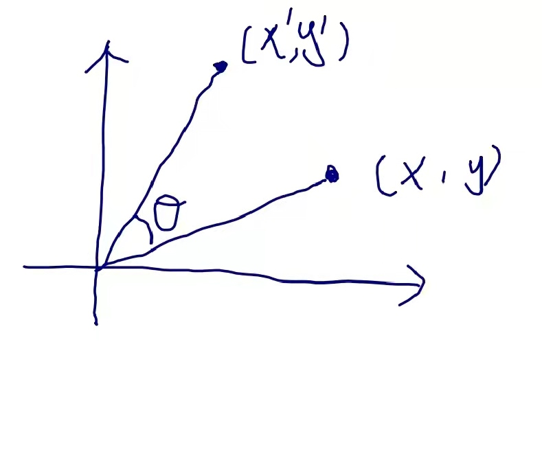

# Rotation matrix 旋转矩阵

在线性代数中，**旋转矩阵**是用于在欧几里得空间中执行旋转的变换矩阵。

旋转矩阵是行列式 1 的正交矩阵。旋转矩阵描述了围绕原点的旋转。
旋转矩阵的逆是它的转置，也是一个旋转矩阵。  
两个旋转矩阵的乘积是一个旋转矩阵。  
对于 n > 2，n × n 旋转矩阵的乘法通常是不可交换的。

# 二维旋转矩阵

二维旋转矩阵具有以下形式：

$$
{\displaystyle R={\begin{bmatrix}\cos \theta &-\sin \theta \\\sin \theta &\cos \theta \end{bmatrix}}}
$$

通过以下矩阵乘法旋转列向量，

 $$
 {\displaystyle {\begin{bmatrix}x'\\y'\\\end{bmatrix}}={\begin{bmatrix}\cos \theta &-\sin \theta \\\sin \theta &\cos \theta \\\end{bmatrix}}{\begin{bmatrix}x\\y\\\end{bmatrix}}.}
 $$ 

因此，点 (x, y) 旋转后的新坐标 (x′, y′) 为

 $$
 {\displaystyle {\begin{aligned}x'&=x\cos \theta -y\sin \theta \,\\y'&=x\sin \theta +y\cos \theta \,\end{aligned}}.}
 $$ 

>**[success]**  
  

## Direction 方向

如果 $$θ$$ 为正（例如 90°），则矢量旋转方向为逆时针方向，如果 $$θ$$ 为负（例如 -90°），则矢量旋转方向为顺时针。 因此，顺时针旋转矩阵为

$$
{\displaystyle R(-\theta )={\begin{bmatrix}\cos \theta &\sin \theta \\-\sin \theta &\cos \theta \\\end{bmatrix}}.}
$$

二维旋转矩阵组是唯一非平凡的（即非一维）可交换情况，因此执行多次旋转的顺序无关紧要。 另一种约定使用旋转轴，[1] 并且上述矩阵也表示*轴顺时针*旋转角度 $$θ$$。

1. ^ 请注意，如果不是旋转矢量，而是旋转参考系，则 sin θ 项上的符号将反转。 如果参考系 A 绕原点逆时针旋转角度 θ 以创建参考系 B，则 Rx（符号翻转）会将参考系 A 坐标中描述的矢量转换为参考系 B 坐标。 

## 常见的旋转矩阵

特别有用的矩阵是

$$
{\displaystyle {\begin{bmatrix}0&-1\\[3pt]1&0\\\end{bmatrix}},\quad {\begin{bmatrix}-1&0\\[3pt]0&-1\\\end{bmatrix}},\quad {\begin{bmatrix}0&1\\[3pt]-1&0\\\end{bmatrix}}} 
$$

# 三维旋转矩阵

基本旋转（也称为元素旋转）是围绕其中一个坐标轴的旋转。
可以使用矩阵乘法从这三个矩阵得到其他旋转矩阵。 

# Conversions 转换

## Quaternion 四元数

## Polar decomposition 极性分解

## Axis and angle 轴和角度

## Euler angles 欧拉角

# Uniform random rotation matrices 均匀随机旋转矩阵

我们有时需要生成一个均匀分布的随机旋转矩阵。 

## 2D

在二维中似乎很直观，这意味着旋转角度均匀分布在 0 和 2π 之间。 这种直觉是正确的，但不会延续到更高的维度。 例如，如果我们以轴角形式分解 3 × 3 旋转矩阵，则角度不应该是均匀分布的； 角度（大小）最多为 θ 的概率应该是
1
/
π
(θ − sin θ)，对于 0 ≤ θ ≤ π。

## 3D

创建一个四元素向量，其中每个元素都是正态分布的样本。 标准化它的长度，你有一个均匀采样的随机单位四元数，它代表一个均匀采样的随机旋转。 请注意，上述仅适用于维度 3 的旋转。

