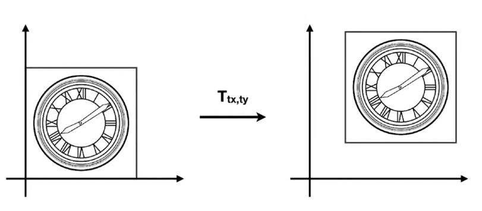

# 2D仿射变换(2D Affine Transformation)

## 平移

我们先看平移变换：

平移变换非常简单，可以由下面的式子表示：

\\[
x'=x+t_x\\\\
y'=y+t_y
\\]

但是有一个问题，我们不能把上述式子直接用矩阵的形式表达，需要在矩阵运算后再加一个偏移量：

\\[
\left[ \begin{array}{c}
    x'\\\\
    y'\\\\
\end{array} \right] =\left[ \begin{matrix}
    a&        b\\\\
    c&        d\\\\
\end{matrix} \right] \left[ \begin{array}{c}
    x\\\\
    y\\\\
\end{array} \right] +\left[ \begin{array}{c}
    t_x\\\\
    t_y\\\\
\end{array} \right] 
\\]

> &#x1F4CC;如果只有平移，则 \\(a,b,c,d\\) 构成一个单位矩阵

> **&#x1F4A1;思考：** 平移不是线性变换，不满足\\(X'=MX\\)

## 齐次坐标

为了解决“平移变换不能够线性变换表示”的问题，将坐标或向量添加一项(以2D为例)：

- 2D point = \\((x, y, 1)^T\\)
- 2D vector = \\((x, y, 0)^T\\)

这样，就可以用统一的X'=MX形式兼容线性变换和平移变换了：

\\[
\left( \begin{array}{c}
    x'\\\\
    y'\\\\
    w'\\\\
\end{array} \right) =\left( \begin{matrix}
    1&        0&        t_x\\\\
    0&        1&        t_y\\\\
    0&        0&        1\\\\
\end{matrix} \right) \cdot \left( \begin{array}{c}
    x\\\\
    y\\\\
    1\\\\
\end{array} \right) =\left( \begin{array}{c}
    x+t_x\\\\
    y+t_y\\\\
    1\\\\
\end{array} \right) 
\\]

> &#x1F4A1; 当前维度解决不了的问题，可以考虑升维解决。  
> &#x1F4CC; 为point增加一项1，因为point移动后不再是原来的point。为vector添加一项0，是因为向量具有平移不变性，向量平移后仍然是原向量。

> &#x1F4CC; \\((x, y, w)^T\\) 如果用于表达2D点，等同于\\((\frac{x}{w}, \frac{y}{w}, 1)\\)

添加项是否存在，不影响point与vector之间运算的意义：

\\[
vector + vector = vector\\\\
point + vector = point\\\\
point - point = vector\\\\
point + point = 两点的中点（齐次坐标下）
\\]

**齐次坐标的性质：**

- 有 \\((x, y, z, 1)\\) 这样一个坐标，那么为该坐标乘以一个不为0的数 \\(k\\)，即 \\((kx, ky, kz, k)\\)，结果不变。 
- 同理，给该坐标乘以坐标本身的 \\(z\\) 值，它仍然表示着3D中的相同点。即 \\((xz, yz, z^2, z)\\)，结果不变。 
- 例如： \\((1, 0, 0, 1)\\) 和 \\((2, 0, 0, 2)\\) 都表示 \\((1, 0, 0)\\) 

## 仿射变换(Affine transformation)

线性变换 + 平移 = 仿射变换  
所有的仿射变换，可以以齐次坐标的形式表达：

\\[
\left[ \begin{array}{c}
    X'\\\\
    1\\\\
\end{array} \right] =\left[ \begin{matrix}
    SR&        T\\\\
    0&        1\\\\
\end{matrix} \right] \left[ \begin{array}{c}
    X\\\\
    1\\\\
\end{array} \right] 
\\]

-----------

> 本文出自CaterpillarStudyGroup，转载请注明出处。  
> https://caterpillarstudygroup.github.io/GAMES101_mdbook/