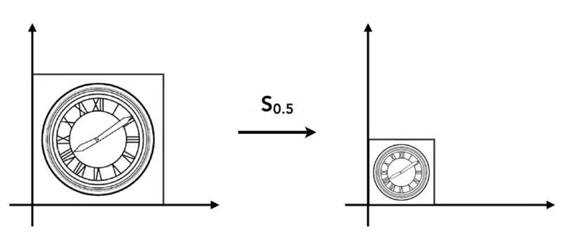
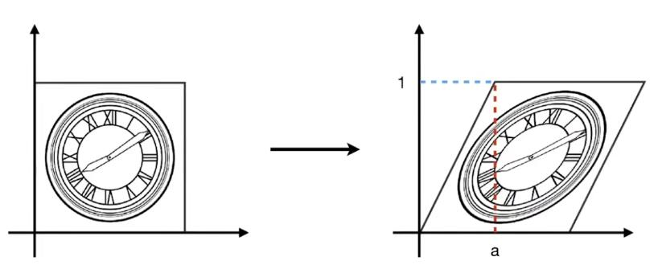
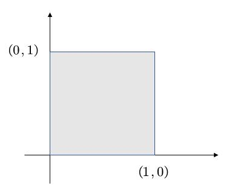
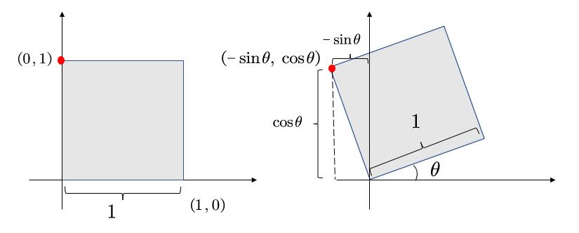

# 2D变换(2D Transformation)

[06：52]

## 缩放(Scale)

  

图中，横轴和纵轴都缩小了\\(\frac{1}{2}\\)，用数学形式表达：

\\[
x'=sx \\\\
y'=sy
\\]
其中，\\((x',y')\\) 是缩放后的坐标，\\(s\\) 是缩放尺度，\\((x,y)\\) 是原坐标。

将该式子写成矩阵的形式为：

\\[
\left[ \begin{array}{c}
    x'\\\\
    y'\\\\
\end{array} \right]  =\left[ \begin{matrix}
    s&        0\\\\
    0&        s\\\\
\end{matrix} \right] \left[ \begin{array}{c}
    x\\\\
    y\\\\
\end{array} \right] 
\\]

即，得到缩放矩阵为：

\\[
S_{0.5}=\left[ \begin{matrix}
	s&		0\\\\
	0&		s\\\\
\end{matrix} \right] =\left[ \begin{matrix}
	0.5&		0\\\\
	0&		0.5\\\\
\end{matrix} \right] 
\\]

如果缩放不是均匀的，例如 \\(x\\) 轴缩小0.5，\\(y\\) 不变，则用矩阵表示为：

\\[
\left[ \begin{array}{c}
    x'\\\\
    y'\\\\
\end{array} \right]  =\left[ \begin{matrix}
    s_x&        0\\\\
    0&        s_y\\\\
\end{matrix} \right] \left[ \begin{array}{c}
    x\\\\
    y\\\\
\end{array} \right] 
\\]

即，得到缩放矩阵为：

\\[
S_{0.5,1.0}=\left[ \begin{matrix}
	s_x&		0\\\\
	0&		s_y\\\\
\end{matrix} \right] =\left[ \begin{matrix}
	0.5&		0\\\\
	0&		1.0\\\\
\end{matrix} \right] 
\\]

## 反射(Reflection)

反射也称对称。

上图中，原图相对于 \\(y\\) 轴做了反转，用等式表示为：

\\[
x'=-x\\\\
y'=y
\\]

该等式可以用矩阵表示为：

\\[
\left[ \begin{array}{c}
    x'\\\\
    y'\\\\
\end{array} \right]  =\left[ \begin{matrix}
    -1&        0\\\\
    0&        1\\\\
\end{matrix} \right] \left[ \begin{array}{c}
    x\\\\
    y\\\\
\end{array} \right] 
\\]

## 切变(Shear)

上图是切变的例子。可以看到，图像上任意一点的 \\(y\\) 轴坐标值并未改变，仅 \\(x\\) 轴坐标改变了。则可以确定的是 \\(y'=y\\)，继续观察，当 \\(y\\) 为0时， \\(x\\) 没有变化，当 \\(y\\) 为1时， \\(x\\) 都水平右移了 \\(a\\) 长度，当 \\(y\\) 为1/2时， \\(x\\) 移动了 \\(\frac{a}{2}\\)，所以，找到了规律， \\(x\\) 移动距离为 \\(ay\\)。用矩阵表示为：

\\[
\left[ \begin{array}{c}
    x'\\\\
    y'\\\\
\end{array} \right]  =\left[ \begin{matrix}
    1&        a\\\\
    0&        1\\\\
\end{matrix} \right] \left[ \begin{array}{c}
    x\\\\
    y\\\\
\end{array} \right] 
\\]

> **&#x1F4CC;补充：** 找到变化规律，就能写出变换的表达式

## 旋转(Rotate)

> &#x2705;旋转默认是绕原点(0,0)旋转；默认旋转方向是逆时针旋转。

**旋转的矩阵表达式推导：**

> **&#x1F4A1;思路：** 旋转的图像每一点都需要符合表达式，那么，特殊的点也必须符合，所以从特殊点入手，找出旋转的规律，从而推导出旋转的矩阵形式表达。

假设有一个正方形，如图所示。

将其旋转 \\(\theta\\) 角度。

我们的目的是得到 \\(\left( x,y \right) ->\left( x',y' \right) \\)

矩阵的形式为：
\\(\left[ \begin{array}{c}
    x'\\\\
    y'\\\\
\end{array} \right]  =\left( \begin{matrix}
    A&        B\\\\
    C&        D\\\\
\end{matrix} \right) \left( \begin{array}{c}
    x\\\\
    y\\\\
\end{array} \right) \\)

只要找出规律，求出ABCD即可。

我们将目光先聚集在下图中的红点。

最基本的，我们可以知道一些信息，例如，原本的(1,0)点被旋转成为(\\(cos\theta，sin\theta\\))，

于是，我们就可以初步得到：

\\(
\left( \begin{array}{c}
    \cos \theta\\\\
    \sin \theta\\\\
\end{array} \right) =\left( \begin{matrix}
    A&        B\\\\
    C&        D\\\\
\end{matrix} \right) \left( \begin{array}{c}
    1\\\\
    0\\\\
\end{array} \right) 
\\)

也就是：

\\(\cos \theta =A\cdot 1+B\cdot 0 = A\\)

\\(\sin \theta =C\cdot 1+D\cdot 0 =C\\)

现在，已经得到了A和C。接着，我们选择另一个点。

不难得到，\\( B=-sin\theta, D=cos\theta \\)

所以有

\\(
\left( \begin{array}{c}
    \cos \theta\\\\
    \sin \theta\\\\
\end{array} \right) =\left( \begin{matrix}
    cos\theta&        -sin\theta\\\\
    sin\theta&        cos\theta\\\\
\end{matrix} \right) \left( \begin{array}{c}
    1\\\\
    0\\\\
\end{array} \right) 
\\)

因此

$$
\left[ \begin{array}{c}
    x'\\\\
    y'\\\\
\end{array} \right] =\left[ \begin{matrix}
    \cos\theta&        -\sin\theta\\\\
    \sin\theta&        \cos\theta\\\\
\end{matrix} \right] \left[ \begin{array}{c}
    x\\\\
    y\\\\
\end{array} \right] 
$$

# 线性变换

上述缩放、反射、切变和旋转，都称为**线性变换**，可以统一由下面的表达式来表达：

\\[
x'=ax+by\\\\
y'=cx+dy
\\]

\\[
\left[ \begin{array}{c}
    x'\\\\
    y'\\\\
\end{array} \right] =\left[ \begin{matrix}
    a&        b\\\\
    c&        d\\\\
\end{matrix} \right] \left[ \begin{array}{c}
    x\\\\
    y\\\\
\end{array} \right] 
\\]

\\[
X'=MX
\\]

> **&#x2757;注意：** 要用相同维度的向量，去和X相乘。旋转矩阵必须满足\\(R^{-1}=R^T\\)

-----------

> 本文出自CaterpillarStudyGroup，转载请注明出处。  
> https://caterpillarstudygroup.github.io/GAMES101_mdbook/