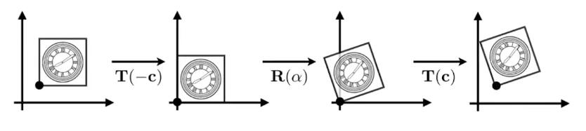

# 变换合成与分解

## 变换合成

- 复杂变换可以通过简单变换一步一步达到，合成之后的变换矩阵维度不变
- 变换顺序非常重要，ABC不等于ACB（矩阵乘法性质）

# 变换分解

以C点为中心的旋转，可以分解为：

1. 从C点平移到原点
2. 旋转
3. 再从原点平移到C点

即：\\(X'=MX=T\left( c \right) \cdot R\left( \alpha \right) \cdot T\left( -c \right) \cdot X\\)

> **&#x1F4A1;我的思考：** 
> 
> 1.复杂问题都可以分解为互相独立的简单问题，但需要保证分解出的子问题是独立的。简单操作也可以组合成复杂操作，但需要保证组合的效果是预期的，而不会引入奇怪的问题。
> 
> 前面两处使用了这种思路
> 
> （1）简单线性变换 VS 复杂仿射变换
> 
> （2）基于不同轴的简单旋转 VS 基于特定方向的旋转（3D旋转见下一节）
> 
> 但这两个问题的子问题都没有完全独立，因此都存在子问题的顺序要求。
> 
> 2.当学到一个新的概念/方法时，可以想一想，为什么要引入这个概念/方法？
> 
> 是为了解决什么问题？
> 
> 以前是用什么方法来解决的？它有什么问题？
> 
> 这个方法是否解决了以前方法的问题？这个方法有什么局限性？
> 
> 两者能否结合？
> 
> 两者如何取舍？

-----------

> 本文出自CaterpillarStudyGroup，转载请注明出处。  
> https://caterpillarstudygroup.github.io/GAMES101_mdbook/