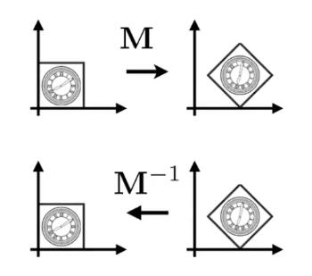

# 逆变换(Inverse transform)

> &#x1F4A1; 当一个变换是通过\\(M\\)得到的，那么可以通过\\(M\\)的逆\\(M^{-1}\\)来恢复变换。 

## 旋转的逆变换

再次来看矩阵旋转 \\(X'=R_{\theta}X\\) :

我们将 \\(X\\) 旋转 \\(\theta\\) 度， \\(R_{\theta}\\) 为：

\\[
R_{\theta}=\left( \begin{matrix}
    \cos \theta&        -\sin \theta\\\\
    \sin \theta&        \cos \theta\\\\
\end{matrix} \right) 
\\]

如果要逆转回来，恢复原来的矩阵，需要旋转 \\(-\theta\\) 度，根据上述旋转的推导，可以得到：

\\[
R_{-\theta}=\left( \begin{matrix}
    \cos \theta&        \sin \theta\\\\
    -\sin \theta&        \cos \theta\\\\
\end{matrix} \right) 
\\]

而 \\(R_{-\theta}\\) 恰好是 \\(R_{\theta}\\) 的转置矩阵 \\(R_{\theta}^{T}\\)， 即：

\\[
R_{-\theta}=R_{\theta}^{T}
\\]

由 “当一个变换是通过\\(M\\)得到的，那么可以通过\\(M\\)的逆\\(M^{-1}\\)来恢复变换” 可知，\\(R_{\theta}^{-1}\\) 与刚刚旋转 \\(-\theta\\) 推导得到的 \\(R_{\theta}\\) 相等，即：

\\[
R_{\theta}^{-1}=R_{-\theta}
\\]

于是有：

\\[
R_{-\theta}=R_{\theta}^{-1}=R_{\theta}^{T}
\\]

-----------

> 本文出自CaterpillarStudyGroup，转载请注明出处。  
> https://caterpillarstudygroup.github.io/GAMES101_mdbook/