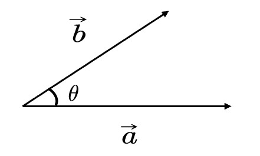
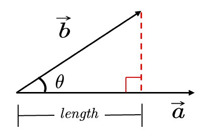
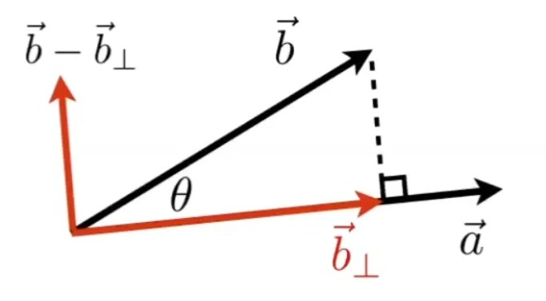
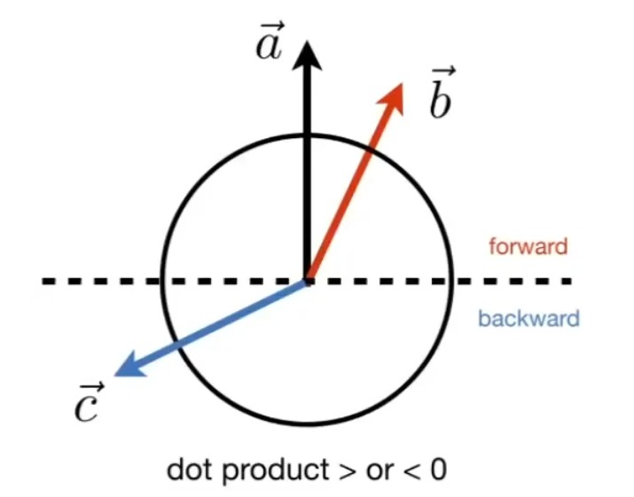

# 向量

*全篇以2D为例，但对高维同样适用。*  

## 向量性质 [07：54]

- 方向:  \\( B - A \\) 或 \\( \vec{a} \\) 

- 长度：\\( ||B-A || \\) 或 \\( ||\vec{a}|| \\)  (与起点无关)

- 单位向量：\\( \vec{a}=\frac{\vec{a}}{||\vec{a}||} \\)，模长为1，通常用于表示方向

**向量**是一维的，分为向量和列向量。如果没有特殊说明，一般默认为列向量。
所以书写公式时，一个向量写为 \\(\vec{a}=\left( x, y \right) ^T\\)，其长度为\\(||\vec{a}|| = \sqrt{x^2 + y^2}\\)

## 向量加法

### 代数意义

$$
\vec{a}=\left( x_1, y_1 \right) ^T  ,  \vec{b}=\left( x_2, y_2 \right) ^T
$$

$$
\vec{a}+\vec{b}=\left( x_1+x_2, y_1+y_2 \right) ^T
$$

### 几何意义

  

## 向量点乘

### 几何意义

  

$$
\vec{a}\cdot \vec{b}=||\vec{a}||\cdot ||\vec{b}||\cdot \cos <\vec{a}, \vec{b}>
$$

向量点乘的结果是标量

> **&#x1F4CC;补充：** 由 \\( \vec{a} \\) 到 \\( \vec{b} \\) 的夹角 \\( <\vec{a},\vec{b}> \\) 是 \\( \theta \\) , 如果是由 \\( \vec{b} \\) 到 \\( \vec{a} \\) 的夹角 \\( <\vec{b}, \vec{a}> \\) , 则为 \\( -\theta \\) 。由于cos是关于x轴对称的，因此\\(a \dot b = b \dot a\\)

### 代数意义

$$
\vec{a}=\left( x_1, y_1 \right) ^T  ,  \vec{b}=\left( x_2, y_2 \right) ^T
$$

$$
\vec{a}\cdot \vec{b}=x_1x_2+y_1y_2
$$

### 性质

- 交换律：\\( \vec{a}\cdot \vec{b}=\vec{b}\cdot \vec{a} \\)

- 分配律： \\( \vec{a}\cdot(\vec{b}+\vec{c})=\vec{a}\cdot \vec{b}+\vec{a}\cdot \vec{c} \\)

- 结合律： \\( (k\cdot \vec{a})\cdot \vec{b}=\vec{a}\cdot (k\cdot \vec{b})=k\cdot(\vec{a}\cdot \vec{b}) \\)

### 作用

1. 计算两个向量之间的夹角
   
   \\( \cos \theta =\frac{\vec{a}\cdot \vec{b}}{||\vec{a}||\cdot ||\vec{b}||} \\)

当a和b都是单位向量时，可简化为：

$$
\cos \theta = \vec{a}\cdot \vec{b}
$$

2. 计算一个向量投影在另一个向量上的投影
   
   
  

   
b在a的投影为\\(\vec{b}_{\bot}\\)，其长度为：  

$$
length=||\vec{b}||\cos \theta =||\vec{b}||\frac{\vec{a}\cdot \vec{b}}{||\vec{b}||\cdot ||\vec{a}||}=\frac{\vec{a}}{||\vec{a}||}\vec{b}=\hat{a}\cdot \vec{b}
$$

其方向同a。

因此：

$$
\vec{b}_{\bot} = (\hat{a}\cdot \vec{b}) \hat a
$$

3. 把向量分解成垂直和平行的两个向量
   
   
   
4. 计算两个向量有多接近
   
   两个向量做点乘，可以反映二者方向的“接近”程度
   
   
   
   表示方向是否相同 ： 我们假设 \\( \vec{a} \\) 已给定，如果一个向量的终点落在虚线上半部分，例如 \\( \vec{b} \\) ，则可以认为该向量在方向上与 \\( \vec{a} \\) 是相同的或是说都是向前的，此时\\(\hat a \cdot \hat b > 0\\)；如果一个向量，例如 \\( \vec{c}\\)，终点落在虚线下半部分，则可以认为 \\( \vec{a} \\) 和 \\( \vec{c}\\) 两个向量的方向基本是相反的，此时\\(\hat a \cdot \hat b < 0\\)  
   
   表示接近程度 ：点乘结果落在 \\([-1, 1]\\) 上，数值越大越接近，结果为1时方向相同。数值越小方向越远，为-1时方向正好相反。
   
   > **&#x1F4CC;补充：**（点乘： \\( \vec{a}\cdot \vec{b} > 0 \\) ，方向相同；   \\( \vec{a}\cdot \vec{c} < 0 \\) ，方向相反）

## 向量叉乘

### 几何意义

\\( \vec{c}=\vec{a}\times \vec{b} \\)

\\(\vec{c}\\) 是一个向量，方向同时与 \\(\vec{a}\\) 和 \\(\vec{b}\\) 垂直（右手法则），大小为 \\(||\vec{a}||\cdot ||\vec{b}||\cdot \sin \theta \\)  (\\(\theta\\) 是a到b的夹角)

> **&#x2705;右手螺旋法则**：  
> 
>    \\(\vec{c}=\vec{a}\times \vec{b}\\) 
> 
>   右手手指指向 \\(\vec{a}\\) 方向，然后沿着去往 \\(\vec{b}\\) 的方向握紧四指，此时大拇指指向的方向，就是 \\(\vec{c}\\) 的方向。

\\(\sin \theta = -\sin(-\theta)\\)，因此\\(a\times b = b\times a\\)
### 性质

[34：15]

- \\( \vec{x}\times \vec{y}=+\vec{z} \\)
- \\( \vec{y}\times \vec{x}=-\vec{z} \\)
- \\( \vec{y}\times \vec{z}=+\vec{x} \\)
- \\( \vec{z}\times \vec{y}=-\vec{x} \\)
- \\( \vec{z}\times \vec{x}=+\vec{y} \\)
- \\( \vec{x}\times \vec{z}=-\vec{y} \\)
- \\( \vec{a}\times \vec{b}=-\vec{b}\times \vec{a} \\) (不满足交换律)
- \\( \vec{a}\times \vec{a}=\vec{0} \\) （不是0，而是**长度为0的向量**）
- \\( \vec{a}\times \left( \vec{b}+\vec{c} \right) =\vec{a}\times \vec{b}+\vec{a}\times \vec{c} \\)  （分配律）
- \\( \vec{a}\times \left( k\vec{b} \right) =k\left( \vec{a}\times \vec{b} \right)  \\)  （结合律）

左手则符号相反

> **&#x1F4CC;** 在一个三维坐标系中，如果\\( \vec{x}\times \vec{y}=\vec{z}\\)，那么这个坐标系称为右手坐标系。

### 代数意义 

[36:11]

\\[
\vec{a}\times \vec{b}=\left( \begin{array}{c}
    y_az_b-y_bz_a\\\\
    z_ax_b-x_az_b\\\\
    x_ay_b-y_ax_b
\end{array} \right) = \left[ \begin{matrix}
	0&		-z_a&    y_a\\\\
	z_a&    0&    -x_a\\\\
   -y_a&    x_a&    0\\\\ 
\end{matrix} \right] \left[ \begin{matrix}
	x_b\\\\
	y_b\\\\
   z_b\\\\
\end{matrix} \right]
\\]

> **&#x1F4A1;思考：** 这个式子中，\\( x_a,y_a,z_a \\) 是\\( \vec{a}\\) 在三维坐标系中的三个坐标分量的代数表示。 叉乘只用于3D中，在2D中没有定义。  

式子中的矩阵称为dual matrix of a，常写作\\(A^*\\)

> &#x2757; 在本课程中默认使用右手坐标系，OPENGL, UE, unity等api默认使用左手坐标系。  

# 其它术语
  
**线性组合**：设α₁,α₂,…,αₑ(e≥1)是域P上线性空间V中的有限个向量.若V中向量α可以表示为：α=k₁α₁+k₂α₂+…+kₑαₑ(kₑ∈P,e=1,2,…,s),则称α是向量组α₁,α₂,…,αₑ的一个线性组合。  

**向量空间**：由向量组成的集合，满足加法封闭性、乘法封闭性。  

**内积**：指接受在实数R上的两个向量并返回一个实数值标量的二元运算。  

**内积空间**：增添了一个额外的结构的向量空间。这个额外的结构叫做内积，或标量积，或点积。这个增添的结构允许我们谈论向量的角度和长度。  

**赋范向量空间**：拥有一个范数的向量空间叫做赋范向量空间。  

**半赋范向量空间**：拥有半范数的叫做半赋范向量空间。  

**哈达玛积**：Hadamard product，又叫Schur积。定义为$$(s \odot t)_j = s_j t_j$$，例如：  
$$
\begin{aligned}
\left[\begin{array}{c} 1 \\ 2 \end{array}\right] 
  \odot \left[\begin{array}{c} 3 \\ 4\end{array} \right]
= \left[ \begin{array}{c} 1 * 3 \\ 2 * 4 \end{array} \right]
= \left[ \begin{array}{c} 3 \\ 8 \end{array} \right] && (28)
\end{aligned}
$$
