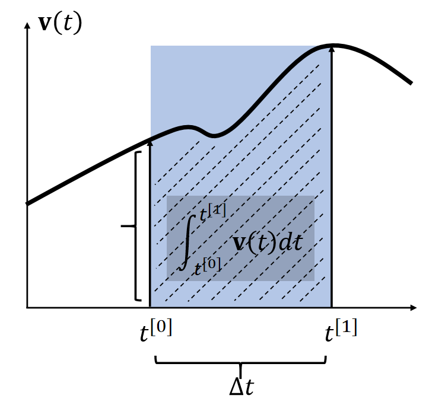

# 数值积分

## 显式积分与隐式积分

将连续积分转化为离散求和的计算方法，用于无法解析求解的积分问题。

By definition, the integral \\(\mathbf{x} (t) = \int \mathbf{v}  (t) dt\\) is the area. Many methods estimate the area as a box.   

|Explicit Euler|Implicit Euler  |Mid-Point|
|---|---|---|
|显式积分|隐式积分||
| | ||
| | ||
|使用 \\(t_0\\) 时刻的速度作为box的高|使用 \\(t_1\\) 时刻的速度作为box的高|
|\\(\int_{t^{[0]}}^{t^{[1]}} \mathbf{v} (t)dt≈∆t  \mathbf{v} (t^{[0]})\\)|\\(\int_{t^{[0]}}^{t^{[1]}} \mathbf{v} (t)dt≈∆t  \mathbf{v} (t^{[1]})\\)|\\(t^{[0]}\\).   \\(\int_{t^{[0]}}^{t^{[1]}} \mathbf{v} (t)dt≈∆t  \mathbf{v} (t^{[0.5]})\\)|

> &#x2705; 假设\\(\mathbf{x} \\)和\\(\mathbf{v} \\)都是一维的。速度的积分就是阴影区域的面积。   
> &#x2705; 近似到一阶项，因此称为一阶方法。漏掉的高阶项就是误差。  
两种方法都只能一阶近似   

P16 
## Leapfrog Integration    

    

> &#x2705; 速度和位置是错开的。上下两种写法，在计算上是一样的。  

In some literature, such a approach is called *semi-implicit*.  

It has a funnier name: the *leapfrog method*.

    
