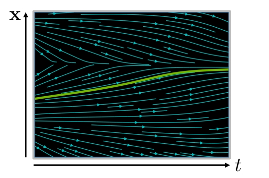
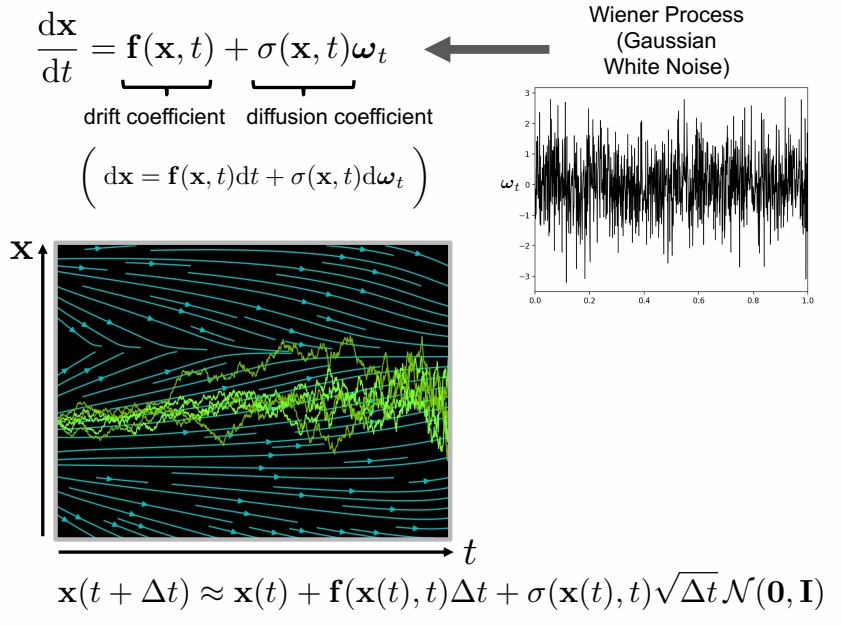

## Ordinary Differential Equation (ODE):    

$$
\frac{d\mathbf{x} }{dt} =\mathbf{f} (\mathbf{x},t) \quad  \mathrm{or}  \quad d\mathbf{x} =\mathbf{f} (\mathbf{x} ,t)dt
$$

> &#x2705; 图中描述了一个 function，这个函数没有闭式解，而是 \\(\mathbf{x}\\) 随着时间的变化。    
> &#x2705; \\(f(\mathbf{x},t)\\) 描述的是一个随时间变化的场 \\(f(\mathbf{x},t)\\) 可以是一个用网络拟合的结果。    

   

Analytical Solution:   

$$
\mathbf{x} (t)=\mathbf{x} (0)+\int_{0}^{t} \mathbf{f} (\mathbf{x} ,\tau )d\tau 
$$

> &#x2705; 这个积分经常无法计算，因此把离散化。  

Iterative Numerical Solution:    

$$
\mathbf{x} (t+\Delta t)\approx \mathbf{x} (t)+\mathbf{f} (\mathbf{x} (t),t)\Delta t
$$

## Stochastic Differential Equation (SDE):   

 

> &#x2705; \\(\sigma \\) 描述 noise 的 scale。\\(\omega _ t\\) 描述噪声。    
> &#x2705; SDE 在每个时间步注入高斯白噪声。因此多次求解 \\(\mathbf{x}(t)\\) 的结果是不一样的。    
